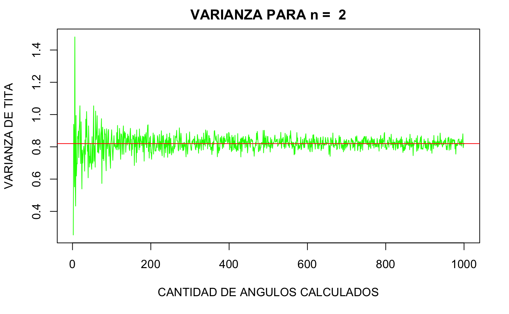
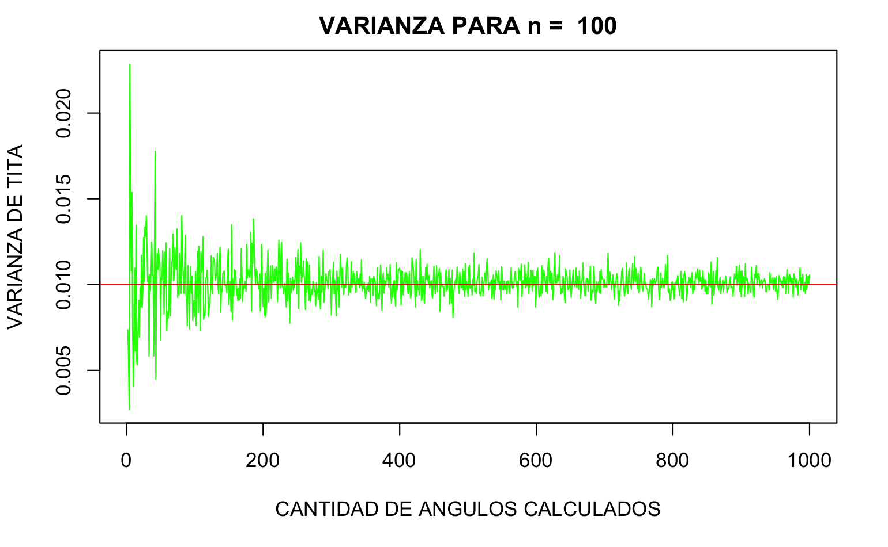

```{r setup, include=FALSE}
knitr::opts_chunk$set(echo = TRUE)
```

# **EJERCICIO 1**


```{r fig2, fig.height = 4, fig.width = 8, fig.align = "center"}
espHb = c()
espGb = c()
i   = 1
for (b in seq(0,2,.01)){

  espHb[i] = integrate(
            function(x){
              #Valores xi * f(x)
              return(((x - b)^2)*dexp(x,2));
            }, 
            -Inf, 
            Inf)$value
  
  espGb[i] = integrate(
            function(x){
              #Valores xi * f(x)
              return((abs(x - b))*dexp(x,2));
            }, 
            -Inf, 
            Inf)$value
  
  i = i+1
  }
  

plot(seq(0,2,.01),
     espHb,
     lwd=3,
     type='l',
     col=2,
     xlab='b', 
     ylab='Esperanza',
     main='Esperanza en función de b',
   )

lines(seq(0,2,.01),
      espGb,
      lwd=3,
      type='l',
      col=3
    )

legend(x = "topleft",          
       legend = c("E((X-b)^2)", "E(|X-b|)"),  
       lty = c(1, 1),          
       col = c(2, 3)
     )

axis(1,
     at = seq(0,2,.1)) 
```

------------------------------------------------------------------------

> *Consigna:* <br>Determinar aproximadamente los valores b que minimizan
> la funcion H(b) y G(b) respectivamente

*Respuesta:*<br>Los valores que minimizan la funciones parecieran rondar
los:

<li>

0.5 para la función E((X-b)\^2)

</li>

<li>

0.3 para la función E(\|X-b\|)

</li>

------------------------------------------------------------------------

> *Consigna:* <br>Tomar una muestra aleatoria de 10000 v.a.
> independientes exponenciales con λ = 2 y calcular i. la media(o
> promedio). ii. la mediana

```{r}
va = rexp(10000, 2)
paste('Media: ', round(mean(va),4)); paste('Mediana: ', round(median(va),4))
```

> *Consigna:* <br>Comparar la media anterior con b∗H, y la mediana con
> b∗G. ¿Son parecidos? Interprete.

*Respuesta:*<br>Los valores hallados son extremadamente similares a los
valores de b que minimizan las funciones del apartado "a". Más
específicamente:

1)  la **media** minimiza la función Hb, donde las distancias se elevan
    al cuadrado. <br>Esto sucede porque, en particular, elevar las
    distancias al cuadrado genera el efecto de una penalización que
    crece a medida que las distancias crecen. <br>Restando la media
    logramos obtener el vector que tiene las distancias "extremas" más
    pequeñas, evitando en cuanto se pueda valores extremos.

2)  la **mediana** minimiza la función Gb, donde se calcula el módulo de
    las distancias. <br>Esto sucede porque, al no elevar al cuadrado las
    diferencias dejamos de lado el efecto de mayor penalización a
    mayores distancias, y todas las distancias se penalizan por igual.
    <br>De este modo, para minimizar la función, deberíamos lograr
    obtener el vector que tenga, en total, las menores distancias. Para
    esto necesitamos el valor que se encuentre exáctamente en el "medio"
    de los datos, es decir, la mediana.

<!-- -->

# **EJERCICIO 2**


ii. Idem i, pero ahora para n = 2, 3, 4, 5, 10, 20, 30, 100. Graficar
    los resultados, es decir la estimacion de la esperanza del angulo en
    funcion de n. Grafique la distribucion de theta (histograma) para
    los distintos valores de n. Los espacios en dimensiones grandes son
    raros, ¿no?, ¿ Como se comporta la varianza de theta?


```{r}
norma <- function(vector_aleatorio) {
  return(sqrt(sum(vector_aleatorio ^ 2)))
}


dame_tita <- function(n_var_al, n_angulos) {
  titas = c()

  for (i in seq(1, n_angulos)){
    X                = rnorm(n_var_al)
    Y                = rnorm(n_var_al)
    producto_escalar = X %*% Y
    normaX           = norma(X)
    normaY           = norma(Y)
    tita_rad         = acos(producto_escalar / (normaX * normaY))
    titas[i]         = tita_rad
  }

  return (titas);
}


for (n in c(2,3,4,5,10,20,30,100)){

  trial = c()
  var_trial = c()
  for (i in 1:1000) {
    trial[i] = mean(dame_tita(n, i))
    var_trial[i] = var(dame_tita(n, i))
  }
  plot(var_trial, col = "green",
       main=paste("VARIANZA PARA n = ",n),
       type = "l",
       xlab = "CANTIDAD DE ANGULOS CALCULADOS",
       ylab = "VARIANZA DE TITA")


  hist(trial, 
       main = paste0("DISTRIBUCION DE THETAS PARA n = ", n),
       xlab = "VALOR DE THETA [rad]",
       ylab = "FRECUENCIA",
       col = "blue")
  plot(seq(1:1000), trial, type='l', 
       main=paste('LEY DE GRANDES NUMEROS PARA n = ',n),
       xlab = "CANTIDAD DE ANGULOS PROMEDIADOS",
       ylab = "ESPERANZA DE THETA",
       ylim=c(.5, 3))
  abline(h=1.56, col='red')
  abline(h=1.56*1.05, col='red', lty=2)
  abline(h=1.56*.95, col='red', lty=2)
}
```

Notamos como la varianza de theta disminuye a medida que aumenta el
numero de dimensiones. Esto lo vemos claramente al comparar los graficos
de varianza para n = 2 variables aleatorias, donde la misma toma un
valor en torno a 0.82, y la varianza para n = 100 variables aleatorias,
donde toma un valor en torno a 0.01.

 

# **EJERCICIO 3**


```{r}
library('plotly')
```

```{r}
#Funciones

muestreo_poblacional = function(casos_p, verbose=F){
  max_tiempo = 10
  tiempo = seq(1:max_tiempo)
  #Usamos una matriz para ir guardando los distintos valores que vayan saliendo, al final, cada columna de la matriz será un sample de los 100 que se hacen, es por esto que la matriz será de (10,100) --> (tiempos, iteraciones)
  poblacion_final = matrix(ncol=0,nrow=max_tiempo)
  
  
  for(k in 1:200){
    if (verbose==T){
      print(paste('Round: ',k))
    }
    #Comenzamos con 1 solo sobreviviente
    poblacion = c(1) 
    #Vector para ir guardando los valores en cada tiempo t
    poblacion_total = c()
    
    for (t in tiempo){
      
      #Se toma un sample de una distribución aleatoria uniforme, si el valor/100 es menor a casos_p, el elemento sobrevive,
      #caso contrario el mismo muere
      probas = runif(length(poblacion), 1, 100) / 100
      poblacion = probas * poblacion
      
      sobrevivientes = poblacion < casos_p
      
      #Lo población es igual a todas las divisiones de los sobrevivientes
      poblacion = rep(1, times = sum(sobrevivientes) * 2)
      
      poblacion_total[t] = sum(poblacion)
    }
   #Populamos la matriz
   poblacion_final = cbind(poblacion_final, poblacion_total)
  } 
  
  return(poblacion_final);
}


crecimiento_conocido = function(t, casos_p){ #Esta es la función conocida, a la que nuestra curva tiene que parecerse
  return((2 * casos_p) ^ t)
}


evolucion_poblacional = function(poblacion_final, casos_p){
  for (i in c(1,2,3,4,7,20,40,80,95,100,150,200)){
    #plot(seq(1,10), apply(poblacion_final, 1, FUN=first), type='l', lwd=2, col='red')
    if (i==1){
      
      fig = plot_ly(width = 1500, height = 500, name='Sample') %>% 
          add_trace(x = seq(1,10), y = poblacion_final[,i], type = 'scatter', mode = 'lines+markers', 
                    marker = list(line = list(width = 2,color='darkgreen')),
                    name = 'Muestra',
                    line=list(color='darkgreen')) %>% 
          add_trace(x=seq(1,10), y=crecimiento_conocido(seq(1,10),casos_p), type = 'scatter', name = 'Teórica', mode = 'lines+markers',
                    line=list(color='red'), marker=list(color='red'), name='Teórico')
      
    } else {
      
      fig = plot_ly(width = 1500, height = 500, showlegend = FALSE) %>% 
          add_trace(x = seq(1,10), y = apply(poblacion_final[,1:i], 1, FUN=mean), type = 'scatter', mode = 'lines+markers', 
                    marker = list(line = list(width = 2,color='darkgreen')),
                    name = 'Muestra',
                    line=list(color='darkgreen')) %>% 
          add_trace(x=seq(1,10), y=crecimiento_conocido(seq(1,10), casos_p), type = 'scatter', name = 'Teórica', mode = 'lines+markers',
                    line=list(color='red'), marker=list(color='red')) 
    }
    
      
      assign(
        paste0(
              "plot_", i),fig)
    }


    fig <- subplot(plot_1, plot_2, plot_3, plot_4, plot_7, plot_20, plot_40, 
                   plot_80, plot_95, plot_100, plot_150,plot_200, 
                   nrows = 2,
                   shareY = TRUE,
                   margin = 0.01) %>% 
            layout(title = paste('Evolución de la población con LGN vs curva teórica (P=',casos_p,')'),
                           annotations = list( 
                list(x = 0.07, y = .9, text = "Iteración 1", xref = "paper",  yref = "paper", xanchor = "center", yanchor = "bottom", showarrow = FALSE),  
                list(x = 0.24, y =.9, text = "Iteración 2", xref = "paper",  yref = "paper", xanchor = "center", yanchor = "bottom", showarrow = FALSE),
                list(x = .41, y = .9, text = "Iteración 3", xref = "paper",  yref = "paper", xanchor = "center", yanchor = "bottom", showarrow = FALSE),
                list(x = .58, y = .9, text = "Iteración 4", xref = "paper",  yref = "paper", xanchor = "center", yanchor = "bottom", showarrow = FALSE),
                list(x = .75, y = .9, text = "Iteración 7", xref = "paper",  yref = "paper", xanchor = "center", yanchor = "bottom", showarrow = FALSE),
                list(x = .92, y = .9, text = "Iteración 20", xref = "paper",  yref = "paper", xanchor = "center", yanchor = "bottom", showarrow = FALSE),
                list(x = 0.07, y = .35, text = "Iteración 40", xref = "paper",  yref = "paper", xanchor = "center", yanchor = "bottom", showarrow = FALSE),
                list(x = 0.24, y =.35, text = "Iteración 80", xref = "paper",  yref = "paper", xanchor = "center", yanchor = "bottom", showarrow = FALSE),
                list(x = .41, y = .35, text = "Iteración 95", xref = "paper",  yref = "paper", xanchor = "center", yanchor = "bottom", showarrow = FALSE),
                list(x = .58, y = .35, text = "Iteración 100", xref = "paper",  yref = "paper", xanchor = "center", yanchor = "bottom", showarrow = FALSE),
                list(x = .75, y = .35, text = "Iteración 150", xref = "paper",  yref = "paper", xanchor = "center", yanchor = "bottom", showarrow = FALSE),
                list(x = .92, y = .35, text = "Iteración 200", xref = "paper",  yref = "paper", xanchor = "center", yanchor = "bottom", showarrow = FALSE)
              )
      )
    
    return (fig);
}
```

P=.2

```{r}
poblacion_final = muestreo_poblacional(.2)
fig             = evolucion_poblacional(poblacion_final, .2)
fig
```

P=.5

```{r}
poblacion_final = muestreo_poblacional(.5)
fig             = evolucion_poblacional(poblacion_final, .5)
fig
```

p=.7

```{r}
poblacion_final = muestreo_poblacional(.7)
fig             = evolucion_poblacional(poblacion_final, .7)
fig
```

p=.8

```{r}
poblacion_final = muestreo_poblacional(.8)
fig             = evolucion_poblacional(poblacion_final, .8)
fig
```

INTERPRETACION: Observamos que a mayor p, la convergencia con la curva
teorica se da de manera mas rapida.

# **EJERCICIO 4**


```{r}
library(dplyr)
datos <- readRDS(file="data_final_grupal.Rda")
```

3a) i) Realice un histograma del peso de los recien nacidos. Hint:
hist(⋆)

```{r}
hist(datos$peso)
```

ii) ¿Para que sirven los argumentos xlab, main, col, breaks en el
    histograma? hist(datos\$peso,xlab="Peso",main="Histograma del
    peso",col=2)

```{r}
hist(datos$peso, xlab = "Peso", main = "Histograma del peso", col=2)
```

iii) Calcule medidas de resumen del peso. Hint: mean(⋆,na.rm=T),
     median(⋆), sd(⋆), mad(⋆), IQR(⋆)

```{r}
(mean(datos$peso, na.rm=T)) 
(median(datos$peso, na.rm = T))
sd(datos$peso, na.rm = T) 
mad(datos$peso, na.rm = T) 
IQR(datos$peso, na.rm = T)
```

iv) Realice un boxplox de la variable peso. Hint: boxplot(⋆)

```{r}
datos$peso %>% boxplot
```

v)  Cambie el color del boxplot anterior

```{r}
datos$peso %>% boxplot(col = "blue")
```

vi) Grafique la acumulada empirica. Hint: plot(ecdf(⋆))

```{r}
plot(ecdf(datos$peso))
```

vii) Realice un qqplot usando alguna distribución "razonable". Hint:
     vaya a la teórica.

```{r}
qqnorm(datos$peso)
```

viii) Realice un qqplot usando la distribución exponencial con λ = 1.
      Hint: goto Hint 3 (a) vii.

```{r}
cuantiles_teoricos = qexp(c(1:length(datos$peso)) / (length(datos$peso) + 1), 1)

qqplot(cuantiles_teoricos, datos$peso, 
       xlab = "Cuantiles Teoricos Exp(1)", 
       ylab = "Cuantiles muestrales")
```

b)  Calcule medidas de resumen de la edad de la madre. Hint: mean(⋆),
    median(⋆), summary(⋆), max(⋆), min(⋆), sd(⋆), mad(⋆), IQR(⋆)

```{r}
summary(datos$`edad madre`, na.rm = T)
max(datos$`edad madre`, na.rm = T)
min(datos$`edad madre`, na.rm = T)
(mean(datos$`edad madre`, na.rm=T)) 
(median(datos$`edad madre`, na.rm = T))
sd(datos$`edad madre`, na.rm = T) 
mad(datos$`edad madre`, na.rm = T) 
IQR(datos$`edad madre`, na.rm = T)
```

4.- Variable categórica. (a) Estudie la variable tipo parto.

i)  Construya una tabla de frecuencia con la variable tipo parto. Hint
    table(⋆)

```{r}
(a <- table(datos$`tipo parto`))
```

ii) ¿Cuantos partos fueron por cesárea (C-section)?

```{r}
table(datos$`tipo parto`)[1]
```

iii) Utilizando la tabla del item (a) realice un diagrama de barra. Hint
     barplot(⋆)

```{r}
barplot(a, col = "violet")
```

iv) A partir de la tabla del item (a) realice un diagrama de torta. Hint
    pie(⋆)

```{r}
pie(a)
```

(b) Estudie la variable dia del parto.

<!-- -->

i)  Realice un diagrama de barra.

```{r}
datos$dia %>% 
  table() %>% 
  barplot(col = "pink")
```

ii) ¿Quedaron ordenados los dias? Vuelva a realizar un diagrama de barra
    pero ahora ordene los dias haciendo algo similar a lo realizado en
    el ejercicio 2 (d).

```{r}
dias <- c("lunes", "martes", "miercoles", "jueves", "viernes", "sabado","domingo")
datos$dia <- factor(datos$dia, levels = dias)

datos$dia %>% 
  table() %>% 
  barplot(col = "pink")

```

Estudiando la relación entre dos variables

5.- Relación entre una variable numerica y una categorica. (a) Estudie
la relacion entre peso del recien nacido y la multiplicidad del parto.
i. Grafique esta relacion plot(datos$parto multiple, datos$peso)

```{r}
datos %>% 
  select(c("parto multiple", "peso")) %>% 
  plot()

```

ii) ¿Como se interpreta el grafico anterior?

Cuantos más chicos nacen en el parto, menor es el peso de cada bebé por
el lugar que ocupan en el vientre, y el tamaño maximo que el mismo se
puede expandir.

(b) Estudie la relacion entre la edad de la madre y la educacion.

<!-- -->

i)  Grafique esta relación. Verifique que tiene bien ordenada la
    categoria educación.

```{r}
library("ggplot2")
graf <- datos %>% select(educ, `edad madre`)
  ggplot(graf, aes(educ, `edad madre`)) +
  geom_boxplot() +
  theme(axis.text.x = element_text(angle = 90, hjust=1))
```

ii) ¿Se puede observar alguna relacion entre las dos variables?

En la mayoria de los casos vemos que las familias se originan entre los
20 y 30 años de la madre. Los mayores niveles de dispersion de edad en
madres, los vemos en los casos "null, not on certificate y no formal
education" La dispersion de la edad de las madres en los niveles
educativos basico y secundario, son similares. La menor dispersion de
los años en las madres, las vemos en los casos que estan cursando su 2do
y 3er año estudios universitarios, probablemente porque son nacimientos
mas planificados, a diferencia de los otros casos que son mas
espontaneos. Tambien vemos en estos casos, que la mediana de las madres
es superior a los otros escenarios.

iii) Realice el grafico del item i pero ahora haciendo que la cajas de
     la primaria tengan el mismo color, lo mismo para el secundario y
     para la universidad. Hint: col=c(⋆1,⋆2,. . . , ⋆n)

```{r}
elementary <- c("1 Years of elementary school", "2 Years of elementary school",
                "3 Years of elementary school", "4 Years of elementary school",
                "5 Years of elementary school", "6 Years of elementary school",
                "7 Years of elementary school", "8 Years of elementary school")

high_school <- c("1 year of high school", "2 years of high school",
                 "3 years of high school","4 years of high school")

college <- c("1 year of college", "2 years of college", "3 years of college")

other <- c("Not on certificate", "NULL", "No formal education")


datos <- datos %>% 
  mutate(nivel_estudio = case_when(educ %in% elementary ~ "elementary",
                                   educ %in% high_school ~ "high school",
                                   educ %in% college ~ "college",
                                   educ %in% other ~ "other"))


graf <- datos %>% select(educ, `edad madre`, nivel_estudio)
  ggplot(graf, aes(educ, `edad madre`, color = nivel_estudio)) +
  geom_boxplot() +
  theme(axis.text.x = element_text(angle = 90, hjust=1))

```

6.- Relacion entre una variable categorica y otra categorica.

(a) Estudie la relacion entre el tipo de parto y el dıa del parto.

<!-- -->

i)  ¿Que pasa si escribe table(datos$tipo parto,datos$dia)?

```{r}
#Estudio de 2 variables categoricas
table(datos$`tipo parto`, datos$dia)
```

ii) Guarde la informacion de la tabla en alguna variable. Hint: ⋆=
    table(datos$tipo parto,datos$dia)

```{r}
tabla <- table(datos$`tipo parto`,datos$dia)
```

iii) Haga un barplot de la tabla, utilice beside=T dentro del barplot. Y
     represente con los colores rojo y verde las barras.

```{r}


barplot(tabla, beside =  T , col = c("red", "green"))

```

```{r}
plot(datos$gestacion, datos$apgar)
```

No se puede observar ninguna relacion clara

6.- Relacion entre una variable categorica y otra categorica.

(a) Estudie la relacion entre el tipo de parto y el dia del parto.

<!-- -->

i.  ¿Que pasa si escribe table(datos$tipo parto,datos$dia)?

```{r}
aggregate(datos$apgar, 
                by = list(datos$gestacion), 
                mean, na.rm=T)
```

ii. Guarde la informacion de la tabla en alguna variable. Hint: ⋆=
    table(datos$tipo parto,datos$dia)

```{r}
(tabla3 = aggregate(datos$apgar, 
                    by = list(datos$gestacion), 
                    mean, na.rm=T))
```

iii. Haga un barplot de la tabla, utilice beside=T dentro del barplot. Y
     represente con los colores rojo y verde las barras.

```{r}
barplot(tabla, beside =  T , col = c("red", "blue","green"))

legend("topright", 
       c("C-section", "Unknown", "Vaginal"), 
       fill = c("red", "blue", "green"))
```

7)  Relacion entre una variable numerica y otra numerica

<!-- -->

a)  Estudie la relacion entre el tiempo de gestacion y el indice Apgar
b)  Grafique los datos. plot(datos$gestacion, datos$apgar)

```{r}
plot(datos$gestacion, datos$apgar)
```

ii) ¿Puede observar alguna relacion?

Este grafico nos dice muy poco de los datos. Esperaríamos que a mayor
cantidad de semana de gestación, mayor sea el índice. Sin embargo, se
ven muchos puntos dispersos porque este gráfico no tiene en cuenta la
superposición de puntos.

iii) Grafique el indice Apgar promedio para cada uno de los valores de
     gestacion. tabla3=aggregate(datos$apgar,list(datos$gestacion),
     mean,na.rm=T) plot(tabla3,xlab="gestacion",ylab="apgar")

```{r}
tabla3 = aggregate(datos$apgar,list(datos$gestacion), mean,na.rm=T)
plot(tabla3,xlab="gestacion",ylab="apgar")
```

iv) ¿Ahora puede visualizar alguna relacion?

Ahora sí encontramos una relación más clara. A medida que aumentan las
semanas de gestacion del bebe, aumenta el índice de apgar.
