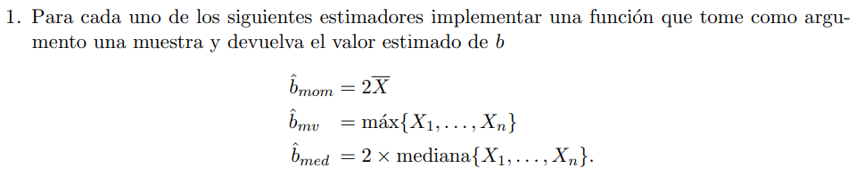
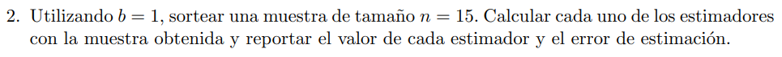
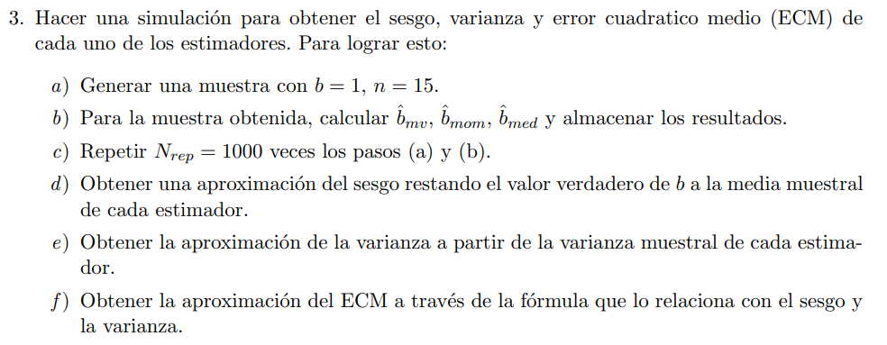
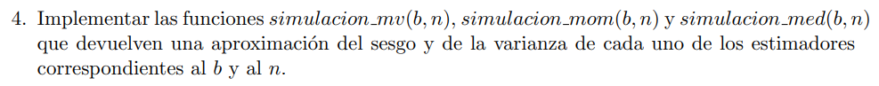
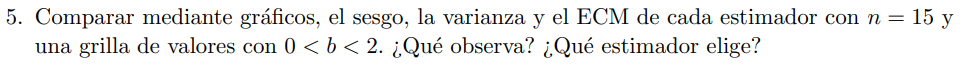
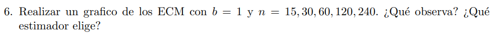
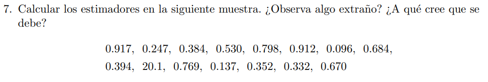
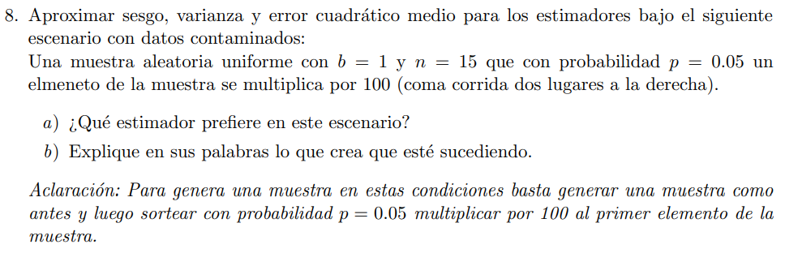

<br><br><br><br><br><br><br><br>

<h1 style="text-align: center;">

**INFERENCIA ESTADISTICA**

</h1>

<h2 style="text-align: center;">

Trabajo práctico Nº 1

</h2>

<br><br>

<h3 style="text-align: left;">

INTEGRANTES:

-   Dominutti, Nicolás

-   Suarez Gurruchaga, Carlos R.

-   Telechea, Hernán

</h3>

<br>  <br><br><br><br>

------------------------------------------------------------------------

<br><br>

<h2>

Enunciado en común para todos los puntos:

</h2>

Sean X1, . . . , Xn una muestra aleatoria con distribución U[0, b] con b
un parámetro desconocido.

------------------------------------------------------------------------

<br><br>

<h2>

Punto 1

</h2>



```{r}
set.seed(123)
```

```{r}
b_momento <- function(muestra) {
  return(2 * mean(muestra))
}

b_MV <- function(muestra) {
  return(max(muestra))
}

b_mediana <- function(muestra) {
  return(2 * median(muestra))
}
```

## <br>

<br>

<h2>

Punto 2

</h2>



```{r}
uniform <- runif(n = 15, min = 0, max = 1)

print(paste0("El resultado del estimador de momentos es: ", round(b_momento(uniform), 2), " con un error de estimacion de : ", round(b_momento(uniform) - 1, 2)))
      
print(paste0("El resultado del estimador de MV es: ", round(b_MV(uniform), 2), " con un error de estimacion de : ", round(b_MV(uniform) - 1,2), 2))

print(paste0("El resultado del estimador mediana es: ", round(b_mediana(uniform),2), " con un error de estimacion de : ", round(b_mediana(uniform) - 1, 2)))
```

## <br>

<br>

<h2>

Punto 3

</h2>



```{r}

b = 1

bmv  <- replicate(1000, b_MV(runif(n = 15, min = 0, max = b)))
bmom <- replicate(1000, b_momento(runif(n = 15, min = 0, max = b)))
bmed <- replicate(1000, b_mediana(runif(n = 15, min = 0, max = b)))

sesgo_bmv  <- mean(bmv)  - b
print(paste0('El sesgo de MV es:', round(sesgo_bmv, 4)))
sesgo_bmom <- mean(bmom) - b 
print(paste0('El sesgo de momentos es:', round(sesgo_bmom, 4)))
sesgo_bmed <- mean(bmed) - b 
print(paste0('El sesgo de mediana es:', round(sesgo_bmed, 4)))

varianza_bmv  <- var(bmv) 
print(paste0('La varianza de MV es:', round(varianza_bmv, 4)))
varianza_bmom <- var(bmom)
print(paste0('La varianza de momentos es:', round(varianza_bmom, 4)))
varianza_bmed <- var(bmed)
print(paste0('La varianza de mediana es:', round(varianza_bmed, 4)))

ECM_bmv  <- varianza_bmv  + sesgo_bmv  ^ 2
print(paste0('El ECM de MV es:', round(ECM_bmv, 4)))
ECM_bmom <- varianza_bmom + sesgo_bmom ^ 2
print(paste0('El ECM de momentos es:', round(ECM_bmom, 4)))
ECM_bmed <- varianza_bmed + sesgo_bmed ^ 2
print(paste0('El ECM de mediana es:', round(ECM_bmed, 4)))

```

## <br>

<br>

<h2>

Punto 4

</h2>



```{r}

simulacion_mv <- function(b = 1, n = 15) {#Estimador de Máxima Verosimilitud sobre 1000 replicaciones de n Uniformes(0,b)
  estimador_b <- replicate(1000, b_MV(runif(n = n, min = 0, max = b)))
  return(c(mean(estimador_b) - b, var(estimador_b)))
}

simulacion_med <- function(b = 1, n = 15) {#Estimador de mediana sobre 1000 replicaciones de n Uniformes(0,b)
  estimador_b <- replicate(1000, b_mediana(runif(n = n, min = 0, max = b)))
  return(c(mean(estimador_b) - b, var(estimador_b)))
}

simulacion_mom <- function(b = 1, n = 15) {#Estimador de momentos sobre 1000 replicaciones de n Uniformes(0,b)
  estimador_b <- replicate(1000, b_momento(runif(n = n, min = 0, max = b)))
  return(c(mean(estimador_b) - b, var(estimador_b)))
}

```

## <br>

<br>

<h2>

Punto 5

</h2>



```{r}
b <- seq(0.1, 1.9, by=0.1) #0<x<2
n <- 15
cont = 1 
sesgo_to_plot_mv <- c(); sesgo_to_plot_med <- c(); sesgo_to_plot_mom <- c()
varianza_to_plot_mv <- c(); varianza_to_plot_med <- c(); varianza_to_plot_mom <- c()

for (i in b) {
  sesgo_to_plot_mv[cont]  <- simulacion_mv (b = i ,n = n)[1]
  sesgo_to_plot_med[cont] <- simulacion_med(b = i ,n = n)[1]
  sesgo_to_plot_mom[cont] <- simulacion_mom(b = i ,n = n)[1]
  varianza_to_plot_mv[cont] <- simulacion_mv (b = i ,n = n)[2]
  varianza_to_plot_med[cont] <- simulacion_med(b = i ,n = n)[2]
  varianza_to_plot_mom[cont] <- simulacion_mom(b = i ,n = n)[2]
  cont = cont+1
}
ECM_to_plot_mv  <- varianza_to_plot_mv + (sesgo_to_plot_mv ^ 2)
ECM_to_plot_med <- varianza_to_plot_med + (sesgo_to_plot_med^ 2)
ECM_to_plot_mom <- varianza_to_plot_mom + (sesgo_to_plot_mom^ 2)


# Grafico del sesgo
plot(y = sesgo_to_plot_mv,
     x = seq(0.1, 1.9, 0.1) , col = "green", 
     type = "l", lwd = 1, 
     ylab = "SESGO COMETIDO", main = "SESGO",
     xlab = "VALORES DE b A ESTIMAR",
     ylim = c(-0.2, 0.2))
lines(y = sesgo_to_plot_mom, x = seq(0.1, 1.9, 0.1), col = "blue",
       lwd = 1)
lines(y = sesgo_to_plot_med, x = seq(0.1, 1.9, 0.1), col = "red",
   lwd = 1)
legend("topright", c("ESTIMADOR DE MVS", "USANDO MEDIANA", "ESTIMADOR DE MOMENTO"),
                  fill = c("green", "red", "blue"), cex = 0.8)


# Grafico de la varianza
plot(y = varianza_to_plot_mv,
     x = seq(0.1, 1.9, 0.1) , col = "green", 
     type = "l", lwd = 1, 
     ylab = "VARIANZA COMETIDA", main = "VARIANZA",
     xlab = "VALORES DE b A ESTIMAR",
     ylim = c(0, 0.3))
lines(y = varianza_to_plot_mom, 
      x = seq(0.1, 1.9, 0.1), 
      col = "blue",
      lwd = 1)
lines(y = varianza_to_plot_med, 
      x = seq(0.1, 1.9, 0.1), col = "red",
      lwd = 1)
legend("topright", 
       c("ESTIMADOR DE MVS", "USANDO MEDIANA", "ESTIMADOR DE MOMENTO"),
      fill = c("green", "red", "blue"), cex = 0.8)


# Grafico del Error cuadratico medio
plot(y = ECM_to_plot_mv,
     x = seq(0.1, 1.9, 0.1) , col = "green", 
     type = "l", lwd = 1, 
     ylab = "ERROR COMETIDO", main = "ERROR CUADRATICO MEDIO (ECM)",
     xlab = "VALORES DE b A ESTIMAR",
     ylim = c(0, 0.3))
lines(y = ECM_to_plot_mom, 
      x = seq(0.1, 1.9, 0.1), col = "blue",
      lwd = 1)
lines(y = ECM_to_plot_med, 
      x = seq(0.1, 1.9, 0.1), col = "red",
      lwd = 1)
legend("topright", 
       c("ESTIMADOR DE MVS", "USANDO MEDIANA", "ESTIMADOR DE MOMENTO"),
       fill = c("green", "red", "blue"), cex = 0.8)
```

Respecto al sesgo, podemos decir que el estimador mas sesgado es el EMV,
mientras que los otros dos metodos de estimacion (momentos y mediana),
rondan valores mas cercanos a cero. Respecto a la varianza, vemos que el
metodo que presenta la mayor varianza es el que utiliza la mediana, y a
medidad que aumenta el valor a estimar de b, la varianza del estimador
de b, aumenta, para todos los metodos. El metodo que presenta la menor
varianza es el de MVS. Sobre el ECM, vemos que el metodo para estimar b
que menor ECM presenta es el de MVS, y a medida que voy aumentando el
valor de b, el ECM de todos los metodos crece. Por lo mencionado
previamente, es que utilizariamos el metodo que usa el valor maximo para
el calculo del estimador de b, esto es metodo de maxima verosimilitud.

## <br>

<br>

<h2>

Punto 6

</h2>



```{r}
ECM_to_plot_mv <- c(); ECM_to_plot_med <- c(); ECM_to_plot_mom <- c()
cont <- 1
n <- c(15, 30, 60, 120, 240)

for (j in n) {
  valores_mv  = simulacion_mv(b=1, n=j)
  valores_mom = simulacion_mom(b=1, n=j)
  valores_med = simulacion_med(b=1, n=j)
  ECM_to_plot_mv [cont] <- valores_mv[2]  + (valores_mv[1])  ^ 2
  ECM_to_plot_med[cont] <- valores_med[2] + (valores_med[1]) ^ 2
  ECM_to_plot_mom[cont] <- valores_mom[2] + (valores_mom[1]) ^ 2
  cont = cont + 1
}
# Grafico del Error cuadratico medio
plot(y = ECM_to_plot_mv,
     x = c(15, 30, 60, 120, 240) , col = "green", 
     type = "l", lwd = 1, 
     ylab = "ERROR COMETIDO", main = "ERROR CUADRATICO MEDIO (ECM)",
     xlab = "VALORES DE MUESTRA 'n'",
     ylim = c(0, 0.06))
lines(y = ECM_to_plot_mom, 
      x = c(15, 30, 60, 120, 240), col = "blue",
      lwd = 1)
lines(y = ECM_to_plot_med, 
      x = c(15, 30, 60, 120, 240), col = "red",
      lwd = 1)
legend("topright", 
       c("ESTIMADOR DE MVS", "USANDO MEDIANA", "ESTIMADOR DE MOMENTO"),
       fill = c("green", "red", "blue"), cex = 0.8)
```

Observamos que el metodo que presenta el mayor ECM para estimar el
parametro b, sigue siendo el que utiliza la mediana. Tambien observamos
que a medida que aumenta el valor de la muestra "n", el ECM, disminuye.
El calculo del estimador a partir del valor maximo, sigue siendo el que
menor ECM presenta, por lo cual repetiriamos la eleccion. <br> --- <br>

<h2>

Punto 7

</h2>



```{r}
muestra_2 <- c(0.917, 0.247, 0.384, 0.530, 0.798, 
               0.912, 0.096, 0.684, 0.394, 20.1, 
               0.769, 0.137, 0.352, 0.332, 0.670)

b_MV(muestra_2)
b_momento(muestra_2)
b_mediana(muestra_2)
```

Si, dan valores muy distintos, especialmente el metodo que utiliza el
valor maximo. Esto se debe a la gran varianza que hay en los valores que
posee la muestra, el metodo del maximo, se enfoca en el valor 20.1, el
cual es muy distinto a los demas valores de la misma. En menor medida,
pero el mismo problema ocurre con el metodo que utiliza el valor
promedio para estimar el parametro b. El mejor metodo para estimarlo, es
el que utiliza la mediana, ya que no es sensible a este valor extremo,
que se encuentra tan alejado de los demas (outlier). <br> --- <br>

<h2>

Punto 8

</h2>



```{r}
dame_muestra_contaminada = function() {
    muestra = runif(n = 15, min = 0, max = 1)
  if (rbinom(n = 1, size = 1, prob = 0.05)) {
    muestra[1] = muestra[1] * 100
    }
  return(muestra)  
}

simulacion_mv_2 <- function() {
  estimador_b <- replicate(4000, b_MV(dame_muestra_contaminada()))
  return(c(mean(estimador_b) - 1, var(estimador_b)))
}

simulacion_med_2 <- function() {
  estimador_b <- replicate(4000, b_mediana(dame_muestra_contaminada()))
  return(c(mean(estimador_b) - 1, var(estimador_b)))
}

simulacion_mom_2 <- function() {
  estimador_b <- replicate(4000, b_momento(dame_muestra_contaminada()))
  return(c(mean(estimador_b) - 1, var(estimador_b)))
}

sesgo_mvs    = simulacion_mv_2()[1]
varianza_mvs = simulacion_mv_2()[2]
ECM_mvs      = varianza_mvs + sesgo_mvs ^ 2
sesgo_med    = simulacion_med_2()[1]
varianza_med = simulacion_med_2()[2]
ECM_med      = varianza_med + sesgo_med ^ 2
sesgo_mom    = simulacion_mom_2()[1]
varianza_mom = simulacion_mom_2()[2]
ECM_mom      = varianza_mom + sesgo_mom ^ 2


print("ESTIMANDO CON MVS")
print(paste("Los valores de SESGO, VARIANZA Y ECM, son: ", round(sesgo_mvs, 4), round(varianza_mvs, 4), round(ECM_mvs, 4), sep = " "))
print("USANDO LA MEDIANA")
print(paste("Los valores de SESGO, VARIANZA Y ECM, son: ",round(sesgo_med, 4), round(varianza_med, 4), round(ECM_med, 4), sep = " "))
print("ESTIMANDO CON EL METODO DE MOMENTOS")
print(paste("Los valores de SESGO, VARIANZA Y ECM, son: ",round(sesgo_mom, 4), round(varianza_mom, 4), round(ECM_mom, 4), sep  = " "))
```

<ul>

<li>

8a) En este escenario, el metodo que menor ECM tiene, es el que utiliza
la mediana, por lo que optariamos por elegir esa forma de estimar el
indicador.

</li>

<li>

8b) Lo que sucede aqui, es que al meter nosotros la muestra contaminada,
la misma afecta principalmente al metodo de MVS, ya que utiliza el valor
maximo para calcular el indicador, y en siguiente medida al metodo de
momentos, que utiliza el valor promedio. Podemos ver como este valor
contaminado nos aumenta considerablemente la varianza del estimador.
Diferente es la situacion con el metodo queutiliza la mediana de la
muestra, para calcular el indicador, ya que le es indistinto, el valor
contaminado que recibe para calcular el estimador, y es por esto que su
ECM es el mas bajo.

</li>

</ul>
