<br><br><br><br><br><br><br><br>

<h1 style="text-align: center;">

**INFERENCIA ESTADISTICA**

</h1>

<h2 style="text-align: center;">

Trabajo práctico Nº 2

</h2>

<br><br>

<h3 style="text-align: left;">

INTEGRANTES:

-   Dominutti, Nicolás

-   Suarez Gurruchaga, Carlos R.

-   Telechea, Hernán

</h3>

<br>  <br><br><br><br>

------------------------------------------------------------------------

<br><br>

```{r}
set.seed(123)
```

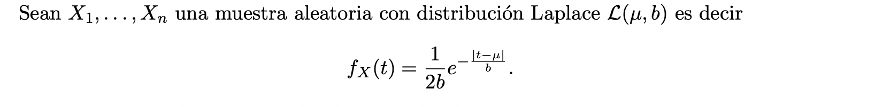

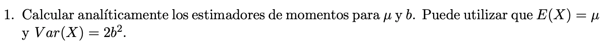

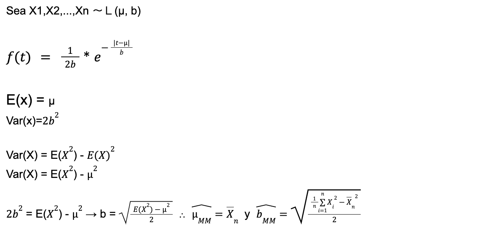

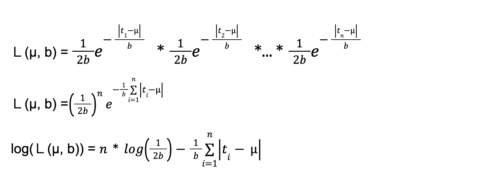](imagenes/ej2.png)


```{r}
estimador_momentos <- function(muestra) {
  n = length(muestra)
  segundo_momento = (1/n) * sum(muestra ^ 2)
  b = sqrt((segundo_momento - (mean(muestra, na.rm = T) ^ 2)) / 2)
  return(c(mean(muestra, na.rm = T), b))
}
```

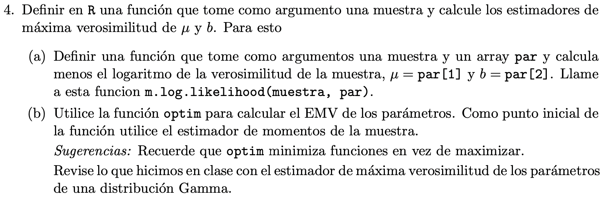

```{r}
m.log.likelihood <- function(muestra, par) {
  mu = par[1]
  b = par[2]
  n = length(muestra)
  
  - (n * log(1 / (2 * b)) - ((1/b) * sum(abs(muestra - mu))))
}

# m.log.likelihood(muestra$x, estimador_momentos(muestra$x))

EMV = function(muestra){ #optim necesita un punto inicial. Usamos el estimador de momentos
  optim(par = estimador_momentos(muestra), 
        fn = m.log.likelihood, 
        muestra = muestra) $par  
}
```

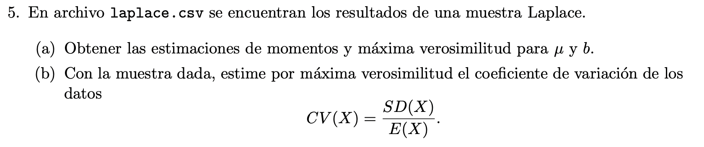

5 a)

```{r}
muestra <- read.csv("~/Desktop/UDESA/003_inferencia_estadistica/trabajo_practico_2/laplace.csv", sep="")

# head(muestra)

print(paste("La estimacion por el metodo de momentos, arroja un mu =",
            round(estimador_momentos(muestra$x)[1], 3), "y b =",
            round(estimador_momentos(muestra$x)[2], 3), sep = " "))

print(paste("La estimacion por el metodo de maxima verosimilitud, arroja un mu =",
            round(EMV(muestra$x)[1], 3), "y b =", round(EMV(muestra$x)[2], 3), 
            sep = " "))

```

5 b)

```{r}
(CV_MV <- sqrt(2 * (EMV(muestra$x)[2]) ^ 2) / EMV(muestra$x)[1])
```


```{r}
# USANDO MV PARA CALCULAR EL INTERVALO
estimador_desvio <- sd(muestra$x) 
lim_inferior <- mean(muestra$x) - 1.96 * estimador_desvio/sqrt(length(muestra$x))
lim_superior <- mean(muestra$x) + 1.96 * estimador_desvio/sqrt(length(muestra$x))

print(paste("Utilizando un nivel de confianza del 95%, nos queda un intervalo de confianza para la media {",round(lim_inferior, 3), round(lim_superior, 3),"}", sep = " "))
```

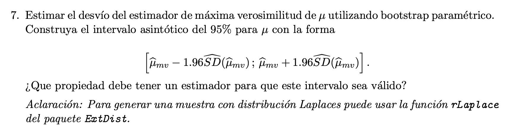

En bootstrap parametrico, yo conozco la funcion de densidad de mi
estimador, y con ella creo muestras bootstrap, para estimar diferentes
parametros de mi estimador.

```{r}
library(VGAM)

b_mv  <- EMV(muestra$x)[2]
mu_mv <- EMV(muestra$x)[1]

# Armo 2000 muestras parametricas boot, a partir de los parametros estimados
# con maxima verosimilitud y mi funcion de distribucion conocida.
# Luego, estimo de cada muestra, el valor de mu, a partir de MV.
vector_mu_boot_parametrico <- replicate(2000, EMV(rlaplace(n = 30, 
                                                    location = mu_mv, 
                                                    scale = b_mv))[1])

# Ahora, calculo los parametros de mi estimador

# Estimo el mu
estimador_mu_boot_param <- mean(vector_mu_boot_parametrico)
# Estimo el desvio del estimador
estimador_desvio_boot_param <- sd(vector_mu_boot_parametrico)


lim_inferior_boot_param <- (EMV(muestra$x)[1] - 1.96 * estimador_desvio_boot_param)
lim_superior_boot_param <- (EMV(muestra$x)[1] + 1.96 * estimador_desvio_boot_param)

print(paste("Utilizando un nivel de confianza del 95%, y el metodo de BOOTSTRAP PARAMETRICO, nos queda un intervalo de confianza para la media {",round(lim_inferior_boot_param, 3), round(lim_superior_boot_param, 3),"}", sep = " "))
```

**Para que este intervalo sea valido, el estimador debe poseer la
propiedad de INVARIANZA, que es el caso del estimador de MAXIMA
VEROSIMILITUD.**

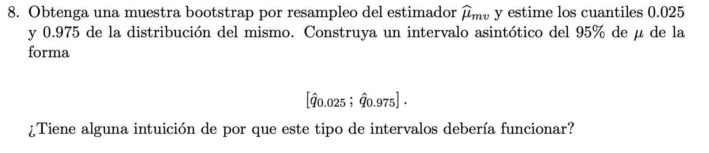

En bootstrap de resampleo, yo no conozco la funcion de densidad de mi
estimador, pero tengo una muestra con la distribucion de mi estimador, y
con ella creo muestras bootstrap, sampleando con reposicion la muestra
que poseo, y a partir de esas muestras bootstrap, intento estimar
diferentes parametros de mi estimador.

```{r}
# Creo mis muestras boot, a partir de la muestra original y un sampleo con
# reposicion, luego calculo a partir de mi estimador de MV, el valor de mu_boot
# por resampleo
vector_mu_boot_resamp <- replicate(5000, EMV(sample(x = muestra$x, 
                                                      size = 30, 
                                                      replace = T))[1])


lim_inferior_boot_resamp <- quantile(x = vector_mu_boot_resamp, probs = 0.025)
lim_superior_boot_resamp <- quantile(x = vector_mu_boot_resamp, probs = 0.975)

print(paste("Utilizando un nivel de confianza del 95%, y el metodo de BOOTSTRAP POR RESAMPLEO, nos queda un intervalo de confianza para la media {",round(lim_inferior_boot_resamp, 3), round(lim_superior_boot_resamp, 3),"}", sep = " "))
```

**Este metodo para generar intervalos de confianza, deberia funcionar,
ya que a partir de la muestra, intento estimar la distribucion que
genero mi muestra en primer lugar. La muestra que utilizamos para
estimar la distribucion, tiene contenida la varianza y la media de mi
distribucion a estimar, junto con un error propio de ella. No es una
muestra de cualquier distribucion la que utilizamos para generar este
intervalo, utilizamos una muestra que proviene de una cierta
distribucion.**

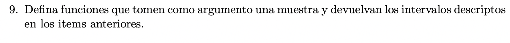

```{r}
dame_intervalo <- function(muestra) {
  estimador_desvio <- sd(muestra) 
  lim_inferior <- mean(muestra) - 1.96 * estimador_desvio/sqrt(length(muestra))
  lim_superior <- mean(muestra) + 1.96 * estimador_desvio/sqrt(length(muestra))
  longitud_int <- 2 * 1.96 * estimador_desvio/sqrt(length(muestra))
  return(c(lim_inferior, lim_superior, longitud_int))
  }


dame_intervalo_boot_parametrico <- function(muestra) {
  b_mv  <- EMV(muestra)[2]
  mu_mv <- EMV(muestra)[1]
  
  # Armo 2000 muestras parametricas boot, a partir de los parametros estimados
  # con maxima verosimilitud
   vector_mu_boot_parametrico <- replicate(2000, EMV(rlaplace(n = 30, 
                                                      location = mu_mv, 
                                                      scale = b_mv))[1])
  
  # Ahora, calculo los parametros de mi estimador

  # Estimo el desvio del estimador
  estimador_desvio_boot_param <- sd(vector_mu_boot_parametrico)
  
  
  lim_inferior_boot_param <- (EMV(muestra)[1] - 1.96 * estimador_desvio_boot_param)
  lim_superior_boot_param <- (EMV(muestra)[1] + 1.96 * estimador_desvio_boot_param)
  longitud_int <- 2 * 1.96 * estimador_desvio_boot_param
  
  return(c(lim_inferior_boot_param, lim_superior_boot_param, longitud_int))
  }


dame_intervalo_boot_resampleo <- function(muestra){
    vector_mu_boot_resamp <- replicate(2000, EMV(sample(x = muestra, 
                                                          size = 30, 
                                                          replace = T))[1])
    
    # Ahora, calculo los parametros de mi estimador
    estimador_desvio_boot_resamp <- sd(vector_mu_boot_resamp)
    
    
lim_inferior_boot_resamp <- quantile(x = vector_mu_boot_resamp, 
                                     probs = 0.025)
lim_superior_boot_resamp <- quantile(x = vector_mu_boot_resamp, 
                                     probs = 0.975)

longitud_int <- abs(lim_superior_boot_resamp - lim_inferior_boot_resamp)

    return(c(lim_inferior_boot_resamp, lim_superior_boot_resamp, longitud_int))
 }

```

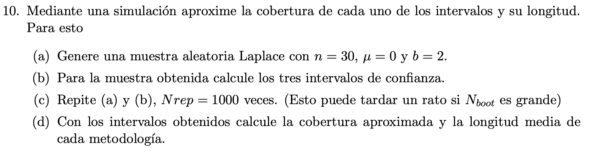

```{r}
cobertura <- c(); cobertura_boot_parametrico <- c(); cobertura_boot_resampleo <- c(); longitud_1 <- c(); longitud_2 <- c(); longitud_3 <- c()

mu = 0

for(i in 1:1000) {

  muestra_testeo <- rlaplace(n = 30,
                             location = mu,
                             scale = 2)


  cobertura[i] = (mu > dame_intervalo(muestra_testeo)[1]) &
                 (mu < dame_intervalo(muestra_testeo)[2])

  longitud_1[i] <- dame_intervalo(muestra_testeo)[3]

  cobertura_boot_parametrico[i] = (mu > dame_intervalo_boot_parametrico(muestra_testeo)[1]) &
                                  (mu < dame_intervalo_boot_parametrico(muestra_testeo)[2])

  longitud_2[i] <- dame_intervalo_boot_parametrico(muestra_testeo)[3]


  cobertura_boot_resampleo[i]   = (mu > dame_intervalo_boot_resampleo(muestra_testeo)[1]) &
                                  (mu < dame_intervalo_boot_resampleo(muestra_testeo)[2])

  longitud_3[i] <- dame_intervalo_boot_resampleo(muestra_testeo)[3]
}

print(paste("Utilizando un 95% de nivel de confianza, y el metodo 'usual', la cobertura, la estimamos en",mean(cobertura), "y la longitud media del intervalo de confianza en",round(mean(longitud_1), 3), sep = " "))


print(paste("Utilizando un 95% de nivel de confianza, y el metodo BOOTSTRAP PARAMETRICO, la cobertura, la estimamos en", mean(cobertura_boot_parametrico), "y la longitud media del intervalo de confianza en", round(mean(longitud_2), 3), sep = " "))


print(paste("Utilizando un 95% de nivel de confianza, y el metodo BOOTSTRAP POR RESAMPLEO, la cobertura, la estimamos en", mean(cobertura_boot_resampleo), "y la longitud media del intervalo de confianza en", round(mean(longitud_3), 3), sep = " "))
```

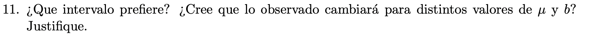 **En este caso, donde tenemos la posibilidad de
conocer la funcion de densidad de la distribucion de nuestro estimador,
preferimos el metodo de BOOTSTRAP PARAMETRICO, ya que es el metodo que
me devuelve el intervalo de confianza mas pequeño.**

**No, independientemente de los valores de los parametros a estimar, el
intervalo mas pequeño, seguira siendo el generado con BOOTSTRAP
PARAMETRICO, luego seguira el de BOOTSTRAP POR RESAMPLEO y por ultimo el
metodo "Convencional", esto se debe a la cantidad de suposiciones que
debe tomar cada metodo a costo de contar con mas o menos informacion,
para resolver la estimacion del parametro.**
