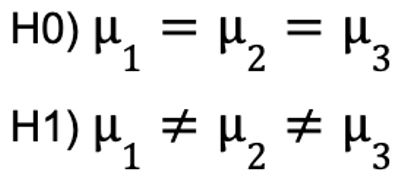

<br><br><br><br><br><br>

<h1 style="text-align: center;">

**INFERENCIA ESTADISTICA**

</h1>

<h2 style="text-align: center;">

Trabajo práctico Final

</h2>

<br><br>

<h3 style="text-align: center;">

INTEGRANTES

Dominutti, Nicolás

Suarez Gurruchaga, Carlos R.

Telechea, Hernán

</h3>

<br>  <br><br>

------------------------------------------------------------------------

<br><br>

```{r setup, include=FALSE}
knitr::opts_chunk$set(echo = TRUE)
```

```{r, echo=FALSE}
set.seed(999)
```


Se quiere testear si los tres grupos de estudio, comparten la misma media, o si alguna de ellas, es distinta. Para esto, consideramos como **hipotesis nula** al caso donde todas las medias comparten su valor y como **hipotesis alternativa** el caso donde almenos una de ellas, no lo hace.

{width="117"}

### Definimos algunas funciones

```{r}
## experimentación anova

escenario1 = function(mus, J, desvio1 = sqrt(3), desvio2 = sqrt(3),
                      desvio3 = sqrt(3)){
  
  grupos = cbind(mus[1] + rnorm(J, 0, desvio1), 
                 mus[2] + rnorm(J, 0, desvio2),
                 mus[3] + rnorm(J, 0, desvio3))
}

SStot = function(muestra){
  sum((muestra - mean(muestra))^2)
}

SSw = function(muestra){
  sum(apply(muestra, 2, SStot))
}

SSb = function(muestra){
  J = nrow(muestra)
  media_tot = mean(muestra)
  J*(sum((colMeans(muestra) - media_tot)^2 ))
}


ploteame <- function(y1, y2=NULL, y3=NULL, x, posicion = "topleft",
                     xlab, ylab, main=NULL, l1=NULL, l2=NULL, l3=NULL,
                     col1 = "red", col2 = "blue", col3 = "green",
                     ylim = NULL, xaxp = NULL,
                     yaxp = NULL) {#Función que plotea 3 gráficos
  plot(y = y1, x = x, 
                     xlab = xlab, col = col1, type = "l",
                     ylab = ylab,
                     main = main,
                     ylim = ylim,
                     lwd = 2,
                     xaxp = xaxp,
                     yaxp = yaxp)

  if (is.numeric(y2)) {
    lines(x = x, lwd = 2,
        y = y2, col = col2)

    lines(x = x, lwd = 2,
        y = y3, col = col3)
    }

  legend(posicion,
       c(l1, l2, l3),
       fill = c(col1, col2, col3), cex = 0.8)
}
```
<br><br>


```{r}
muestra = escenario1(mus = c(0, 0, 0), J = 20)
```
<br><br>


```{r}
round(SStot(muestra), 3) == round(SSw(muestra) + SSb(muestra), 3)
```
<br><br>


```{r}
# Creamos una funcion que calcula el Fcritico y el Fobservado, y devuelve
# True, en caso de rechazar H0 o False en caso de no tener evidencia suficiente
# para rechazarla.
rechazaHO <- function (muestra) {
  F_critico <- qf(p = 0.9, 
                  df1 = ncol(muestra) - 1, 
                  df2 = 3 * (nrow(muestra) - 1))
  
  F_observado <- (SSb(muestra) * ncol(muestra) * (nrow(muestra) - 1)) / 
                 ((ncol(muestra) - 1) * SSw(muestra))
  
  return(F_observado >= F_critico)
}
```
<br>

------------------------------------------------------------------------

<br>


```{r}

(proporcion_rechazos_h0 <- mean(replicate(1000, rechazaHO(escenario1(mus = c(0, 0, 0), J = 20, desvio1 = sqrt(1), desvio2 = sqrt(1), desvio3 = sqrt(1))))))

```
<br><br>


```{r}
escenario2 <- function (medias, J) {
  grupos = cbind(medias[1] + runif(n = J, min = -3, max = 3), 
                 medias[2] + runif(n = J, min = -3, max = 3),
                 medias[3] + runif(n = J, min = -3, max = 3))
  return(grupos)
  }
```
<br><br>


```{r}
escenario3 <- function (medias, J) {
  grupos = cbind(medias[1] + rt(n = J, df = 3), 
                 medias[2] + rt(n = J, df = 3),
                 medias[3] + rt(n = J, df = 3))
  return(grupos)
  }
```
<br><br>


```{r}
proporcion_rechazos_h0_error_normal <- function(medias, J) {
  return(mean(replicate(1000, rechazaHO(escenario1(medias, J, desvio1=sqrt(1) 
                                                      , desvio2=sqrt(1),desvio3=sqrt(1))))))
 }

proporcion_rechazos_h0_error_unif <- function(medias, J) {
  return(mean(replicate(1000, rechazaHO(escenario2(medias, J)))))
 }


proporcion_rechazos_h0_error_t <- function(medias, J) {
  return(mean(replicate(1000, rechazaHO(escenario3(medias, J)))))
 }
```
<br><br>


```{r}
c = 1
vector_nivel_error_normal <- c()
vector_nivel_error_unif <- c()
vector_nivel_error_t <- c()

for(n_obs in seq(3, 30, by = 3)) {
  vector_nivel_error_normal[c] <- proporcion_rechazos_h0_error_normal(c(0, 0, 0),n_obs)
  vector_nivel_error_unif[c] <- proporcion_rechazos_h0_error_unif(c(0, 0, 0),
                                                                 n_obs)
  vector_nivel_error_t[c] <- proporcion_rechazos_h0_error_t(c(0, 0, 0), n_obs)

  c = c + 1
 }

vector_nivel_error_normal
vector_nivel_error_unif
vector_nivel_error_t
```
<br><br>


```{r}
c = 1; vect_potencia_error_normal <- c(); vect_potencia_error_unif <- c(); 
vect_potencia_error_t <- c()

for (mu3 in seq(0, 2, 0.25)) {
  vect_potencia_error_normal[c] <- proporcion_rechazos_h0_error_normal(c(0, 0, mu3), 20)
  vect_potencia_error_unif[c] <- proporcion_rechazos_h0_error_unif(c(0, 0, mu3), 20)
  vect_potencia_error_t[c] <- proporcion_rechazos_h0_error_t(c(0, 0, mu3), 20)
  c <- c + 1
 }
 
ploteame(y1 = vect_potencia_error_normal, y2 = vect_potencia_error_unif, 
         y3 = vect_potencia_error_t, x = seq(0, 2, 0.25), 
         xlab = "VALOR DE mu3 VERDADERO", 
         ylab = "POTENCIA CALCULADA EMPIRICAMENTE", 
         main = "POTENCIA ANOVA CON DISTINTAS DISTRIBUCIONES DE ERRORES", 
         l1 = "POTENCIA ERROR NORMAL", l2 = "POTENCIA ERROR UNIF", 
         l3 = "POTENCIA ERROR t")

abline(h = 1, col = "brown", lty = 5, lwd = 1)
```
<br><br>


Observamos que independientemente de la distribucion que tengan nuestros errores, a medida que el mu3 verdadero, se aleja del valor 0 (hipotesis nula), la potencia del ANOVA, aumenta. Esto es, "al test, le cuesta menos darse cuenta cuando rechazar H0, siendo esta FALSA". Respecto a la importancia del **supuesto de normalidad** en los errores, vemos como el ANOVA que posee un marcado mejor desempeño, es el que tiene una distribucion NORMAL en sus errores. Respecto al nivel de significancia, no vemos que el tipo de distribucion lo afecte.
<br>

------------------------------------------------------------------------

<br>


```{r}
escenario4 <- function (medias, desvios) {
  grupos = cbind(medias[1] + rnorm(n = 20, mean = 0, sd = desvios[1]), 
                 medias[2] + rnorm(n = 20, mean = 0, sd = desvios[2]),
                 medias[3] + rnorm(n = 20, mean = 0, sd = desvios[3]))
  return(grupos)
}
```
<br><br>


```{r}
prop_rech_h0_homocedasticidad <- function(medias, desvios) {
  return(mean(replicate(1000, rechazaHO(escenario4(medias, desvios)))))
 }
```
<br><br>


```{r}
prop_rech_h0_homocedasticidad(medias = c(0, 0, 0), 
                                        desvios = c(1, 1, 1.5))
```
<br><br>


```{r}
c <- 1; vect_nivel_test <- c()

for(desvio_3 in seq(1, 3, 0.25)) {
  vect_nivel_test[c] <- prop_rech_h0_homocedasticidad(medias = c(0, 0, 0), 
                                        desvios = c(1, 1, desvio_3))
  c <- c + 1
}


ploteame(y1 = vect_nivel_test, x = seq(1, 3, 0.25), xlab = "VALOR DEL DESVIO",
         ylab = "NIVEL EMPIRICO DEL TEST", 
         main = "NIVEL DEL TEST ANOVA SIN CUMPLIR HOMOCEDASTISIDAD", 
         l1 = "NIVEL EMPIRICO DEL TEST", l2 = "NIVEL TEORICO DEL TEST",
         ylim = c(0.08, 0.14))

abline(h = 0.1, col = "blue", lty = 2, lwd = 2)
```
<br><br>


```{r}
c = 1; vect_potencia_heterocedasticidad <- c()

for (mu3 in seq(0, 2, 0.25)) {
  vect_potencia_heterocedasticidad[c] <- prop_rech_h0_homocedasticidad(medias = c(0, 0, mu3), 
                                                                                 desvios = c(1, 1, 1.5))
  c <- c + 1
 }

ploteame(y1 = vect_potencia_heterocedasticidad, 
         x = seq(0, 2, 0.25), 
         xlab = "VALOR DE mu3 VERDADERO",
         ylab = "POTENCIA EMPIRICA DEL TEST", 
         main = "POTENCIA DEL TEST ANOVA SIN CUMPLIR HOMOCEDASTISIDAD",
         l1 = "POTENCIA EMPIRICA DEL TEST")

abline(h = 1, col = "brown", lty = 5, lwd = 1)

```
<br><br>


Otra vez observamos que, a medida que el mu3 verdadero, se aleja del valor 0 (valor que poseen mu1 y mu2), la potencia del ANOVA, aumenta. <br> Respecto a la importancia del **supuesto de homocedasticidad**, observamos que parece no afectar, pero esto puede deberse al aumento de nuestro valor alfa, como vimos que ocurria en el item 15), con lo cual, si bien nuestra potencia, no pareciera afectarse con esta heterocedastisidad, al tener un alfa mayor, estamos aumentando los rechazos de hipotesis nulas, que en realidad son verdaderas. Vamos a aumentar aun mas la heterocedastisidad de los errores de nuestra muestra, a ver que ocurre con la potencia.

```{r}
c <- 1; vect_nivel_test <- c()

for(desvio_3 in seq(1, 6, 1)) {
  vect_nivel_test[c] <- prop_rech_h0_homocedasticidad(medias = c(0, 0, 0), 
                                        desvios = c(1, 1, desvio_3))
  c <- c + 1
}


ploteame(y1 = vect_nivel_test, x = seq(1, 6, 1), xlab = "VALOR DEL DESVIO",
         ylab = "NIVEL EMPIRICO DEL TEST", 
         main = "NIVEL DEL TEST ANOVA SIN CUMPLIR HOMOCEDASTISIDAD", 
         l1 = "NIVEL EMPIRICO DEL TEST", l2 = "NIVEL TEORICO DEL TEST",
         ylim = c(0.095, 0.140) )

abline(h = 0.1, col = "blue", lty = 2, lwd = 2)
```

Observamos como continua la tendencia a aumentar en el valor de alfa (nivel empirico del test), a medida que aumentamos la HETEROCEDASTISIDAD de los errores.

```{r}
c = 1; vect_potencia_heterocedasticidad_2 <- c()
for (mu3 in seq(0, 2, 0.25)) {
  vect_potencia_heterocedasticidad_2[c] <- prop_rech_h0_homocedasticidad(medias = c(0, 0, mu3), 
                                                                       desvios = c(1, 1, 6))
  c <- c + 1
 }

ploteame(y1 = vect_potencia_heterocedasticidad_2, 
         x = seq(0, 2, 0.25), 
         xlab = "VALOR DE mu3 VERDADERO",
         ylab = "POTENCIA EMPIRICA DEL TEST", 
         main = "POTENCIA DEL TEST ANOVA SIN CUMPLIR HOMOCEDASTISIDAD",
         l1 = "POTENCIA EMPIRICA DEL TEST CON sd3, SEIS VECES sd1 y sd2")

```

Respecto a la potencia del ANOVA, podemos observar una caida de aproximadamente el 50%, al aumentar la heterocedastisidad. Con esto comprobamos que el **supuesto de homocedasticidad**, cobra GRAN RELEVANCIA, cuando los valores de heterocedasticidad de los errores son ALTOS. En los casos donde la heterocedastisidad es pequeña, no afecta en gran medida a la potencia del test, pero debe tenerse en cuenta que nuestro error tipo I, aumenta y con eso tendremos mas FALSOS POSITIVOS.
<br>

------------------------------------------------------------------------

<br>


```{r}
escenario5 = function(mus, dep){
  J = 20
  desvio1 = 1
  desvio2 = 1
  desvio3 = 1
  base_err = rnorm(J, 0, sd = 1)
  
  grupos = cbind(mus[1] + rnorm(J, 0, desvio1*sqrt(1-dep)) + base_err*sqrt(dep),
                 mus[2] + rnorm(J, 0, desvio2*sqrt(1-dep)) + base_err*sqrt(dep),
                 mus[3] + rnorm(J, 0, desvio3*sqrt(1-dep)) + base_err*sqrt(dep))
}
```

La funcion "escenario5":
<ul>
<li> toma como argumento un vector de medias y un numero "dep" entre 0 y 1, que indica el nivel de correlacion de los errores que habrá entre las muestras. </li>
<li> genera una matriz "grupos", la cual se compone de tres vectores que conforman sus columnas.A su vez, cada vector de variables: </li>
<li>
    <ul>
      <li> se crea a partir de una componente que representa la media del grupo, la cual surge del parámetro pasado a la funcion,</li>
      <li> a esto se le suma una componente de error aleatoria con distribucion normal para cada grupo, cuyo desvío se ve directamente afectado por el valor "dep", tomando este el valor 0 cuando dep==1 (esto quiere decir que, a mayor valor de dep, las distribuciones de los errores se van acercando cada vez más a la media, para llegar a no tener varianza y convertirse en un evento determinístico en lugar de aleatorio),</li>
      <li> por ultimo, se encuentra la componente "de correlacion", la cual comparten todos los grupos con la misma distribucion de error normal "base_err". Cuando la variable "dep" toma el valor 0, este termino "de correlacion" se anula y los errores quedan totalmente independientes.</li>
     </ul>
</li>
</ul>
<br><br>


```{r}
proporcion_rechazos_h0_ind <- function(medias, dep) {
  return(mean(replicate(1000, rechazaHO(escenario5(mus = medias, dep = dep)))))
}
```
<br><br>


```{r}
c <- 1; vect_nivel_test_ind <- c()

for(dependencia in seq(0, 1, 0.1)) {
  vect_nivel_test_ind[c] <- proporcion_rechazos_h0_ind(medias = c(0, 0, 0), 
                                                       dep = dependencia)
  c <- c + 1
}

ploteame(y1 = vect_nivel_test_ind, 
         x = seq(0, 1, 0.1), 
         xlab = "PROPORCION DE DEPENDENCIA ENTRE ERRORES",
         ylab = "NIVEL DEL ANOVA", 
         main = "NIVEL EMPIRICO DEL ANOVA SIN SUPUESTO DE INDEPENDENCIA",
         posicion = "right",
         l1 = "NIVEL EMPIRICO ANOVA", 
         l2 = "NIVEL TEORICO DEL TEST",
         l3 = "50% INDEPENDENCIA",
         xaxp = c(0, 1, 5),
         yaxp = c(0, 0.25, 5),
         ylim = c(0, 0.11))

axis(2, at = c(vect_nivel_test_ind[6]), las = 2)
axis(1, at = c(0.5), las = 1)

abline(h = 0.1, col = "blue", lty = 2, lwd = 2)
abline(h = 0, col = "brown", lty = 5, lwd = 1)
segments(x0 = 0.5, y0 = -0.01, x1 = 0.5, 
         y1 = vect_nivel_test_ind[6], lty = 3, lwd = 2, col = "green")
segments(x0 = -0.05, y0 = vect_nivel_test_ind[6], x1 = 0.5, 
         y1 = vect_nivel_test_ind[6], lty = 3, lwd = 2, col = "green")
```

Observamos como a medida que aumenta la correlacion entre los errores, el nivel empirico (probabilidad de error TIPO I) cae, hasta el punto donde se convierte en asíntota de 0.
<br><br>


```{r}
c = 1; vect_potencia_ind <- c()

for (mu3 in seq(0, 2, 0.1)) {
  vect_potencia_ind[c] <- proporcion_rechazos_h0_ind(medias = c(0, 0, mu3), 
                                                     dep = 0.5)
  c <- c + 1
 }


ploteame(y1 = vect_potencia_ind, 
         x = seq(0, 2, 0.1), 
         xlab = "VALOR DE mu3 VERDADERO",
         ylab = "POTENCIA EMPIRICA DEL ANOVA", 
         main = "POTENCIA TEST ANOVA CON INDEPENDENCIA 50% ENTRE ERRORES",
         l1 = "POTENCIA EMPIRICA DEL ANOVA")

abline(h = 1, col = "brown", lty = 5, lwd = 1)
```

Vamos a simular con distintos valores de dependencia, como se comporta la potencia de nuestro test.

```{r}
c = 1; vect_potencia_dep_100 <- c(); vect_potencia_dep_0 <- c()

for (mu3 in seq(0, 2, 0.1)) {
  vect_potencia_dep_100[c] <- proporcion_rechazos_h0_ind(medias = c(0, 0, mu3), 
                                                     dep = 1)

  vect_potencia_dep_0[c] <- proporcion_rechazos_h0_ind(medias = c(0, 0, mu3), 
                                                     dep = 0)
  c <- c + 1
 }

ploteame(y1 = vect_potencia_dep_0, y2 = vect_potencia_ind, 
         y3 = vect_potencia_dep_100, x = seq(0, 2, 0.1), 
         xlab = "VALOR DE mu3 VERDADERO",
         ylab = "POTENCIA EMPIRICA DEL ANOVA", 
         main = "POTENCIAS TESTS ANOVA (DEPENDENCIA 100% / 50% / 0%)",
         l1 = "POTENCIA ANOVA 0% DEPENDENCIA",
         l2 = "POTENCIA ANOVA 50% DEPENDENCIA",
         l3 = "POTENCIA ANOVA 100% DEPENDENCIA",
         col1 = "blue",
         col2 = "red",
         col3 = "green",
         posicion = "right",
         ylim = c(0,1))

abline(h = 1, col = "brown", lty = 5, lwd = 1)
```

Al observar este grafico, podriamos caer en la confusion de que el **supuesto de independencia** de los errores no es relevante, incluso parece que en el caso de un 100% de correlacion nuestro ANOVA llega antes a un valor maximo de potencia del test que con una independencia total. Pero esto es **INCORRECTO**.

Nosotros habiamos observado como al aumentar el grado de correlacion de los errores, nuestro alfa (region de rechazo del estadistico) disminuia, hasta un valor asítota de 0. Entonces podriamos preguntarnos, como es que rechazamos correctamente (POTENCIA), si no tenemos region de rechazo (Alfa ~ 0). Vamos a observar la distribucion de nuestra varianza entre grupos (Ssb), en 4 escenarios:

    - MUESTRAS TOTALMENTE INDEPENDIENTES CON H0 VERDADERA.
    - MUESTRAS TOTALMENTE INDEPENDIENTES CON H0 FALSA.
    - MUESTRAS TOTALMENTE DEPENDIENTES CON H0 VERDADERA.
    - MUESTRAS TOTALMENTE DEPENDIENTES CON HO FALSA.

#### MUESTRAS TOTALMENTE INDEPENDIENTES CON H0 VERDADERA.

```{r}
SSb_vect = c(); SSw_vect = c()
varianza = 1

for(i in 1:1000){
muestra_indep_h0_verdadera = escenario5(mus = c(0, 0, 0), dep = 0)
SSb_vect[i] = SSb(muestra_indep_h0_verdadera)
SSw_vect[i] = SSw(muestra_indep_h0_verdadera)
}

hist(SSb_vect/varianza, freq = F, main = "VARIANZA BETWEEN - MUESTRAS INDEP CON H0 VERDADERA", col = "brown")
points(dchisq(x = min(SSb_vect):max(SSb_vect),
              df = 3-1, ncp = mean(SSb_vect)),
              col = "darkblue",
              pch = 15)
```

#### MUESTRAS TOTALMENTE INDEPENDIENTES CON H0 FALSA.

```{r}
SSb_vect = c();SSw_vect = c()

for(i in 1:1000){
muestra_indep_h0_falsa = escenario5(mus = c(0, 0, 1), dep = 0)
SSb_vect[i] = SSb(muestra_indep_h0_falsa)
SSw_vect[i] = SSw(muestra_indep_h0_falsa)
}


hist(SSb_vect/varianza, freq = F, 
     main = "VARIANZA BETWEEN - MUESTRAS INDEP CON H0 FALSA",
     col = "brown")
points(dchisq(x = min(SSb_vect):max(SSb_vect), 
              df = 3-1, ncp = mean(SSb_vect)), 
       col = "darkblue",
       pch = 15)
```

#### MUESTRAS TOTALMENTE DEPENDIENTES CON H0 VERDADERA

```{r}
SSb_vect = c()

for(i in 1:1000){
muestra_dep_h0_verdadera = escenario5(mus = c(0, 0, 0), dep = 1)
SSb_vect[i] = SSb(muestra_dep_h0_verdadera)
}

hist(SSb_vect/varianza, freq = F, 
     main = "VARIANZA BETWEEN - MUESTRAS DEPEND. H0 VERDADERA",
     col = "brown")
```

#### MUESTRAS TOTALMENTE DEPENDIENTES CON H0 FALSA

```{r}
SSb_vect = c()

for(i in 1:100){
muestra_dep_h0_falsa = escenario5(mus = c(0, 0, 1), dep = 1)
SSb_vect[i] = SSb(muestra_dep_h0_falsa)
}


# print(paste("Observamos que la el vector de varianzas between, no tiene siquiera distribucion, ya que ",round(var(SSb_vect/varianza), 4)), sep = " ")
plot(SSb_vect/varianza, type='l', lwd=2,
     ylim = c(13.3, 13.4),
     xlab = "Iteraciones",
     main = "VARIANZA BETWEEN - MUESTRAS DEPEND. CON H0 FALSA",
     col  = "brown")
```

Lo que observamos es que en los casos donde se cumple el supuesto de independencia, la distribucion de nuestro **SSb**, se asemeja en gran medida a una distribucion **CHI-CUADRADO**, entonces nuestro estadistico de Fisher que utilizamos para calcular el valor critico a partir del cual rechazamos, es **valido**. <br> Por el contrario, en los casos donde NO SE CUMPLE EL SUPUESTO, vemos como nos da otra distribucion que **no se parece a una CHI-CUADRADO**, con lo cual nuestro valor critico, no lo podemos calcular a partir de la distribucion de Fisher, y estaria mal calculado en los casos donde lo realizamos de esta manera.


Es por esto que concluimos que **el supuesto de INDEPENDENCIA DE LOS ERRORES, es el mas importante** que se debe cumplir, para que nuestro test ANOVA, no arroje resultados erroneos.
