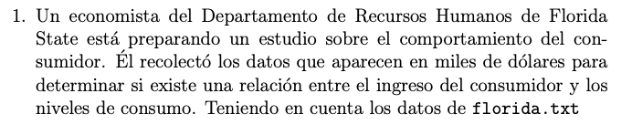
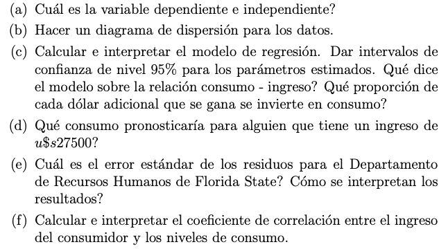
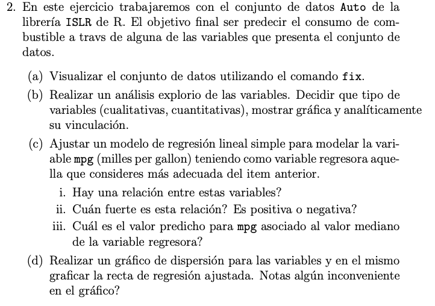
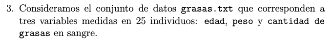
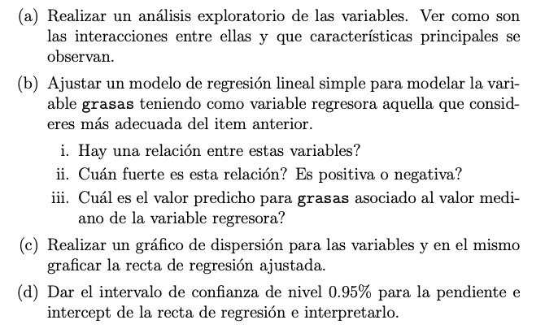
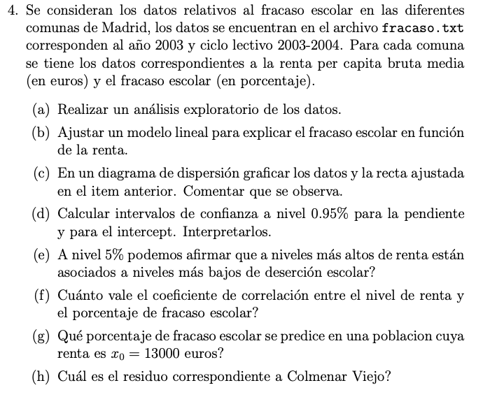
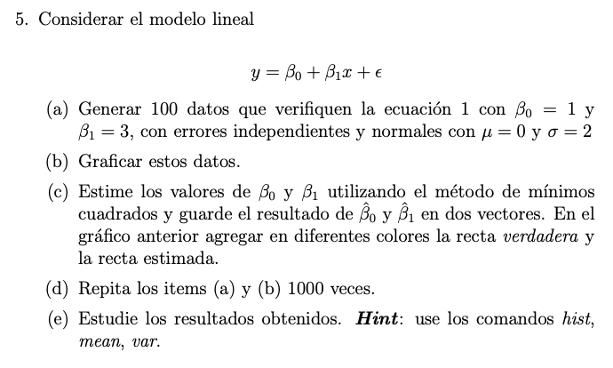
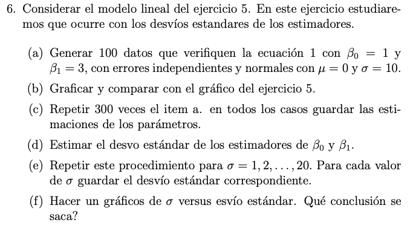

```{r setup, include=FALSE}
knitr::opts_chunk$set(echo = TRUE)
```

 {width="692"}

```{r}
florida <- read.table("~/Desktop/UDESA/004_regresion_avanzada/02_Trabajos_practicos/Práctica_1/florida.txt", header=TRUE, quote="\"")

head(florida)
```

1 a) La variable dependiente o target es el *consumo*, y la variable explicativa o feature es el *ingreso*.

1b )

```{r}
plot(florida, main = "CONSUMO EXPLICADO A PARTIR DEL INGRESO",
              col = "blue",
              pch = 10)
```

1 c)

```{r}
(modelo = lm(formula = florida$Consumo ~ florida$Ingreso))
```

El intercepto del modelo es 3.2038 y el Beta de la feature Ingreso es 0.466, el modelo quedaria expresado con la ecuacion:

### consumo = 3.2038 + 0.4666 \* ingreso

Este modelo de regresion lineal simple explica el consumo medio estimado a partir del ingreso, y nos dice que por cada unidad adicional (medidad en miles de usd) que se tiene de ingreso del consumidor, el consumo aumenta en una proporcion de 0.4666 unidades.

```{r}
summary(modelo)
```

### INTERVALO DE CONFIANZA

```{r}
t_b0 = qt(p = 1-(0.05/2), df = nrow(florida) - 2)
s_hat_intercept = summary(modelo)$coefficients[1, 2]

(lim_sup_int_b0 = modelo$coefficients[1] - t_b0*s_hat_intercept)

(lim_inf_int_b0 = modelo$coefficients[1] + t_b0*s_hat_intercept)
```

```{r}
t_b1 = qt(p = 1-(0.05/2), df = nrow(florida) - 1)
s_hat_b1 = summary(modelo)$coefficients[2, 2]

(lim_sup_int_b1 = modelo$coefficients[2] - t_b1*s_hat_b1)

(lim_inf_int_b1 = modelo$coefficients[2] + t_b1*s_hat_b1)
```

```{r}
confint(object = modelo,
        level = 0.95)
```

Si una persona no tiene ingresos, su consumo sera de 3.20378 unidades, y por cada unidad extra de ingreso (medida en miles de usd), el consumo aumentara en promedio entre 0.252 y 0.681, unidades.

1 d)

```{r}
ingreso = 27500

(consumo_pronosticado = 3.2038 + 0.4666 * ingreso)
```

Para una persona que tenga un ingreso de usd 27.500, se pronostica un consumo promedio de 12834.7 unidades.

1 e)

```{r}
summary(modelo)
```

El error estandar de los residuos (RSE) para el departamento de rrhh de Florida State es de 2.162. Esto quiere decir que aun conociendo los verdaderos valores de b0 y b1, el consumo se aleja de la recta de regresion en aproximadamente 2.162 unidades.

1 f)

```{r}
(coef_correlacion= sqrt(0.7589))
```

El coeficiente de correlacion es de 0.87, este valor me indica que tan bien mi modelo lineal explica a partir del ingreso, el consumo promedio. Por lo tanto, el ingreso, explica en un 87% el consumo promedio.



```{r}
library(ISLR)
head(Auto)
```

2 a)

```{r}
# fix(Auto)
```

2 b)

```{r}
summary(Auto)
```

Hay 9 variables: Cuantitativas: mpg, displacement, horsepower, weight, acceleration, cylinders, year Cualitativas : origin, name

```{r}
attach(Auto)

Auto_2 = as.data.frame(cbind(cylinders, horsepower, weight, year, displacement, mpg))
boxplot(mpg ~ cylinders, col = "blue",
    main = "consumo en millas en funcion de la cantidad de cilindros")
```

```{r}
plot(mpg ~ horsepower, col = "blue",
    main = "consumo en millas en funcion de la cantidad de cv")
```

```{r}
plot(mpg ~ weight, col = "blue",
    main = "consumo en millas en funcion del peso del vehiculo")
```

```{r}
plot(mpg ~ year, col = "blue",
    main = "consumo en millas en funcion del anio del vehiculo")
```

```{r}
plot(mpg ~ displacement, col = "blue",
    main = "consumo en millas en funcion de")
```

```{r}
# Creamos un data frame, con las variables que creemos podrian tener mayor relacion lineal con el target.
pairs(Auto_2)
```

```{r}
hist(mpg, col = "brown", main = "distribucion de mi variable target")
```

2 c)

Escogemos la feature "horsepower" para hacer el modelo de regresion lineal simple.

```{r}
(modelo_2 = lm(mpg ~ horsepower, data = Auto))
```

```{r}
summary(modelo_2)
```

i.  Observamos una relacion lineal inversamente proporcional en relacion a que por cada unidad de hp, disminuye en promedio 0.157 la cantidad de millas recorridas con 1 galon de combustible.

ii. La variabilidad de la cantidad de millas recorridas con 1 galon de combustible, es explicada linealmente en un 60.5% por la cantidad de hp del vehiculo. Su relacion, como mencionamos es inversamente proporcional, con lo cual es negativo el coeficiente.

iii. 

```{r}

(mpg_estimada = 39.9359 - 0.1578 * median(horsepower))
```

El valor predicho para la mediana de la variable regresora es 25.18

2 d)

```{r}


plot(mpg ~ horsepower, 
     main = "Millas por galon de combustible en funcion de los hp",
     ylim = range(mpg),
     col = "darkblue")

lines(x = Auto$horsepower, 
      y = modelo_2$coefficients[1] + modelo_2$coefficients[2] * Auto$horsepower, 
      col = "red", lwd = 2)
```

A medida que aumenta la cantidad de hp, parece que la variabilidad disminuye, con lo cual el supuesto de homocedasticidad se rompe.

Tambien notamos que el modelo tiene un error promedio de prediccion mayor a 4.906 mpg, lo cual es alto.

 {width="682"}

```{r}
grasas <- read.csv("~/Desktop/UDESA/004_regresion_avanzada/02_Trabajos_practicos/Práctica_1/grasas.txt", sep="")

head(grasas)
```

```{r}
summary(grasas)
```

Variables cuantitativas : edad, peso y grasas

```{r}
pairs(grasas, col = "darkblue")
```

Parece haber una buena correlacion lineal entre la edad y la cantidad de grasas.

Salvo por un valor extraño, observamos que no hay una distribucion definida entre la variable peso y la cantidad de grasas, por lo que ambas variables parecen tener un elevado grado de independencia. Lo mismo sucede entre las variables edad y peso.

```{r}
#Distribucion de la variable target
hist(grasas$grasas, col = "brown", 
     main = "Distribucion variable target")
```

3 b)

```{r}
(modelo_3 = lm(grasas ~ edad, data = grasas))
```

```{r}
summary(modelo_3)
```

i)  Observamos que un aumento en una unidad de la edad de la persona, genera un aumento promedio de 7.717g de grasa.

ii) Observamos que la variabilidad media de grasa en gramos de las personas que forman parte del dataset se encuentra explicada en un 70%, por la edad de los individuos.

iii) 

```{r}
modelo_3$coefficients[1] + (modelo_3$coefficients[2])*median(grasas$edad)
```

El valor predicho de los gramos de grasa, asociado al valor mediano de la variable edad, es 299.44g

3 c)

```{r}
plot(grasas$grasas ~ grasas$edad, col = "darkblue",
     main = "Gramos de grasa en funcion de la edad de la persona")
lines(grasas$edad, 
      modelo_3$coefficients[1] + modelo_3$coefficients[2]*grasas$edad,
      lwd = 2)
```

3 d)

```{r}
(lim_inferior_b0_grasas = modelo_3$coefficients[1] - qt(0.975, nrow(grasas)-1)*29.6376)
(lim_superior_b0_grasas = modelo_3$coefficients[1] + qt(0.975, nrow(grasas)-1)*29.6376)

(lim_inferior_b1_grasas = modelo_3$coefficients[2] - qt(0.975, nrow(grasas)-1)*0.7243)
(lim_superior_b1_grasas = modelo_3$coefficients[2] + qt(0.975, nrow(grasas)-1)*0.7243)
```

De 100 intervalos de confianza que calculemos de muestreos distintos, 95 contendran el verdadero valor del parametro b1. Por lo cual el verdadero valor del parametro b1 estara contenido entre 7.188 y 8.246, con un 95% de probabilidad.

```{r}
confint(modelo_3)
```

```{r}
fracaso <- read.csv("~/Desktop/UDESA/004_regresion_avanzada/02_Trabajos_practicos/Práctica_1/fracaso.txt", sep="")

head(fracaso)
```



4 a)

```{r}
plot(Fracaso ~ Renta,
     data = fracaso,
     main = "Fracaso escolar en funcion de la renta per capita",
     col = "darkblue")
```

Parece haber algun nivel de relacion lineal entre la renta per capita bruta y el nivel de fracaso escolar.

```{r}
hist(fracaso$Fracaso, col = "brown",
     main = "Distribucion variable target")
```

4 b)

```{r}
(modelo_4 = lm(Fracaso ~ Renta, data = fracaso))
```

```{r}
summary(modelo_4)
```

4 c)

```{r}
plot(fracaso$Fracaso ~ fracaso$Renta, col = "red",
     main = "Fracaso estudiantil en funcion de la renta bruta")

lines(fracaso$Renta, 
      modelo_4$coefficients[1] + modelo_4$coefficients[2]*fracaso$Renta,
      lwd = 2)
```

Se observa que el dato que es atravesado por el modelo es el que representa a la media de la variable explicada y a la media de la variable independiente.

Observamos una relacion inversamente proporcional entre el fracaso escolar y la renta bruta.

4 d)

```{r}
(min_int_b0=modelo_4$coefficients[1] - qt(0.975, nrow(fracaso) -2) * 3.6445)
(max_int_b0=modelo_4$coefficients[1] + qt(0.975, nrow(fracaso) -2) * 3.6445)
```

El verdadero valor del parametro intercepto del modelo, se encuentra dentro del intervalo comprendido entre 30.91 y 46.073, con un 95% de probabilidad.

```{r}
(min_int_b1=modelo_4$coefficients[2] - qt(0.975, nrow(fracaso) -1) * 0.2659)
(max_int_b1=modelo_4$coefficients[2] + qt(0.975, nrow(fracaso) -1) * 0.2659)
```

El verdadero valor del parametro beta 1 del modelo, se encuentra dentro del intervalo comprendido entre -1.89 y -0.79, con un 95% de probabilidad.

4 e)

```{r}
summary(modelo_4)
```

Dado que el modelo utiliza un nivel de significancia incluso menor para el test de hipotesis y logra rechazar H0, los resultados de este test, tambien nos sirven para un nivel de significancia del 5%, con lo cual podemos concluir que niveles mas altos de renta, estan asociados a niveles mas bajos de desercion escolar.

4 f)

```{r}
library(dplyr)
fracaso %>% 
  select(c(Renta, Fracaso)) %>% cor()
```

Observamos una correlacion inversa del 74% entre el porcentaje de fracaso escolar y la renta bruta.

4 g)

```{r}
modelo_4$coefficients[1] + modelo_4$coefficients[2] * 13
```

En una poblacion cuya renta es 13000 euros, se predice un nivel de fracaso escolar medio de 20.98%.

4 h)

```{r}
x=fracaso[fracaso$Ciudad=="Colmenar", "Renta"]

y_verdadero=fracaso[fracaso$Ciudad=="Colmenar", "Fracaso"]

(residuo = y_verdadero - as.numeric(modelo_4$coefficients[1] + modelo_4$coefficients[2] * x))
```

El residuo de nuestra regresion lineal simple para Colmenar Viejo es de 0.95% de fracaso escolar.



5 a)

```{r}
bo = 1
b1 = 3
x = sort(sample(c(-500:500), 100, replace = F))

modelo_lineal = function(x, e) {bo + b1*x + e}

y_1 = mapply(modelo_lineal, x, rnorm(n = 100, sd = 2))
```

5 b)

```{r}
plot(y = y_1, x = x, lwd = 2, 
     main = "Modelo Lineal Simple con error conocido",
     xlab = "Feature 'x'",
     ylab = "Variable Target")
```

5 c)

```{r}
(modelo_5 = lm(y_1 ~ x))
```

```{r}
plot(y = y_1, x = x, lwd = 2, type = "l", 
     main = "Modelo Lineal Teorico vs Estimado",
     xlab = "Feature 'x'",
     ylab = "Variable Target")

lines(x = x, y = modelo_5$coefficients[1] + modelo_5$coefficients[2]*x,
      col = "red", lwd = 2)

legend("bottomright", 
       c("MODELO CON 'e' Y BETA CONOCIDOS", "MODELO ESTIMADO"),
       fill = c("black", "red"), cex = 0.8)
```

5 d)

```{r}
y_2 = c(); vector_b0=c(); vector_b1=c()

for (i in 1:1000) {
  x_2 = sort(sample(c(-500:500), 100, replace = F))
  y_2 = mapply(modelo_lineal, x_2, rnorm(sd=2, n =100))
  
  vector_b0[i] = lm(y_2 ~ x_2)$coefficients[1]
  vector_b1[i] = lm(y_2 ~ x_2)$coefficients[2]
}

```

```{r}
par(mfrow = c(2,1))
hist(vector_b0, col = "darkgreen",
     main = "Distribucion del estimador del intercepto",
     xlab = "Valor estimado del intercepto")

hist(vector_b1, col = "darkblue",
     main = "Distribucion del estimador del beta 1",
     xlab = "Valor estimado del Beta1")

mean(vector_b0)
mean(vector_b1)
```

Observamos una distribucion acampanada, con valor medio tendiendo al valor real de los parametros, con lo que comprobamos que son estimadores insesgados.

```{r}
var(vector_b0)
var(vector_b1)
```

Observamos que la varianza de los estimadores de los parametros, tiende a 0.

Por lo tanto dado que la varianza de los estimadores tiende a 0 y que la esperanza de los estimadores es el parametro que buscan estimar, el error cuadratico medio tiende a cero y por tanto se comprueba que son estimadores consistentes.



6 a)

```{r}
b0 = 1
b1 = 3

modelo_lineal_2 = function(x, e) {b0 + b1*x + e}

y_3 = mapply(modelo_lineal_2, x, rnorm(n=100, sd = 10))
```

6 b)

```{r}
plot(y = y_1, x = x, 
              lwd = 1, 
              xlab = "Variable Explicativa",
              ylab = "Variable Explicada",
              main = "MODELO LINEAL SIMPLE CON DISTINTOS 'e'",
              col = "red")

points(y = y_3, x = x, 
                col = "blue", 
                lwd = 1)
```

6 c)

```{r}
y_4 = c(); vector_b0_2=c(); vector_b1_2=c()

for (i in 1:300) {
  x = sort(sample(c(-500:500), 100, replace = F))
  y_4 = mapply(modelo_lineal_2, x, rnorm(n =100, sd = 10))
  
  vector_b0_2[i] = lm(y_4 ~ x)$coefficients[1]
  vector_b1_2[i] = lm(y_4 ~ x)$coefficients[2]
}
```

6 d)

```{r}
sd(vector_b0_2)
sd(vector_b1_2)
```

6 e)

```{r}
y_5 = c(); vector_b0_3=c(); vector_b1_3=c(); vector_sd_estimador_b0=c();
vector_sd_estimador_b1=c()

modelo_lineal_3 = function(x, sd) {b0 + b1*x + rnorm(n=1, sd = sd)}

for(tita in 1:20) {
  for (i in 1:300) {
    y_5 = mapply(modelo_lineal_3, x, tita)
    
    vector_b0_3[i] = lm(y_5 ~ x)$coefficients[1]
    vector_b1_3[i] = lm(y_5 ~ x)$coefficients[2]
  }
   vector_sd_estimador_b0[tita]=sd(vector_b0_3) 
   vector_sd_estimador_b1[tita]=sd(vector_b1_3)
  }
```

6 f)

```{r}
par(mfrow=c(2,1))

plot(vector_sd_estimador_b0, x = (1:20), 
                             col = "darkred", 
                             xlab = "Desvio del error aleatorio para B0",
                             ylab = "SD ESTIMADOR",
                             main = "INTERCEPTO",
                             lwd = 2, type = "l")

plot(vector_sd_estimador_b1, x = (1:20),
                             col = "darkblue",
                             xlab = "Desvio del error aleatorio para B1",
                             ylab = "SD ESTIMADOR",
                             main = "B1",
                             lwd = 2, type = "l")
```

Observamos como a medida que aumenta la varianza del error aleatorio "e", el desvio del estimador del intercepto y Beta 1, aumentan.

```{r}

```

```{r}
```

```{r}
```

```{r}
```

```{r}
```

```{r}
```
