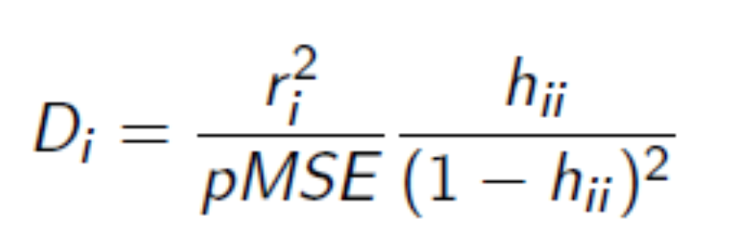
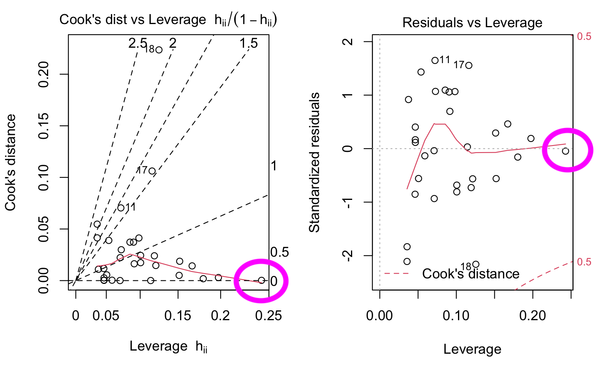

```{r setup, include=FALSE}
knitr::opts_chunk$set(echo = TRUE)
```

```{r}
library(dplyr)
library(tidyverse)
library(MASS)
library(openintro)
library(gstat)
library(RobStatTM)
```

1)  

```{r}
mammals = as.data.frame(na.omit(mammals))
head(mammals)
glimpse(mammals)
```

1 a)

```{r}
plot(y = mammals$brain_wt,
     x = mammals$body_wt,
     main = "PESO DEL CEREBRO RESPECTO AL PESO CORPORAL",
     xlab = "PESO CORPORAL",
     ylab = "PESO DEL CEREBRO",
     col = "blue")
```

En este grafico que quiere mostrar la relacion del peso corporal con el peso del cerebro del mamifero observamos un posible outlier, el cual posee un peso de cerebro mucho mayor que su peso corporal, esto es sospechoso, y puede ocurrir que la observacion tenga un error. Tambien observamos otro registro, que presenta un peso de cerebro mucho mayor a su peso corporal, que se encuentra mas cerca de la nube de puntos general.

```{r}
modelo_cerebro = lm(brain_wt ~ body_wt, data = mammals)

summary(modelo_cerebro)
```

```{r}
plot(modelo_cerebro, 2)
```

Observamos que la distribucion de los residuos comparada con una distribucion normal teorica, si los mismos tuvieran distribucion normal, veriamos las observaciones agrupadas formando una recta. En este caso, vemos un poco de estructura de una recta, pero se rompe un poco en los extremos, en especial en las observaciones 22, la 2, y la 9. Vamos a realizar el test de bondad de ajuste de kolmogorov smirnov, para confirmar si los residuos tienen distribucion normal (uno de los 5 supuestos).

```{r}
ks.test(modelo_cerebro$residuals, "pnorm", 
                                   mean(modelo_cerebro$residuals), 
                                   sd(modelo_cerebro$residuals))
```

Estamos evaluando en la H0 que los residuos tienen distribucion normal N(0, tita\^2), por lo que buscamos un pvalue alto, mayor a un 0.2 en lo posible. En este caso nuestro pvalue es pequeño, con lo cual rechazamos la hipotesis nula y nuestros residuos NO tienen distribucion normal.

```{r}
#grafico de los residuos vs predicciones
plot(modelo_cerebro, 1)
```

En este grafico no deberiamos visualizar ninguna estructura, ya que los residuos deberian ser independientes de las predicciones. En nuestro caso parece no haber una estructura definida, pero si vemos que la observacion 22 se encuentra muy alejada, y la 9 tambien. Vamos a estudiar esto con los residuos normalizados.

```{r}
plot(y = studres(modelo_cerebro), x = modelo_cerebro$fitted.values,
     main = "RESIDUOS VS PREDICHOS",
     xlab = "FITTED VALUES",
     ylab = "RESIDUALS",
     ylim = c(-3.2, 10.5))

abline(h = 3, col = "red", lwd = 2)
abline(h = -3, col = "red", lwd = 2)
abline(h = 0, col = "darkblue", lwd = 1)
```

De nuevo, no parece observarse estructura en los residuos, pero si se observa un valor de una observacion muy alejado, muy superior a 3, lo cual la convierte en un muy posible outlier.

Vamos a realizar el test de rangos de spearman, para que nos confirme si realmente NO tengo un problema de HETEROSEDASTISIDAD. H0: HOMOCEDASTISIDAD DE LOS RESIDUOS vs H1: HETEROSEDASTISIDAD

```{r}
cor.test(abs(modelo_cerebro$residuals), modelo_cerebro$fitted.values, 
                                        method = "spearman")
```

Debido a que el pvalue, es pequeño(menor a 0.2), rechazamos H0, con lo que tenemos un problema de HETEROSEDASTISIDAD de los residuos. Dado que los residuos no tienen distribucion normal, y hay HETEROSEDASTISIDAD, probablemente tengamos que transformar el target, para poder solucionar estos problemas, y funcione mejor nuestro modelo lineal.

```{r}
plot(modelo_cerebro, 3)
```

```{r}
plot(modelo_cerebro, 4)
```

```{r}
plot(modelo_cerebro,5)
```

```{r}
plot(modelo_cerebro,6)
```

1 b)

Para solucionar los problemas de heterosedastisidad y no normalidad de los residuos, vamos a aplicar la transformacion box y cox.

```{r}
modelo_cerebro_box_cox = boxcox(modelo_cerebro)
```

```{r}
modelo_cerebro_box_cox$x[which.max(modelo_cerebro_box_cox$y)]
```

Observamos que el lambda que nos devuelve es practicamente 0, por lo tanto la transformacion que debemos realizar en la variable de respuesta es ln(y)

```{r}
mammals$log_brain_wt=log(mammals$brain_wt)
```

```{r}
modelo_cerebro_2 = lm(log_brain_wt ~ body_wt, data = mammals)

summary(modelo_cerebro_2)
```

Observamos una caida muy grande del R2, esto se debe a que al aplicarle el logaritmo al target, perdimos en gran medida la relacion lineal con la variable regresora.

```{r}
plot(x = mammals$body_wt, y = mammals$log_brain_wt, col = "red",
     main = "log BRAIN WT EXPLICADO POR BODY WT", xlab = "BODY_WT",
     ylab = "logBRAIN_WT")
```

Para recuperarla, vamos a aplicarle logaritmo a body_wt

```{r}
mammals$logbody_wt = log(mammals$body_wt)
```

```{r}
plot(x = mammals$logbody_wt, y = mammals$log_brain_wt, col = "red",
     main = "log BRAIN WT EXPLICADO POR log BODY WT", xlab = "log BODY_WT",
     ylab = "logBRAIN_WT")
```

```{r}
modelo_cerebro_2b = lm(log_brain_wt ~ logbody_wt, data = mammals)

summary(modelo_cerebro_2b)
```

```{r}
plot(modelo_cerebro_2b, 2)
```

Ahora vemos una distribucion de los residuos que se asemeja mucho mas a una normal

```{r}
ks.test(modelo_cerebro_2b$residuals, "pnorm", 
                                   mean(modelo_cerebro_2b$residuals), 
                                   sd(modelo_cerebro_2b$residuals))
```

Observamos un pvalue mayor a 0.2, con lo cual H0, se cumple y tenemos una distribucion de los residuos que se asemeja a una normal.

```{r}
plot(modelo_cerebro_2b, 1)
```

```{r}
plot(y = studres(modelo_cerebro_2b), x = modelo_cerebro_2b$fitted.values,
     main = "RESIDUOS VS PREDICHOS (Box & Cox)",
     xlab = "FITTED VALUES",
     ylab = "RESIDUALS",
     ylim = c(-3.2, 10.5))

abline(h = 3, col = "red", lwd = 2)
abline(h = -3, col = "red", lwd = 2)
abline(h = 0, col = "darkblue", lwd = 1)
```

Con esta transformacion observamos que la observacion que parecia un outlier, no lo era.

```{r}
cor.test(abs(modelo_cerebro_2b$residuals), modelo_cerebro_2b$fitted.values, 
                                          method = "spearman")
```
Con este valor "frontera" de pvalue, vemos que hay un grado de HETEROCEDASTISIDAD en nuestros residuos.

```{r}
plot(modelo_cerebro_2b, 3)
```

```{r}
plot(modelo_cerebro_2b, 4)
```

1 c)

```{r}
anova(lm(log_brain_wt ~ logbody_wt, data = mammals),
      lm(log_brain_wt ~ logbody_wt + gestation, data = mammals),
      lm(log_brain_wt ~ logbody_wt + gestation + life_span, data = mammals),
      lm(log_brain_wt ~ logbody_wt + gestation + life_span + total_sleep, data = mammals))
```

Observamos que el modelo con menor RSS es el que utiliza todas las variables

```{r}
modelo_cerebro_3 = lm(log_brain_wt ~ logbody_wt + gestation + 
                                     life_span + total_sleep, data = mammals)
summary(modelo_cerebro_3)
```


Observamos que la feature gestation y total sleep no logran rechazar H0, con lo cual no son estadisticamente significativas.

```{r}
plot(modelo_cerebro_3)
```

```{r}
ks.test(modelo_cerebro_3$residuals, "pnorm", 
                                   mean(modelo_cerebro_3$residuals), 
                                   sd(modelo_cerebro_3$residuals))
```

Confirmamos que los residuos tienen una distribucion que se asemeja a una normal, dado que no se rechaza H0 del test de bondad de ajuste.

```{r}
cor.test(abs(modelo_cerebro_3$residuals), modelo_cerebro_3$fitted.values, 
                                          method = "spearman")
```

Observamos que no se rechaza H0, por lo que en los residuos de nuestro modelo hay HOMOCEDASTISIDAD


1 d)

```{r}
plot(y = studres(modelo_cerebro_3), x = modelo_cerebro_3$fitted.values,
     main = "RESIDUOS STUDENTIZADOS VS PREDICHOS (modelo 3)",
     xlab = "FITTED VALUES",
     ylab = "RESIDUALS",
     ylim = c(-3.2, 3.2))

abline(h = 3, col = "red", lwd = 2)
abline(h = -3, col = "red", lwd = 2)
abline(h = 0, col = "darkblue", lwd = 1)
```

No vemos observaciones que puedan ser posibles outliers, ya que todas tienen un valor absoluto de residuo estudentizado menor a 3.

```{r}
n_parametros = length(modelo_cerebro_3$coefficients)
n = nrow(mammals)

which((cooks.distance(modelo_cerebro_3) > pf(n_parametros, 
                                             n - n_parametros, 0.5)) == T)
```

no hay observaciones con distancia de cook mayor al percentil 0.5 de una distribucion F(5, 37)

```{r}
par(mfrow=c(1,1)) 
plot(modelo_cerebro_3, 4) 

abline(h = pf(n_parametros, n - n_parametros, 0.5), col = "red")
```


```{r}
plot(modelo_cerebro_3, 5) 
```

Observamos que la observacion 2 tiene un muy alto leverage y un residuo moderadamente alto, pero no supera las 3 unidades. No es OUTLIER 
Observamos que la observacion 42 tiene un valor normal de leverage y un residuo alto, pero no supera las 3 unidades. No es un OUTLIER 
Observamos que la observacion 27 tiene un valor normal de leverage y un alto residuo, pero no supera las 3 unidades. No es un OUTLIER

Las otras observaciones tienen un residuo, y/o leverage bajo.

```{r}
plot(modelo_cerebro_3, 6) 
```

Concluimos que no hay outliers en la muestra, dado que para los casos de las observaciones 2 , 42 y 27 que tienen un leverage y distancia de cook altos, sus residuos, no superan el modulo de 3 unidades.

### REGRESION ROBUSTA

```{r}
control = lmrobdet.control(bb = 0.5, efficiency = 0.85, family = "bisquare")

mm_modelo_cerebro = lmrobdetMM(log_brain_wt ~ logbody_wt + gestation + 
                               life_span + total_sleep, data = mammals, 
                                                        control = control)

summary(mm_modelo_cerebro)
```

Al realizar la regresion robusta, y calcular los MM estimadores, observamos que tanto gestation, como total_sleep, no son significativos, con un alfa del 5%.

```{r}
plot(mm_modelo_cerebro, 1)
```

```{r}
plot(mm_modelo_cerebro, 2)
```

```{r}
ks.test(mm_modelo_cerebro$residuals, "pnorm", 
                                   mean(mm_modelo_cerebro$residuals), 
                                   sd(mm_modelo_cerebro$residuals))
```

Con un pvalue mayor a 0.2, optamos por considerar que hay normalidad en los residuos, ya que rechazo H0.

```{r}
cor.test(abs(mm_modelo_cerebro$residuals), mm_modelo_cerebro$fitted.values, method = "spearman")
```

Con un pvalue de 0.86, consideramos H0 verdadera, y por tanto hay HOMOCEDASTISIDAD de los residuos.

```{r}
plot(mm_modelo_cerebro, 4)
```

Vamos a graficar los RWEIGHTS del modelo en funcion de los residuos estudentizados, para intentar detectar posibles outliers. Una observacion que tenga un bajo rweight y alto residuo, es considerada un outlier.

```{r}
plot(studres(mm_modelo_cerebro), mm_modelo_cerebro$rweights, 
     main = "RESIDUOS STUDENTIZADOS VS RWEIGHTS", col = "blue",
     xlab = "RESIDUOS ESTUDENTIZADOS",
     ylab = "R-WEIGHTS")
```

2)  

```{r}
fracaso <- read.csv("~/Desktop/UDESA/004_regresion_avanzada/02_Trabajos_practicos/Práctica_3/fracaso.txt", sep="")
```

```{r}
fracaso_ols=lm(fracaso$Fracaso ~ fracaso$Renta)

summary(fracaso_ols)
```

```{r}
plot(fracaso_ols, 1)
```

No parece observarse una estructura en los residuos, vamos a chequear si se cumple el supuesto de homocedastisidad.

```{r}
cor.test(abs(fracaso_ols$residuals), 
         fracaso_ols$fitted.values, method = "spearman")
```

Observamos un pvalue alto, con lo cual se cumple el supuesto de HOMOCEDASTISIDAD de los residuos del modelo lineal.

```{r}
plot(fracaso_ols, 2)
```

Observamos que la distribucion de los residuos se asemeja bastante a una distribucion normal

```{r}
ks.test(fracaso_ols$residuals, "pnorm", mean(fracaso_ols$residuals), sd(fracaso_ols$residuals))
```

Observamos un pvalue alto, con lo cual se cumple H0: Los residuos tienen una distribucion Normal.

```{r}
plot(fracaso_ols, 3)
```

```{r}

plot(fracaso_ols, 4)

pf(length(fracaso_ols$coefficients), nrow(fracaso) - length(fracaso_ols$coefficients), 0.5)
```

Ninguna observacion presenta una distancia de Cook mayor a 0.36 (percentil 0.5 de una Fisher 2, 21).

```{r}
plot(fracaso_ols, 5)
```

No vemos ninguna observacion con un residuo superior a 3 en valor absoluto. Los residuos no tienen una estructura definida (Homocedastisidad). La observacion 23, es la que presenta un mayor leverage, pero no tiene un residuo alto, con lo cual no es un outlier.

```{r}
plot(fracaso_ols, 6)
```

Vamos a proponer plantear una regresion robusta, para ver si mejora nuestro modelo.

```{r}
control = lmrobdet.control(bb = 0.5,efficiency = 0.85, family = "bisquare")

fracaso_mm = lmrobdetMM(Fracaso ~ Renta, data = fracaso, control = control)

summary(fracaso_mm)
```

```{r}
plot(fracaso_mm)
```

Vamos a graficar los RWEIGHTS del modelo en funcion de los residuos estudentizados, para intentar detectar posibles outliers. Una observacion que tenga un bajo rweight y alto residuo, es considerada un outlier.

```{r}
plot(studres(fracaso_mm), fracaso_mm$rweights, 
     main = "RESIDUOS STUDENTIZADOS VS RWEIGHTS", col = "blue",
     xlab = "RESIDUOS ESTUDENTIZADOS",
     ylab = "R-WEIGHTS")

abline(v = 3, col = "red", lwd = 2)
```

Encontramos que la observacion 5 podria ser un posible outlier, ya que tiene un residuo mayor a 3, vamos a estudiar su leverage, para saber si afecta mucho nuestro modelo mm.

```{r}
sort(studres(fracaso_mm), decreasing = T)[1]
```

```{r}
sort(hatvalues(fracaso_mm), decreasing = T)
```

Observamos que la observacion 5, si bien tiene un residuo alto, su aporte al modelo, es bajo, con lo cual no afecta demasiado los parametros estimados.

```{r}
boxplot(hatvalues(fracaso_mm), main ="LEVERAGE FRACASO MM", col = "blue")
```

```{r}
data_renta = data.frame("Renta" = fracaso$Renta)

#Intervalo de confianza:
int_confianza_fracaso = predict(fracaso_mm,
                                 newdata = data_renta,
                                 interval = c("confidence"), level = 0.95)

#Intervalo de prediccion:
prediccion_fracaso = predict(fracaso_mm,
                              newdata = data_renta,
                              interval = c("predict"), level = 0.95)
```

```{r}
plot(fracaso$Fracaso ~ fracaso$Renta,
     main = "FRACASO ACADEMICO EXPLICADO POR RENTA", 
     xlab = "RENTA",
     ylab = "FRACASO",
     cex = 0.2)

points(fracaso$Fracaso ~ fracaso$Renta,
       col = "darkblue", lwd = 2, cex = 0.2)

lines(x = fracaso$Renta, y = fracaso_mm$coeff[1] + 
      fracaso_mm$coeff[2] * fracaso$Renta,
      col = "blue", lwd = 3)

# Intervalos de confianza
lines(x = data_renta$Renta, pch = 16,
       y = int_confianza_fracaso[, 2], col = "purple", cex = 0.4)

lines(x = data_renta$Renta, pch = 16,
       y = int_confianza_fracaso[, 3], col = "purple", cex = 0.4)

# Intervalos de prediccion
# lines(x = data_renta$Renta,
#       y = prediccion_fracaso[, 2], col = "lightblue", lwd =3)
# 
# lines(x = data_renta$Renta,
#       y = prediccion_fracaso[, 3], col = "lightblue", lwd =3)

legend("topright", 
       c("intervalo de prediccion", "intervalo de confianza"), 
       fill = c("lightblue", "purple"), cex = 0.9)
```

3)  

```{r}
trees <- read.csv("~/Desktop/UDESA/004_regresion_avanzada/02_Trabajos_practicos/Práctica_3/trees.txt", sep="")
```

```{r}
trees$Girth = log(trees$Girth)
trees$Height = log(trees$Height)
trees$Volume = log(trees$Volume)
```

```{r}
trees_ols = lm(Volume ~ Girth + Height, data = trees)

summary(trees_ols)
```

3 a)

```{r}
plot(trees_ols, 1)
```

Dado que no se visualiza ninguna estructura, podemos inferir que los error son independientes entre si.

```{r}
cor.test(abs(trees_ols$residuals), trees_ols$fitted.values, 
         method = "spearman")
```

Con un pvalue de 0.28, constatamos que los residuos presentan la misma varianza (Homocedastisidad)

```{r}
plot(trees_ols, 2)
```

```{r}
ks.test(trees_ols$residuals, "pnorm", mean(trees_ols$residuals), 
                                      sd(trees_ols$residuals))
```

Observamos que los residuos presentan una distribucion normal

```{r}
pairs(trees)
```

```{r}
cor(trees, method = "spearman")
```

Se observa una correlacion lineal del 44% entre las covariables, pero como p\<\<n-p (3 \<\< 28), no afecta demasiado a nuestro modelo.

2 b)

```{r}
plot(trees_ols, 4)
```

Observamos que el registro con mayor distancia de Cook es el 18.

```{r}
trees = trees[-18, ]
```

```{r}
trees_ols_2 = lm(Volume ~ Girth + Height, data = trees)

summary(trees_ols_2)
```

Observamos que el Beta 0, se ve modificado en casi 0.5 unidades, Beta 1 en 0.03 y Beta 2 en 0.15 unidades. Teniendo en cuenta que solo retiramos una observacion del total el impacto que genera en los parametros estimados de nuestro modelo, es alto.

2 c)

```{r}
par(mfrow = c(1, 2))
plot(trees_ols, 6)
plot(trees_ols, 5)
```

La distancia de Cook se calcula como:

{width="234"}

Con lo cual depende tanto del residuo que posee la observacion, asi como tambien del leverage de esa observacion. Con lo cual, las observaciones que poseen un alto leverage, y por lo tanto pueden afectar en gran medida a el valor de los parametros estimados del modelo, y que a su vez, tienen una distancia de Cook baja, es debido a que poseen un residuo pequeño, y por tanto, no modifican en gran medida a nuestro modelo, y por esto no son considerados OUTLIERS, sino simplemente puntos con gran peso para nuestra regresion.



4)

```{r}
alcohol = robustbase::alcohol

head(alcohol)
```
4 a)
```{r}
summary(alcohol)
```

```{r}
pairs(alcohol)
# ggpairs(data = alcohol)
```

```{r}
cor(alcohol, method = "spearman")
```
Observamos una muy alta correlacion entre las variables regresoras, lo que nos dice es que hay informacion "repetida" entre las variables explicativas.

```{r}
hist(alcohol$logSolubility, main = "DISTRIBUCION DEL TARGET",
    xlab = "LOG SOLUBILITY", col = "brown")
```
4 b)

```{r}
ols_alcohol=lm(logSolubility ~., data = alcohol)

summary(ols_alcohol)
```
Observamos que la regresion si explica el target, ya que el estadistico F, es significativo.
Observamos tambien que la unica covariable que tiene un parametro significativo es LogPC, los demas casos no logran rechazar H0.


### ANALISIS DE LOS RESIDUOS
```{r}
plot(ols_alcohol, 1)
```
No se observa una estructura en los residuos, con lo cual parecieran ser independientes entre ellos.

Vamos a dar un vistazo con los residuos normalizados.

```{r}
plot(y = studres(ols_alcohol), x = ols_alcohol$fitted.values,
     main = "RESIDUOS ESTUDENTIZADOS vs FITTED VALUES",
     xlab = "FITTED VALUES", ylab = "RESIDUOS ESTUDENTIZADOS",
     ylim = c(-3.2, 7))

abline(h = 3, col = "red", lwd = 2)
abline(h = -3, col = "red", lwd = 2)
```
Notamos un valor que tiene un residuo bastante elevado y es un posible outlier.

```{r}
sort(studres(ols_alcohol), decreasing = T)[1]
```
Encontramos que la observacion numero 39, posee un residuo muy elevado.

```{r}
plot(ols_alcohol, 2)
```

```{r}
ks.test(ols_alcohol$residuals, "pnorm", mean(ols_alcohol$residuals), 
                                        sd(ols_alcohol$residuals))
```
Observamos una distribucion normal de los residuos del modelo.

```{r}
cor.test(abs(ols_alcohol$residuals), ols_alcohol$fitted.values, 
         method = "spearman")
```
Concluimos con el test de correlacion de rangos, que los residuos del modelo tienen la misma varianza (HOMOCEDASTISIDAD)

```{r}
plot(ols_alcohol, 3)
```

4 c)

```{r}
control = lmrobdet.control(bb = 0.5, efficiency = 0.85, family = "bisquare")

mm_alcohol = lmrobdetMM(logSolubility ~., data = alcohol)

summary(mm_alcohol)
```
Al aplicar una regresion robusta, observamos un gran cambio de los valores estimados de los betas, asi como tambien, vemos que el beta estimado para la covariable RM, pasa a ser estadisticamente significativo. Nuestro R2 se mantiene igual practicamente. El RSE del modelo, se reduce casi a la mitad en comparacion con el modelo calculado por OLS.


### ANALISIS DE LOS RESIDUOS

```{r}
plot(mm_alcohol, 4)
```
Observamos 2 posibles outliers en las observaciones 39 y 12, con residuos elevados para esas observaciones.

```{r}
cor.test(abs(mm_alcohol$residuals), mm_alcohol$fitted.values,
         method = "spearman")
```

Con un pvalue de 0.66, comprobamos que tenemos HOMOSEDASTISIDAD de los residuos.

```{r}
plot(mm_alcohol, 2)
```
```{r}
ks.test(mm_alcohol$residuals, "pnorm", mean(mm_alcohol$residuals),
                                       sd(mm_alcohol$residuals))
```
Observamos un pvalue muy chico que rechaza H0, con lo cual, la distribucion de nuestros residuos no es Normal para el modelo robusto.

4 d)

Vamos a graficar los RWEIGHTS del modelo en funcion de los residuos, para intentar detectar posibles outliers. Una observacion que tenga un bajo rweight y alto residuo, es considerada un outlier.

```{r}
plot(mm_alcohol$residuals, mm_alcohol$rweights, 
     main = "RESIDUOS VS RWEIGHTS", col = "blue",
     xlab = "RESIDUOS",
     ylab = "R-WEIGHTS")
```

```{r}
sort(mm_alcohol$rweights, decreasing = F)[1:4]
```

Observamos que los registros 12 y 39, tienen un valor alto de residuo y un rweigths de 0 (bajo), por lo tanto, son outliers.

```{r}
alcohol_2 = alcohol[-c(12, 39), ]

control_2 = lmrobdet.control(bb = 0.5, efficiency = 0.85, family = "bisquare")

mm_alcohol_sin_outliers = lmrobdetMM(logSolubility ~., data = alcohol_2, 
                                     control = control_2)

summary(mm_alcohol_sin_outliers)
```


```{r}
ks.test(mm_alcohol_sin_outliers$residuals, "pnorm", 
                                        mean(mm_alcohol_sin_outliers$residuals), 
                                        sd(mm_alcohol_sin_outliers$residuals))
```
Al remover estos registros, pudimos corregir la distribucion de los residuos, donde ahora si nuestro pvalue es de 0.58, con lo que aceptamos H0, y nuestros residuos tienen distribucion Normal, por lo que cumplen ese supuesto.

```{r}
cor.test(abs(mm_alcohol$residuals), mm_alcohol$fitted.values,
         method = "spearman")
```
Vemos que la Homocedastisidad se mantiene.

```{r}
plot(mm_alcohol_sin_outliers, 1)
```
Tampoco vemos una estructura formada por los residuos que nos diga que los mismos no son independientes.
Observamos que las Robust Distances (leverage MM-estimadores) nos dicen que varias observaciones tienen alto leverage.
Observamos que los Robust Standardized Residuals, nos dice que la observacion 36, podria representar un outlier, pero dado que la regresion le asigna un peso del 80%, y esta muy cerca del valor de corte maximo para considerarlo un outlier, vamos a dejarlo.


5)

```{r}
cps09marsubjc <- read.csv("~/Desktop/UDESA/004_regresion_avanzada/02_Trabajos_practicos/Práctica_3/cps09marsubjc.txt", sep="")
```


```{r}
cps09marsubjc$wage = cps09marsubjc$earnings / (cps09marsubjc$hours * cps09marsubjc$week)
```

5 a)

```{r}
summary(cps09marsubjc)
```
Variables continuas: week, hours, earnings, age
Variables categoricas: marital, region, race, uncov, union, education, hisp, female

```{r}
pairs(cps09marsubjc[, c("age", "education", "earnings", "hours", "wage")])
```

```{r}
cor(cps09marsubjc[, c("age", "education", "earnings", "hours", "wage")], method = "spearman")
```

Observamos una alta correlacion lineal entre wage, education y earnings, seguido por age.

```{r}
hist(cps09marsubjc$wage, col = "brown", main = "DISTRIBUCION DEL TARGET",
     xlab = "WAGE")
```

```{r}
modelo_cps_ols = lm(wage ~ education, data = cps09marsubjc)

summary(modelo_cps_ols)
```


```{r}
plot(modelo_cps_ols, 1)
```
Observamos una estructura en los residuos del modelo.

```{r}
cor.test(abs(modelo_cps_ols$residuals), modelo_cps_ols$fitted.values, 
         method = "spearman")
```
Observamos que el pvalue es muy pequeño, con lo cual se rechaza H0, y hay HETEROCEDASTISIDAD

```{r}
plot(modelo_cps_ols, 2)
```

```{r}
ks.test(modelo_cps_ols$residuals, "pnorm",
                  mean(modelo_cps_ols$residuals), sd(modelo_cps_ols$residuals))
```
De nuevo se rechaza H0, con lo que la distribucion de nuestros residuos no es Normal.

```{r}
plot(modelo_cps_ols, 3)
```

b)

Como observamos un problema de Heterocedastisidad, vamos a probar, si buscando una transformacion de la variable target, logramos corregir esto.

```{r}
modelo_cps_ols_box_cox = boxcox(modelo_cps_ols)
```


```{r}
modelo_cps_ols_box_cox$x[which.max(modelo_cps_ols_box_cox$y)]
```

El lambda que nos devuelve el metodo es 0, por lo tanto la transformacion que debemos realizar en la variable de respuesta es ln(y)

```{r}
cps09marsubjc$logwage = log(cps09marsubjc$wage)

modelo_cps_ols_2 = lm(logwage ~ education, data = cps09marsubjc)
```


```{r}
plot(modelo_cps_ols_2, 1)
```
Observamos que la Homogeneidad de los residuos, aumenta, pero se observa aun una Heterogeneidad.

```{r}
cor.test(abs(modelo_cps_ols_2$residuals), modelo_cps_ols_2$fitted.values, 
         method = "spearman")
```
Se rechaza H0, y por tanto corroboramos que aun hay Heterogeneidad de la varianza de los residuos.

```{r}
ks.test(modelo_cps_ols_2$residuals, "pnorm",
                  mean(modelo_cps_ols_2$residuals), sd(modelo_cps_ols_2$residuals))
```
Tambien se comprueba que la distribucion de los residuos del modelo no es Normal.


### Vamos a intentar utilizando otras variables regresoras para predecir el target.

```{r}

anova(lm(logwage ~ age + hisp + education + earnings + hours + week + union + 
                   uncov + region + marital + race + female, data = cps09marsubjc),
      lm(logwage ~ age + hisp + education + earnings + hours + week + union + 
                   uncov + region + marital, data = cps09marsubjc),
      lm(logwage ~ age + hisp + education + earnings + hours + week + union + 
                   marital, data = cps09marsubjc),
      lm(logwage ~ education + week + hours + earnings + age, data = cps09marsubjc),
      lm(logwage ~ week + hours + earnings + age, data = cps09marsubjc),
      lm(logwage ~ week + hours + earnings, data = cps09marsubjc),
      lm(logwage ~ earnings + hours, data = cps09marsubjc),
      lm(logwage ~ week + earnings, data = cps09marsubjc),
      lm(logwage ~ earnings, data = cps09marsubjc))


```
Observamos que el modelo 3 es el que posee el mejor RSS, y por tanto lo adoptaremos.

```{r}
modelo_cps_ols_final = lm(logwage ~ age + hisp + education + earnings + hours + 
                          week + union + marital, data = cps09marsubjc)

summary(modelo_cps_ols_final)
```
Si bien sabemos que en situaciones donde los estimadores de metodos de regresion robustos y el metodo convencional OLS den valores similares, siempre el metodo OLS, mientras no haya outliers con alto leverage que influencien nuestro hiperplano de regresion, dara intervalos de confianza mas pequeños para nuestros betas estimados.


```{r}
control = lmrobdet.control(bb = 0.5, efficiency = 0.85, family = "bisquare")


modelo_cps_ols_finalMM = lmrobdetMM(logwage ~ age + hisp + education + earnings 
                                    + hours + week + union + marital, 
                                    data = cps09marsubjc, control = control)

summary(modelo_cps_ols_finalMM)
```

Observamos que los beta estimados difieren ampliamente, asi como tambien vemos un incremento considerable en el R2 al utilizar un metodo robusto.

```{r}
plot(modelo_cps_ols_finalMM, 1)
```
Observamos una gran cantidad de observaciones con extremadamente alto valor de residuo y bajo leverage, por lo tanto estas observaciones no afectarian demasiado a nuestra regresion.

```{r}
plot(modelo_cps_ols_finalMM, 2)
```
No se observa una recta clara en el QQplot.

```{r}
ks.test(modelo_cps_ols_finalMM$residuals, "pnorm",
                                          mean(modelo_cps_ols_finalMM$residuals),
                                          sd(modelo_cps_ols_finalMM$residuals))
```
Con un Pvalue muy pequeño, rechazamos h0, y por tanto, los residuos de nuestro modelo no tienen una distribucion normal.

```{r}
cor.test(abs(modelo_cps_ols_finalMM$residuals), modelo_cps_ols_finalMM$fitted.values, method = "spearman")
```
Con un pvalue muy pequeño, rechazamos h0, y por tanto, las varianzas de los residuos de nuestro modelo no tienen Homocedasticidad.

```{r}
plot(modelo_cps_ols_finalMM$residuals, modelo_cps_ols_finalMM$rweights, 
     col = "blue", main = "PESO ASIGNADO A LAS OBS vs RESIDUOS",
     xlab = "RESIDUOS", ylab = "RWEIGHTS")
```
El metodo de MM-Estimadores, asigna un determinado peso a cada observacion a partir de su residuo, si su residuo es muy alto, el modelo lo considerara un outlier y le asignara un peso 0, para que no afecte de manera negativa al modelo.
Podemos observar que este dataset posee una gran cantidad de observaciones que son outliers, a los que les asigno un rweight de 0.


6) 

```{r}
usch <- read.csv("~/Desktop/UDESA/004_regresion_avanzada/02_Trabajos_practicos/Práctica_3/usch.txt", sep="")
```

```{r}
head(usch)
```
6 a)

```{r}
plot(x = usch$ingreso, y = usch$consumo, 
                       main = "PORCENTAJE DE CAMBIOS DEL CONSUMO
     EXPLICADO POR EL INGRESO",
                       xlab = "INGRESO", ylab = "CONSUMO")
```


```{r}
usch$tiempo = 1:187
plot(y = usch$ingreso, x = usch$tiempo, type = "l", col = "blue", lwd = 2,
     xlab = "TIEMPO [TRIMESTRAL]", ylab = "INGRESO", main = "CONSUMO E INGRESO EN FUNCION DEL TIEMPO")
lines(y = usch$consumo, x = usch$tiempo, col = "red", lwd = 2)

legend("topright",c("CONSUMO", "INGRESO"), fill = c("red", "blue"))
```
6 b)

```{r}
consumo_ols=lm(consumo ~ ingreso, data = usch)

summary(consumo_ols)
```
6 c)

```{r}
plot(consumo_ols, 1)
```
```{r}
plot(consumo_ols, 2)
```
```{r}
ks.test(consumo_ols$residuals, "pnorm", 
                                mean(consumo_ols$residuals), 
                                sd(consumo_ols$residuals))
```
Estamos muy al limite para decidir si los residuos tienen o no una distribucion Normal.


```{r}
cor.test(abs(consumo_ols$residuals), consumo_ols$fitted.values, method = "spearman")
```
Hay HOMOCEDASTISIDAD en la varianza de los residuos.

```{r}
plot(y = studres(consumo_ols), x = usch$tiempo, 
                               main = "RESIDUOS STUDENTIZADOS vs  TIEMPO",
                               xlab = "TIEMPO", 
                               ylab = "RESIDUO STUDENTIZADO DEL MODELO")

abline(h = -3, lwd = 2, col= "red")
```
No se observa una estructura, que nos diga que el tiempo explica los residuos del modelo.

Observamos 3 valores con residuos muy altos entre las observaciones

```{r}
sort(studres(consumo_ols))[1:3]
```

```{r}
plot(consumo_ols, 3)
```
En este grafico, se observan tambien, 

```{r}
plot(consumo_ols, 4)
```
Observamos que de esas 3 observaciones, la numero 42, tiene una distancia de Cook alta.

```{r}
plot(consumo_ols, 5)
```
Observamos que el leverage de la observacion 42, no es demasiado alto, por lo que este outlier no afecta demasiado a nuestro modelo y optamos por conservarlo.

6 d)

```{r}
(matriz_correlaciones = cor(usch))
```

Se observa que el coeficiente de correlacion entre la variable consumo e ingreso es positivo. A su vez, tambien notamos que la relacion entre consumo y el tiempo , asi como tambien entre el ingreso y el tiempo, son inversamente proporcionales.

esteamos si el residuo en el tiempo t, depende del residuo en el tiempo t-1 en el modelo consumo_ols
```{r}
library(lmtest)
dwtest(consumo_ols, alternative = "two.sided")
```
H0: No hay correlacion entre el residuo t y t-1

Debido a que el valor es pequeño, parece haber una muy baja correlacion entre los residuos.

6 e)

```{r}
cont = 1

for (t in 2:length(usch$consumo)) {
  usch[cont,"consumo_t"] = usch$consumo[t] - matriz_correlaciones[2, 1]*usch$consumo[t - 1]
  usch[cont,"ingreso_t"] = usch$ingreso[t] - matriz_correlaciones[2, 1]*usch$ingreso[t - 1]
  cont = cont + 1
}


```


```{r}
consumo_ols_2 = lm(ingreso_t ~ consumo_t, data = usch)

summary(consumo_ols_2) 
```


7)

```{r}
data(meuse.all)
summary(meuse.all)
```

7 a)
```{r}
meuse_ols=lm(meuse.all$copper ~ meuse.all$dist + meuse.all$elev + meuse.all$om)

summary(meuse_ols)
```
Observamos que la regresion es significativa, con un R2 del 61%. Todos los betas resultan estadisticamente significativos.

```{r}
plot(meuse_ols, 1)
```
Parece haber 3 observaciones (4, 41 y 54), con residuo alto.
Parece denotarse una estructura en los residuos que da cuenta de HETEROCEDASTISIDAD

```{r}
cor.test(abs(meuse_ols$residuals), meuse_ols$fitted.values, method = "spearman")
```
Con un pvalue muy pequeño, rechazamos H0, confirmando que hay HETEROCEDASTISIDAD entre las varianzas de los residuos, segun notamos en el grafico anterior.

```{r}
plot(meuse_ols, 2)
```
```{r}
ks.test(meuse_ols$residuals, "pnorm", 
                              mean(meuse_ols$residuals), 
                              sd(meuse_ols$residuals))
```
El valor del pvalue en este caso tambien es muy bajo, por lo que la distribucion de los residuos no se asemeja a una normal.

```{r}
plot(meuse_ols, 3)
```


```{r}
plot(meuse_ols, 4)
```
Notamos que la observacion 54 que presenta un valor elevado de residuo, tambien presenta una distancia de Cook alta, al igual que la observacion 107.

```{r}
plot(meuse_ols, 5)
```
Si bien la observacion 54 presenta un residuo superior al modulo de 3, no presenta un alto leverage, con lo que este outlier, no afecta demasiado nuestra regresion.

```{r}
plot(meuse_ols, 6)
```

Intentaremos solucionar los problemas encontrados en los residuos con transformaciones box y cox sobre el target.

```{r}
alfa_box_cox = boxcox(meuse_ols)
```

```{r}
alfa_box_cox$x[which.max(alfa_box_cox$y)]
```

```{r}
meuse.all$copper_box_cox = meuse.all$copper^(-0.5)

meuse_ols_2 = lm(meuse.all$copper_box_cox ~ meuse.all$dist + meuse.all$elev + meuse.all$om)

summary(meuse_ols_2)

```
```{r}
plot(meuse_ols_2, 1)
```
Observamos que logramos limpiar la estructura que presentaban los residuos

```{r}
cor.test(abs(meuse_ols_2$residuals), meuse_ols_2$fitted.values, method = "spearman")
```
Corroboramos que hay HOMOCEDASTICIDAD en los residuos

```{r}
plot(meuse_ols_2, 2)
```


```{r}
ks.test(meuse_ols_2$residuals, "pnorm", 
                              mean(meuse_ols_2$residuals), 
                              sd(meuse_ols_2$residuals))
```
Corroboramos tambien que los residuos tienen una distribucion parecida a una normal.

```{r}
plot(meuse_ols_2, 3)
```
No observamos una estructura en los residuos, que nos den cuenta que podemos obtener un mejor modelo transformando las covariables regresoras.


```{r}
plot(meuse_ols_2, 5)
```

Vamos a probar ahora implementar un metodo robusto de regresion lineal, para intentar conseguir un mejor modelo.

```{r}
c = lmrobdet.control(efficiency = 0.85, family = "bisquare")

meuse_mm=lmrobdetMM(meuse.all$copper ~ meuse.all$dist + meuse.all$elev + meuse.all$om, control = c)
summary(meuse_mm)
```
Ahora probaremos con el metodo robusto y con el target transformado.

```{r}
meuse_mm_boxcox=lmrobdetMM(meuse.all$copper_box_cox ~ meuse.all$dist + meuse.all$elev + meuse.all$om, control = c)
summary(meuse_mm_boxcox)
```
Dado que los beta estimados, dan distintos a los generados a partir de OLS, observamos que outliers estan afectando nuestra regresion por OLS, con lo que decidimos adoptar nuestro metodo robusto como mejor modelo para predecir el target.


```{r}
plot(meuse_mm_boxcox, 1) 
```
Se observan algunos registros que son posibles outliers, los cuales tienen un residuo elevado y un leverage elevado.

```{r}
plot(meuse_mm_boxcox, 2)
```

```{r}
plot(meuse_mm_boxcox, 3)
```


```{r}
plot(meuse_mm_boxcox, 4)
```


```{r}
plot(meuse_mm_boxcox, 5)
```

```{r}
plot(meuse_mm_boxcox$residuals, meuse_mm_boxcox$rweights,
     main = "RWEIGHTS vs RESIDUALS", xlab = "RESIDUALS MM ESTIMATORS",
     ylab = "RWEIGHTS", col = "blue")
```
```{r}
meuse_mm_boxcox$rweights[meuse_mm_boxcox$rweights == 0]
```
Encontramos 7 observaciones que nuestro modelo robusto les asigno peso 0, dado que son outliers, y nuestra regresion por OLS, no se percato y fue afectada por ellos.

### SIMULACIONES

1 a)

```{r}
dame_df = function(n = 10) {
          x3 = runif(n = n, min = -4, max = 4)
          x1 = runif(n = n, min = -4, max = 4)
          x2 = runif(n = n, min = -4, max = 4)
          e = rexp(n = n, rate = 0.5) - 2
          
          y = 5 + 3*x1 - 2*x2 + e
          
  return(data.frame(x1, x2, x3, y))
 }
```

1 b)

```{r}
df = dame_df()

modelo_simulacion_ols = lm(y ~ x1 + x2 + x3, data = df)

summary(modelo_simulacion_ols)
```
1 c)

i)
```{r}
(betas_estimados_ols=modelo_simulacion_ols$coefficients)
```

ii)
```{r}
(int_confianza = confint(modelo_simulacion_ols, 
                        level = 0.90, 
                        parm = c("(Intercept)", "x3")))
```


```{r}

(5 > int_confianza[1, 1]) & (5 < int_confianza[1, 2])

(0 > int_confianza[2, 1]) & (0 < int_confianza[2, 2]) 
```

1 d)

```{r}
interv_b0 = c(); interv_b3 = c(); b0 = c(); b3 = c()

for(i in 1:1000){
  df = dame_df()
  modelo_ols_simulacion = lm(y ~ x1 + x2 + x3, data = df)
  int_confianza = confint(modelo_ols_simulacion, 
                        level = 0.90, 
                        parm = c("(Intercept)", "x3"))

  b0[i] = modelo_ols_simulacion$coefficients[1]
  b3[i] = modelo_ols_simulacion$coefficients[4]
  interv_b0[i] = (5 > int_confianza[1, 1]) & (5 < int_confianza[1, 2])
  interv_b3[i] = (0 > int_confianza[2, 1]) & (0 < int_confianza[2, 2])
  }

```


1 e)
i)
```{r}
plot(modelo_simulacion_ols)
```


```{r}
par(mfrow = c(1,2))

boxplot(b0)
boxplot(b3)
```


```{r}
hist(b0, freq = F, col = "blue", main = "ESTIMACION DEL INTERCEPT")
```

```{r}
hist(b3, freq = F, col = "blue", main = "ESTIMACION DE BETA 3")
```

1 e)
```{r}
mean(interv_b0)
mean(interv_b3)
```

1 f)
```{r}
for(i in 1:1000){
  df = dame_df(30)
  modelo_simulacion_ols_2 = lm(y ~ x1 + x2 + x3, data = df)
  int_confianza = confint(modelo_simulacion_ols_2, 
                        level = 0.90, 
                        parm = c("(Intercept)", "x3"))

  b0[i] = modelo_simulacion_ols_2$coefficients[1]
  b3[i] = modelo_simulacion_ols_2$coefficients[4]
  interv_b0[i] = (5 > int_confianza[1, 1]) & (5 < int_confianza[1, 2])
  interv_b3[i] = (0 > int_confianza[2, 1]) & (0 < int_confianza[2, 2])
  }
```

```{r}
plot(modelo_simulacion_ols_2)
```

```{r}
par(mfrow = c(1,2))

boxplot(b0)
boxplot(b3)
```


```{r}
hist(b0, col = "blue", main = "ESTIMACION DEL INTERCEPT n=30")
```

```{r}
hist(b3, col = "blue", main = "ESTIMACION DE BETA 3 n=30")
```

```{r}
for(i in 1:1000){
  df = dame_df(100)
  modelo_simulacion_ols_3 = lm(y ~ x1 + x2 + x3, data = df)
  int_confianza = confint(modelo_simulacion_ols_3, 
                        level = 0.90, 
                        parm = c("(Intercept)", "x3"))

  b0[i] = modelo_simulacion_ols_3$coefficients[1]
  b3[i] = modelo_simulacion_ols_3$coefficients[4]
  interv_b0[i] = (5 > int_confianza[1, 1]) & (5 < int_confianza[1, 2])
  interv_b3[i] = (0 > int_confianza[2, 1]) & (0 < int_confianza[2, 2])
  }
```


```{r}
plot(modelo_simulacion_ols_3)
```
```{r}
hist(b0, col = "blue", main = "ESTIMACION DEL INTERCEPT n = 100")
```

```{r}
hist(b3, col = "blue", main = "ESTIMACION DE BETA 3 n = 100")
```
```{r}
dame_df_2 = function(n = 10) {
          x3 = runif(n = n, min = -4, max = 4)
          x1 = runif(n = n, min = -4, max = 4)
          x2 = runif(n = n, min = -4, max = 4)
          e = runif(n = n, min = -2, max = 2)
          
          y = 5 + 3*x1 - 2*x2 + e
          
  return(data.frame(x1, x2, x3, y))
}

for(i in 1:1000){
  df = dame_df(100)
  modelo_simulacion_ols_4 = lm(y ~ x1 + x2 + x3, data = df)
  int_confianza = confint(modelo_simulacion_ols_4, 
                        level = 0.90, 
                        parm = c("(Intercept)", "x3"))

  b0[i] = modelo_simulacion_ols_4$coefficients[1]
  b3[i] = modelo_simulacion_ols_4$coefficients[4]
  interv_b0[i] = (5 > int_confianza[1, 1]) & (5 < int_confianza[1, 2])
  interv_b3[i] = (0 > int_confianza[2, 1]) & (0 < int_confianza[2, 2])
  }
```

```{r}
mean(interv_b0)
mean(interv_b3)
```


```{r}
plot(modelo_simulacion_ols_4)
```


```{r}
```

