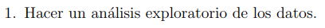
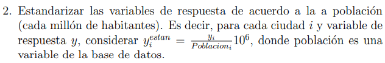
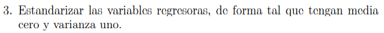
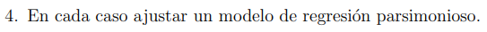

```{r setup, include=FALSE}
knitr::opts_chunk$set(echo = TRUE)
library(tidyverse)
library(readxl)
library(dplyr)
library(GGally)
library(mltools)
library(data.table)
library(glmnet)
library(car)
library(RColorBrewer)
library(MASS)
set.seed(999)
```
<br><br><br><br><br><br><br><br>

<h1 style="text-align: center;">

Regresión Lineal Múltiple

</h1>

<h3 style="text-align: center;">

TP Final

</h3>

<br><br><br><br>

<h3 style="text-align: center;">

Alumnos

</h3>

<h3 style="text-align: center;">

Nicolás Dominutti, Carlos Suarez Gurruchaga, Hernán Telechea

</h3>

<br>  <br><br><br>

------------------------------------------------------------------------

<br>



### Primer acercamiento y correcciones

```{r}
SegVial <- read_excel("SegVial.xlsx")

(head(SegVial,3))
glimpse(SegVial)
```

Tenemos 20 variables analizadas con 24 datos cada una, no se observan valores NaNs. 11 de esas variables aparecen como categóricas, el resto como cuantitativas. Sin embargo, al observar la tabla de datos, solo 3 deberían ser categóricas. Las demás aparecen como tal por tener decimales. Las vamos a transformar.

```{r}
SegVial[,c(6, 7, 8, 9, 10, 11, 18, 19)] = lapply(SegVial[,c(6, 7, 8, 9, 10, 11, 18, 19)], function(x) as.numeric(x))
summary(SegVial)
```
<br><br>

### Estudio de las covariables relacionadas con la poblacion

<br>

Vamosa empezar nuestro estudio de las covariables poniendo foco en la población de cada ciudad

```{r fig.height=4,fig.width=8}
boxplot(SegVial$Poblacion, main = "Poblacion", col = "blue", horizontal = T)
```

A priori, vemos cómo existen algunas ciudades que sobresalen en cuanto a población se refiere.

```{r fig.height=3,fig.width=8}
SegVial %>% ggplot(aes(x=reorder(Ciudad,Poblacion,max), y=Poblacion))+ geom_bar(stat = 'identity', col='red') +
  geom_bar(stat = 'identity', aes(x=Ciudad, y=PBI), col='blue') +
  theme(axis.text.x=element_text(angle = 90)) +
  labs(title="Población y PBI en cada ciudad")+
  xlab('Ciudades')
```

En este gráfico podemos ver la Población de cada ciudad en rojo y el PBI de las mismas en azul. Observamos que las 4 ciudades de las que hablábamos son: Inner London, Madrid, Rome y Paris, teniendo Inner London y París 2 de los PBI más elevados. Quizá el caso que más llama la atención es Montpellier, que presenta baja población pero muy alto PBI.

```{r fig.height=4,fig.width=8}
aux_plot = copy(SegVial)
aux_plot$PBI_per_capita = aux_plot$PBI / aux_plot$Poblacion
aux_plot %>% ggplot(aes(x=reorder(Ciudad,PBI_per_capita,max), y=PBI_per_capita))+ geom_bar(stat = 'identity', col='green') +
  theme(axis.text.x=element_text(angle = 90)) +
  labs(title="PBI per capita en cada ciudad")+
  xlab('Ciudades')
```

Vemos como al calcular el PBI per cápita Montpellier destaca y Madrid pasa a ser la ciudad con el indicador más bajo.

<br>

Analicemos ahora la Densidad Poblacional de cada ciudad
```{r fig.height=4,fig.width=8}
boxplot(SegVial$DenPob, main = "Densidad Poblacional", col = "blue", horizontal = T)
```

```{r fig.height=3,fig.width=8}
SegVial %>% ggplot(aes(x=reorder(Ciudad,DenPob,max), y=DenPob))+ geom_bar(stat = 'identity', col='red') +
  theme(axis.text.x=element_text(angle = 90)) +
  labs(title="Densidad Poblacional de cada ciudad")+
  xlab('Ciudades')
```

Observamos 4 ciudades que presentan valores de densidad poblacional mas elevadas que el resto: Paris, Barcelona, Inner London y Lyon. Sabemos que ciudades como Inner London o París tienen una elevada población, pero ciudades como Barcelona no, pero por otro lado también sabemos que la densidad poblacional es un ratio entre población sobre km2, veamos cómo son los km2 para cada ciudad.

```{r fig.height=3,fig.width=8}
aux_plot$km2 = aux_plot$Poblacion / aux_plot$DenPob
aux_plot %>% ggplot(aes(x=reorder(Ciudad,km2,max), y=km2))+ geom_bar(stat = 'identity', col='black') +
  theme(axis.text.x=element_text(angle = 90)) +
  labs(title="km2 de cada ciudad")+
  xlab('Ciudades')
```

Como decíamos antes, las ciudades con menor área van a ser más propensas a tener una concentración poblacional mayor, en este caso vemos cómo Barcelona, Lyon y Lillie tienen alta densidad poblacional no por su cuantiosa población, sino por su reducida área de extensión.

<br><br>

### Estudio de las variables target

<br>

```{r include=F, echo=F}
#Creamos sumatoria de accientes
SegVial$accidentes_viales = SegVial$PeatAuto + SegVial$CicAuto + SegVial$V2RMSM + SegVial$V2RMAuto + SegVial$AutoAuto + SegVial$AutoSM
```

Este trabajo tiene como objetivo intentar darle explicación a las variables de los accidentes ocurridos, con el fin de proponer políticas públicas para disminuirlos a futuro. En este apartado vamos a investigar un poco estas features target.

Primero que nada vamos a analizar cómo son las incidencias de cada tipo de accidente en todo el dataset y luego por ciudad

```{r}
color <- brewer.pal(6, "Pastel1")

pie(c(sum(SegVial$PeatAuto), sum(SegVial$CicAuto), sum(SegVial$V2RMSM),
  sum(SegVial$V2RMAuto), sum(SegVial$AutoSM), sum(SegVial$AutoAuto)), 
labels = c(" PEATON->AUTO (27.6%)"," CICLISTA->AUTO (11.9%)", " DOS RUEDAS(M)->SI MISMOS (8.6%)", 
           " DOS RUEDAS(M)->AUTO (29.2%)", " AUTO->SI MISMOS (7%)", " AUTO->AUTO (15.7%)"),
col = color, main = "DISTRIBUCION DE LOS ACCIDENTES EN EL DATASET")
```

Tenemos un dataset en donde la mayoría de los accidentes son de:
* vehículos de 2 ruedas vs autos
* autos a peatones


```{r}
incidencias = copy(SegVial)
incidencias = incidencias %>% dplyr::select(Ciudad, V2RMSM, V2RMAuto, AutoAuto, AutoSM, PeatAuto, CicAuto, accidentes_viales)
incidencias$V2RMSM = round(incidencias$V2RMSM / incidencias$accidentes_viales,4)
incidencias$V2RMAuto = round(incidencias$V2RMAuto / incidencias$accidentes_viales,4)
incidencias$AutoAuto = round(incidencias$AutoAuto / incidencias$accidentes_viales,4)
incidencias$AutoSM = round(incidencias$AutoSM / incidencias$accidentes_viales,4)
incidencias$PeatAuto = round(incidencias$PeatAuto / incidencias$accidentes_viales,4)
incidencias$CicAuto = round(incidencias$CicAuto / incidencias$accidentes_viales,4)
incidencias = melt(as.data.table(incidencias))
```
```{r fig.height=4,fig.width=8}
incidencias[incidencias$variable!='accidentes_viales',] %>% ggplot(aes(x=Ciudad ,y=value, fill  = variable))+ geom_bar(stat = "identity") +
  theme(axis.text.x=element_text(angle = 90)) +
  labs(title="Incidencia del tipo de accidentes por ciudad")
```

De este grafico podemos sacar información interesante:

* En Barcelona más del 75% de los accidentes involucran un vehículo de 2 ruedas motorizado
* Madrid, Niza, Marsella, Paris y Toulouse, son los otros  países en donde más del 50% de los accidentes involucran este tipo de vehículos
* Los accidentes que involucran a ciclistas representan un porcentaje mayor del total en Bristol, Inner London, Manchester, Oslo y Strasbourg, siendo en Bristol los de mayor incidencia
* Los choques entre autos son preponderantes en Sheffield
* Los accidentes que involucran peatones llegan al 48% en Glasgow, seguido por el 46% en Liverpool y el 42% en Bradford

<br>

Ahora vamos a ver más en detalle los valores que toman las variables respuesta en el dataset

```{r fig.height=8, fig.width=8}
par(mfrow = c(3, 2))


boxplot(SegVial$PeatAuto, col = "blue",
     main = "PEATON->AUTO", horizontal = T)

boxplot(SegVial$CicAuto, col = "blue",
     main = "CICLISTA->AUTO", horizontal = T)

boxplot(SegVial$V2RMSM, col = "blue",
     main = "MOTO->SI MISMO", horizontal = T)

boxplot(SegVial$V2RMAuto, col = "blue",
     main = "MOTO->AUTO", horizontal = T)

boxplot(SegVial$AutoSM, col = "blue",
     main = "AUTO->SI MISMO", horizontal = T)

boxplot(SegVial$AutoAuto, col = "blue",
     main = "AUTO->AUTO", horizontal = T)
```

```{r}
aux_para_plot = reshape2::melt(SegVial[,c('Ciudad','V2RMSM','V2RMAuto','AutoAuto','AutoSM','PeatAuto','CicAuto','accidentes_viales')], value.name = "accidentes")
```
```{r fig.height=3,fig.width=8}
aux_para_plot %>% ggplot(aes(x=Ciudad ,y=accidentes, alpha=.2, color = variable))+ geom_point() +
  theme(axis.text.x=element_text(angle = 90)) +
  labs(title="Cantidad de accidentes por tipo en cada ciudad")
```

De estos gráfico podemos ver que:
* Hay ciudades con cantidades atípicamente altas de accidentes de los diversos tipos
* Inner London resulta ser la ciudad que tiene mayor cantidad de accidentes totales, accidentes PeatAuto y accidentes V2RMAuto
* Roma y Madrid ocupan el 2do y 3er puesto respectivamente en cuando a accidentes totales

Recordemos del apartado de población, que estas son las 3 ciudades que mayor población tienen. 

Veamos ahora con un poco más de detalle por tipo de accidente

```{r echo=FALSE, fig.height=3, fig.width=8}
SegVial %>% ggplot(aes(x=reorder(Ciudad,PeatAuto,max), y=PeatAuto))+ 
  geom_bar(stat = 'identity', col='red') +
  theme(axis.text.x=element_text(angle = 90)) +
  labs(title="Accidentes Peaton-Auto")+
  xlab('Ciudades')

SegVial %>% ggplot(aes(x=reorder(Ciudad,CicAuto,max), y=CicAuto))+ 
  geom_bar(stat = 'identity', col='red') +
  theme(axis.text.x=element_text(angle = 90)) +
  labs(title="Accidentes Cic-Auto")+
  xlab('Ciudades')

SegVial %>% ggplot(aes(x=reorder(Ciudad,V2RMAuto,max), y=V2RMAuto))+ 
  geom_bar(stat = 'identity', col='red') +
  theme(axis.text.x=element_text(angle = 90)) +
  labs(title="Accidentes V2RM-Auto")+
  xlab('Ciudades')

SegVial %>% ggplot(aes(x=reorder(Ciudad,AutoSM,max), y=AutoSM))+ 
  geom_bar(stat = 'identity', col='red') +
  theme(axis.text.x=element_text(angle = 90)) +
  labs(title="Accidentes AutoSM")+
  xlab('Ciudades')

SegVial %>% ggplot(aes(x=reorder(Ciudad,AutoAuto,max), y=AutoAuto))+ 
  geom_bar(stat = 'identity', col='red') +
  theme(axis.text.x=element_text(angle = 90)) +
  labs(title="Accidentes Auto-Auto")+
  xlab('Ciudades')

SegVial %>% ggplot(aes(x=reorder(Ciudad,V2RMSM,max), y=V2RMSM))+ 
  geom_bar(stat = 'identity', col='red') +
  theme(axis.text.x=element_text(angle = 90)) +
  labs(title="Accidentes V2RSM")+
  xlab('Ciudades')
```
 
Como dijimos, observamos que tanto la ciudad de *Inner London*, como *Roma* y *Madrid* aparecen en la mayoria de los casos con valores muy altos de accidentes de distintos tipos.

<br><br>

## Estudio de variables regresoras

<br>

##### Areas ciclista y baja velocidad

Vamos a continuar analizando las covariables relacionadas al area destinada para cada uso

```{r fig.height=6,fig.width=8}
par(mfrow = c(2,1))

boxplot(SegVial$ArCiclista, main = "Area Ciclista vs Motor", col = "blue",horizontal = T)
boxplot(SegVial$ArBajaVel, main = "Area baja velocidad", col = "blue",horizontal = T)
```

Sobre la relacion entre el area destinada de baja velocidad, no observamos valores alejados del grupo para alguna ciudad en particular.

```{r}
round(mean(SegVial$ArBajaVel), 2)
```
Observamos que en promedio 7 de cada 10 km2 no tienen restricciones de velocidad en las Ciudades. 

```{r}
SegVial %>% 
  dplyr::select(Pais, Ciudad, ArCiclista) %>% 
  arrange(-ArCiclista) %>% head(2)
```

Respecto a la relacion entre el area destinada para Ciclistas vs Vehiculos Motorizados, observamos 2 Ciudades de Francia, que presentan una cantidad de superficie mayor para el uso de la bicicleta, respecto al grupo de ciudades estudiado en general. 

<br>

##### Parcitipación modal

```{r fig.height=3,fig.width=8}
aux_para_plot = reshape2::melt(SegVial[,c('Ciudad','PMPeatones','PMCiclistas','PMTPublico','PMVMotor')], value.name = "PM")
aux_para_plot %>% ggplot(aes(x=Ciudad ,y=PM, alpha=.2, fill  = variable))+ geom_bar(stat = "identity") +
  theme(axis.text.x=element_text(angle = 90)) +
  labs(title="PM por tipo de movilidad en cada ciudad")
```

A simple vista podemos ver que:
* Existe una clara preponderancia del transporte via vehiculo motorizado
* París es la ciudad con una menor PM de vehículos a motor y una mayor incidencia de personas que se desplazan caminando. Recordemos que París es una de las ciudades con mayor cantidad de accidentes de V2RM
* Barcelona también tiene poco PM de vehículos con motor, preponderando el transporte público
* Leeds, Bordeaux, Roma y Sheffield tienen muy bajo PM de peatones
* Bristol y Strasbourg tienen niveles elevados de ciclistas, respecto a las demas ciudades

<br>

##### Variables meteorológicas

```{r fig.height=6,fig.width=8}
par(mfrow = c(2,1))

boxplot(SegVial$Temp, main = "TEMPERATURA MEDIA [C]", col = "blue", horizontal = T)
boxplot(SegVial$Precipitacion, main = "PRECIPITACION MEDIA [mm]", col = "blue", horizontal = T)
```

```{r}
SegVial %>% 
  dplyr::select(Pais, Ciudad, Precipitacion) %>% 
  arrange(-Precipitacion) %>% head(1)
```
Observamos un valor elevado de mm de agua para la ciudad de Glasgow, ¿Esto impacta en la cantidad de ciclistas?

```{r fig.height=8,fig.width=8}
par(mfrow = c(2, 2))


plot(y = SegVial$PMCiclistas, x = SegVial$Precipitacion, col = "blue",
     main = "modal CICLISTAS vs mm PRECIPITADOS", 
     xlab = "mm PRECIPITADOS", ylab = "CICLISTAS [%]")

plot(y = SegVial$PMPeatones, x = SegVial$Precipitacion, col = "blue",
     main = "modal PEATONES vs mm PRECIPITADOS", 
     xlab = "mm PRECIPITADOS", ylab = "PEATONES [%]")


plot(y = SegVial$PMCiclistas, x = SegVial$Temp, col = "blue",
     main = "modal CICLISTAS vs Temp Media")

plot(y = SegVial$PMPeatones, x = SegVial$Temp, col = "blue",
     main = "modal PEATONES vs Temp Media")

```
```{r}
cor(SegVial$PMCiclistas, SegVial[, c(18:19)], method = "spearman")
```
No se observa una correlacion entre una ciudad con muchas lluvias o con mucha temperatura y el optar o no por el transporte en bicicleta.


*Revisemos lo mismo con peatones*

```{r}
cor(SegVial$PMPeatones, SegVial[, c(18:19)], method = "spearman")
```

Aqui si se observa una correlacion un poco más fuerte. Para las ciudades que tienen una media de temperatura mas elevada, la gente utiliza mas el transporte a pie, lo cual tiene sentido. A su vez, tambien observamos que ciudades que presentan mas cantidad de lluvias, ven reducido el uso del transporte a pie.

```{r}
cor(SegVial$PMTPublico, SegVial[, c(18:19)], method = "spearman")
cor(SegVial$PMVMotor, SegVial[, c(18:19)], method = "spearman")
```

Observamos que ciudades con mayor cantidad de precipitaciones, y temperaturas medias mas bajas, tienen un aumento del transporte motorizado.


<br><br>

Continuamos el analisis respondiendo algunas preguntas típicas de los accidentes viales:

*¿Mayor densidad de poblacion favorece la cantidad de accidentes en general?*

```{r fig.height=6, fig.width=8}
par(mfrow = c(2,3))
plot(SegVial$DenPob, SegVial$AutoAuto, main='DenPob vs accidentes Auto-Auto')
plot(SegVial$DenPob, SegVial$AutoSM, main='DenPob vs accidentes AutoSM')
plot(SegVial$DenPob, SegVial$V2RMAuto, main='DenPob vs accidentes V2RM-Auto')
plot(SegVial$DenPob, SegVial$V2RMSM, main='DenPob vs accidentes V2RMSM')
plot(SegVial$DenPob, SegVial$PeatAuto, main='DenPob vs accidentes Peat-Auto')
plot(SegVial$DenPob, SegVial$CicAuto, main='DenPob vs accidentes Cic-Auto')
```

Por sentido común, esperaríamos que poblaciones con mayor densidad sean propensas a más accidentes, de cualquier tipo, ya que la concentración de gente en zonas más pequeñas deberia impactar en el ordenamiento del tránsito. Sin embargo, los plots no indican esto, por lo que DenPob no pareciera ser una variable muy indicadora del nivel de accidentes. 

*¿Mayor cantidad de poblacion favorece a la cantidad de accidentes?*

```{r fig.height=6,fig.width=8}
par(mfrow = c(2,3))
plot(SegVial$Poblacion, SegVial$AutoAuto, main='Poblacion vs accidentes Auto-Auto')
plot(SegVial$Poblacion, SegVial$AutoSM, main='Poblacion vs accidentes AutoSM')
plot(SegVial$Poblacion, SegVial$V2RMAuto, main='Poblacion vs accidentes V2RM-Auto')
plot(SegVial$Poblacion, SegVial$V2RMSM, main='Poblacion vs accidentes V2RMSM')
plot(SegVial$Poblacion, SegVial$PeatAuto, main='Poblacion vs accidentes Peat-Auto')
plot(SegVial$Poblacion, SegVial$CicAuto, main='Poblacion vs accidentes Cic-Auto')
```

```{r}
t(cor(SegVial$Poblacion, SegVial[, c(12:17)], 
                         method = "spearman"))
```

Observamos que la población tiene relación aproximadamente lineal respecto a los distintos tipos de accidentes. No sabemos si las variables de accidente son realmente índices o totales de accidentes. Si fueran lo segundo, tiene sentido el efecto - donde hay más gente, podés reportar más casos-. Sin embargo, cabe destacar como vimos en los gráficos previos, que esa gente esté más o menos distante, impacta poco.

nota: Cabe aclarar que se evidencia visualmente la presencia de valores atipicamente altos, que fueron analizados previamente en la seccion "ANALISIS DE LOS TARGETS".

Vamos a analizar si alguna covariable presenta una correlacion lineal contra la variable target_combinacion (sumatoria de todos los accidentes por ciudad). Si fuera asi, esto indicaria que tiene algo que explicar con respecto a alguno de los targets.

```{r fig.width=8, fig.height=8}
df_pairs_1 = SegVial[,-c(1:3, 5, 12:20)]

ggpairs(df_pairs_1, progress = F)
```
```{r fig.width=8, fig.height=8}
df_pairs_2 = SegVial[,c(18:21)]

ggpairs(df_pairs_2, progress = F)
```

Observamos una gran correlacion entre nuestro target_combination y poblacion, asi como tambien con PMTPublico y a continuacion lo siguen ArCiclista, Precipitacion y PMCiclistas. Estas covariables probablemente puedan explicarnos bastante de nuestros targets al momento de armar los modelos.

------------------------------------------------------------------------

<br>



```{r}
SegVial$PeatAuto_std = (SegVial$PeatAuto / SegVial$Poblacion) * (10 ^ 6)
SegVial$CicAuto_std  = (SegVial$CicAuto  / SegVial$Poblacion) * (10 ^ 6)
SegVial$V2RMSM_std   = (SegVial$V2RMSM   / SegVial$Poblacion) * (10 ^ 6)
SegVial$V2RMAuto_std = (SegVial$V2RMAuto / SegVial$Poblacion) * (10 ^ 6)
SegVial$AutoSM_std   = (SegVial$AutoSM   / SegVial$Poblacion) * (10 ^ 6)
SegVial$AutoAuto_std = (SegVial$AutoAuto / SegVial$Poblacion) * (10 ^ 6)
SegVial$accidentes_viales_std = (SegVial$accidentes_viales / SegVial$Poblacion) * (10 ^ 6)
```

------------------------------------------------------------------------

<br>



```{r}
SegVial[,-c(1:3, 12:17, 21:26)] = as.data.frame(scale(SegVial[,-c(1:3, 12:17, 21:26)]))

head(SegVial)
```

Como ya dijimos, el objetivo del presente trabajo es encontrar caracteristicas urbanas para encontrar las vulnerabilidades de los usuarios viales, y de esta manera proponer politicas publicas eficaces para disminuir la fatalidad y cantidad de accidentes. Dicho esto, dado las características del dataset,  se evidencia que las covariables Pais, Codigo Pais y Ciudad, no nos darian informacion util para este analisis, y por tanto optamos por descartarlas.

```{r}
df_peatauto = SegVial[, -c(1:3, 12:17, 21, 23:28)]
df_cicauto  = SegVial[, -c(1:3, 12:17, 21, 22, 24:28)]
df_v2rmsm   = SegVial[, -c(1:3, 12:17, 21, 23, 25:28)]
df_v2rmauto = SegVial[, -c(1:3 ,12:17, 21:24, 26:28)]
df_autosm   = SegVial[, -c(1:3 ,12:17, 21:25, 27:28)]
df_autoauto = SegVial[, -c(1:3 ,12:17, 21:26, 28)]
df_accidentesviales = SegVial[, -c(1:3 ,12:17, 21:27)]
```

------------------------------------------------------------------------

<br><br>



<br>

# TARGET PEATAUTO

<br>

```{r}
modelo_peatauto_ls = lm(PeatAuto_std ~., df_peatauto)

summary(modelo_peatauto_ls)
```
Observamos un R2adj del orden del 50%, y un pvalue global, no tan bueno como nos gustaria, pero significativo. Tambien notamos que varios estimadores no resultan significativamente distintos de 0, esto puede deberse a problemas de alta colinealidad entre covariables. Vamos a realizar un analisis de la colinealidad entre las covariables.

<br>

#### Vamos a realizar un analisis VIF

<br>

nota: Aplicamos una transformacion logaritmica para una visualizacion mas amigable, los valores por sobre la linea roja, indican correlacion elevada.

```{r fig.height=5,fig.width=8}
barplot(log(vif(modelo_peatauto_ls))[vif(modelo_peatauto_ls) > 5],
          main = "log VIF DE LAS COVARIABLES", col = "blue")

abline(h = log(5), lwd = 2, col = "red")
```

(Cabe destacar en el gráfico se muestra el logaritmo de los valores del VIF, para facilitar la visualización)

Se observan problemas de colinealidad entre las participaciones modales de las formas de transporte: PMPeatones, PMCiclistas, PMTPublic y PMVmotor. Esto tiene logica desde la construccion de las variables modales.

<br>

#### Vamos a trabajar para intentar solucionar los problemas de multicolinealidad hallados.

<br>

Un primer approach podemos hacerlo a partir de metodos de seleccion de covariables como el criterio stepwise.

*METODO STEPWISE TARGET PEATAUTO*

```{r}
modelo_peatauto_wise=step(modelo_peatauto_ls, direction = c("both"), trace = F)

summary(modelo_peatauto_wise)
```

Pasamos de tener 11 a 8 covariables en nuestro modelo, pero observamos que el metodo opto por quedarse con las covariables de participacion modal. Tambien, observamos una mejoria en el R2adj, asi como tambien en el RSE. Tambien logramos aumentar la cantidad de estimadores estadisticamente distintos de cero.

```{r fig.height=5,fig.width=8}
barplot(log(vif(modelo_peatauto_wise))[vif(modelo_peatauto_wise) > 5],
          main = "log VIF DE LAS COVARIABLES", col = "blue")

abline(h = log(5), lwd = 2, col = "red")
```

Seguimos manteniendo el problema de multicolinealidad, vamos a probar otro enfoque.

Vamos a aplicar un metodo de regularizacion, para quitar covariables, a ver si logramos mejorar nuestro modelo.

<br>

*METODO DE REGULARIZACION LASSO TARGET PEATAUTO*

```{r}
xx = model.matrix(PeatAuto_std ~., data = df_peatauto)[, -1]

modelo_peatauto_lassocv <- cv.glmnet(xx, y = df_peatauto$PeatAuto_std, 
                                         alpha = 1,
                                         nfolds = 5)
```


```{r}
modelo_peatauto_lassocv_min <- glmnet(xx, y = df_peatauto$PeatAuto_std, 
                                         alpha = 1,
                                         lambda = modelo_peatauto_lassocv$lambda.min)

modelo_peatauto_lassocv_1sd <- glmnet(xx, y = df_peatauto$PeatAuto_std, 
                                         alpha = 1,
                                         lambda = modelo_peatauto_lassocv$lambda.1se)

cbind(coef(modelo_peatauto_lassocv_min),
      coef(modelo_peatauto_lassocv_1sd))
```
Ambos criterios de penalidad deciden conservar las mismas covariables para la regresion

```{r}
modelo_peatauto_ls_2=lm(PeatAuto_std ~ ArCiclista + PMPeatones, data = df_peatauto)

summary(modelo_peatauto_ls_2)
```
Observamos pvalue global e individuales mucho mas significativos. Nuestro R2adj se ubica en un 55% para el target PeatAuto_std.

```{r fig.height=5,fig.width=8}
par(mfrow=c(2,2))
plot(modelo_peatauto_ls_2)
```

Revisamos si los residuos poseen algun tipo de estructura o si se encuentra algun outlier, pero todo parece estar en orden.

```{r include=F, echo=F}
library(RobStatTM)
```


```{r}
control = lmrobdet.control(bb = 0.5, efficiency = 0.85, family = "bisquare")

modelo_MM_peatauto= lmrobdetMM(PeatAuto_std ~ ArCiclista + 
                              PMPeatones, data = df_peatauto, control = control)

summary(modelo_MM_peatauto)
```
```{r fig.height=4,fig.width=8}
plot(modelo_MM_peatauto$residuals, modelo_MM_peatauto$rweights,
     main = "ESTUDIO DE OUTLIERS", xlab = "RESIDUOS", ylab = "RWEIGHTS", col = "blue")
```

No se observan outliers, pero conseguimos un mejor R2adj que con el metodo de LS.

<br><br>

# TARGET CICAUTO

<br>

```{r}
modelo_cicauto_ls = lm(CicAuto_std ~., data = df_cicauto)

summary(modelo_cicauto_ls)
```
```{r fig.height=5,fig.width=8}
barplot(log(vif(modelo_cicauto_ls))[vif(modelo_cicauto_ls) > 5],
          main = "log VIF DE LAS COVARIABLES", col = "blue")

abline(h = log(5), lwd = 2, col = "red")
```

<br>

#### METODO STEPWISE TARGET CICAUTO

<br>

```{r}
modelo_cicauto_wise=step(modelo_cicauto_ls, direction = c("both"), trace = F)

summary(modelo_cicauto_wise)
```

<br>

#### METODO DE REGULARIZACION LASSO TARGET CICAUTO

<br>

```{r}
xx = model.matrix(CicAuto_std ~., data = df_cicauto)[, -1]

modelo_cicauto_lassocv <- cv.glmnet(xx, y = df_cicauto$CicAuto_std, 
                                         alpha = 1,
                                         nfolds = 5)
```


```{r}
modelo_cicauto_lassocv_min <- glmnet(xx, y = df_cicauto$CicAuto_std, 
                                         alpha = 1,
                                         lambda = modelo_cicauto_lassocv$lambda.min)

modelo_cicauto_lassocv_1sd <- glmnet(xx, y = df_cicauto$CicAuto_std, 
                                         alpha = 1,
                                         lambda = modelo_cicauto_lassocv$lambda.1se)

cbind(coef(modelo_cicauto_lassocv_min),
      coef(modelo_cicauto_lassocv_1sd))
```

Observamos que el criterio 1sd de lambda, directamente nos deja sin covariables y que el criterio min, nos sugiere que dejemos tanto PMPeatones como PMTPublico, dado que ambas tienen colinealidad como marcamos previamente, optamos por dejar solo PMPeatones

```{r}
modelo_cicauto_ls_2=lm(CicAuto_std ~ PMPeatones + Temp, data = df_cicauto)

summary(modelo_cicauto_ls_2)
```

No nos queda un modelo muy bueno, por ahora nos quedariamos con *modelo_cicauto_wise*

```{r fig.height=5,fig.width=8}
par(mfrow=c(2,2))
plot(modelo_cicauto_wise)
```

Se observan registros a tener en cuenta con alto leverage y residuo cercano a 3

```{r}
modelo_MM_cicauto = lmrobdetMM(CicAuto_std ~ PMPeatones + Temp, data = df_cicauto, control = control)

summary(modelo_MM_cicauto)
```

```{r fig.height=4,fig.width=8}
plot(modelo_MM_cicauto$residuals, modelo_MM_cicauto$rweights,
     main = "ESTUDIO DE OUTLIERS", xlab = "RESIDUOS", ylab = "RWEIGHTS", col = "blue")
```

Encontramos 1 outlier, al que la regresion robusta le asigna un rweight de 0, y que tiene un residuo muy elevado.

```{r}
sort(modelo_MM_cicauto$rweights)[1]
```

Dropeamos esta ciudad y creamos un modelo OLS:

```{r}
modelo_cicauto_ls_3 = lm(CicAuto_std ~ PMPeatones + Temp, data = df_cicauto[-c(20),])

summary(modelo_cicauto_ls_3)
```

<br><br>

# TARGET V2RMSM

<br>

```{r}
modelo_v2rmsm_ls = lm(V2RMSM_std ~., data = df_v2rmsm)

summary(modelo_v2rmsm_ls)
```
```{r fig.height=5,fig.width=8}
barplot(log(vif(modelo_v2rmsm_ls))[vif(modelo_v2rmsm_ls) > 5],
          main = "log VIF DE LAS COVARIABLES", col = "blue")

abline(h = log(5), lwd = 2, col = "red")
```

<br>

#### METODO STEPWISE TARGET V2RMSM

<br>

```{r}
modelo_v2rmsm_wise=step(modelo_v2rmsm_ls, direction = c("both"), trace = F)

summary(modelo_v2rmsm_wise)
```

<br>

#### METODO DE REGULARIZACION LASSO TARGET V2RMSM

<br>

```{r}
xx = model.matrix(V2RMSM_std ~., data = df_v2rmsm)[, -1]

modelo_v2rmsm_lassocv <- cv.glmnet(xx, y = df_v2rmsm$V2RMSM_std, 
                                         alpha = 1,
                                         nfolds = 5)
```


```{r}
modelo_v2rmsm_lassocv_min <- glmnet(xx, y = df_v2rmsm$V2RMSM_std, 
                                         alpha = 1,
                                         lambda = modelo_v2rmsm_lassocv$lambda.min)

modelo_v2rmsm_lassocv_1sd <- glmnet(xx, y = df_v2rmsm$V2RMSM_std, 
                                         alpha = 1,
                                         lambda = modelo_v2rmsm_lassocv$lambda.1se)

cbind(coef(modelo_v2rmsm_lassocv_min),
      coef(modelo_v2rmsm_lassocv_1sd))
```

Vamos a adoptar el criterio min en este caso

```{r}
modelo_v2rmsm_ls_2=lm(V2RMSM_std ~ Poblacion + ArBajaVel + PMCiclistas+
                        Precipitacion + Temp, data = df_v2rmsm)

summary(modelo_v2rmsm_ls_2)
```

```{r fig.height=5,fig.width=8}
par(mfrow=c(2,2))
plot(modelo_v2rmsm_ls_2)
```

Hay algunas ciudades con alta distancia de cook y residuo superior a modulo de 2.

```{r}
modelo_MM_v2rmsm = lmrobdetMM(V2RMSM_std ~ Poblacion + ArBajaVel + PMCiclistas + 
    Precipitacion + Temp, data = df_v2rmsm, control = control)

summary(modelo_MM_v2rmsm)
```

```{r fig.height=4,fig.width=8}
plot(modelo_MM_v2rmsm$residuals, modelo_MM_v2rmsm$rweights,
     main = "ESTUDIO DE OUTLIERS", xlab = "RESIDUOS", ylab = "RWEIGHTS", col = "blue")
```

```{r}
sort(modelo_MM_v2rmsm$rweights)[1]
SegVial[c(6) ,"Ciudad"]
```

Encontramos que la ciudad de Marseille, tiene un residuo muy alto y peso bajo segun nuestro modelo robusto. Vamos a dropearla y crear otro modelo LS, sin esta observacion.

```{r}
modelo_v2rmsm_ls_3 = lm(V2RMSM_std ~ Poblacion + ArBajaVel + PMCiclistas + 
                      Precipitacion + Temp, data = df_v2rmsm[-c(6),])


summary(modelo_v2rmsm_ls_3)
```

Vamos a ver si podemos encontrar alguna transformacion de las covariables que mejore aun mas nuestro modelo.

```{r}
# 
df_v2rmsm$PMCiclistas = df_v2rmsm$PMCiclistas + 1
df_v2rmsm$Precipitacion = df_v2rmsm$Precipitacion + 2.1
df_v2rmsm$Temp = df_v2rmsm$Temp + 2
# 
# boxTidwell(V2RMSM_std ~ Precipitacion + PMCiclistas + Temp, data = df_v2rmsm[-c(6), ])
```


```{r}
df_v2rmsm$PMCiclistas2 = 1/sqrt(df_v2rmsm$PMCiclistas)

df_v2rmsm$Temp = sqrt(df_v2rmsm$Temp)

df_v2rmsm$Precipitacion2 = df_v2rmsm$Precipitacion^2

modelo_v2rmsm_ls_3 = lm(V2RMSM_std ~ Poblacion + ArBajaVel + 
                     PMCiclistas2 + Precipitacion2 + Temp , data = df_v2rmsm[-c(6),])


summary(modelo_v2rmsm_ls_3)
```
```{r}
modelo_v2rmsm_wise2 = step(modelo_v2rmsm_ls_3, direction = c("both"), trace = F)

summary(modelo_v2rmsm_wise2)
```

<br><br>

# TARGET V2RMAUTO

<br>

```{r}
modelo_v2rmauto_ls = lm(V2RMAuto_std ~., data = df_v2rmauto)

summary(modelo_v2rmauto_ls)
```
```{r}
modelo_v2rmauto_wise = step(modelo_v2rmauto_ls, direction = c("both"), 
                            trace = F)


summary(modelo_v2rmauto_wise)
```
```{r fig.height=4, fig.width=8}
barplot(log(vif(modelo_v2rmauto_wise))[vif(modelo_v2rmauto_wise) > 5],
          main = "log VIF DE LAS COVARIABLES", col = "blue")

abline(h = log(5), lwd = 2, col = "red")
```

<br>

#### METODO DE REGULARIZACION LASSO TARGET V2RMAUTO

<br>

```{r}
xx = model.matrix(V2RMAuto_std ~., data = df_v2rmauto)[, -1]

modelo_v2rmauto_lassocv <- cv.glmnet(xx, y = df_v2rmauto$V2RMAuto_std, 
                                         alpha = 1,
                                         nfolds = 5)
```


```{r}
modelo_v2rmauto_lassocv_min <- glmnet(xx, y = df_v2rmauto$V2RMAuto_std, 
                                         alpha = 1,
                                         lambda = modelo_v2rmauto_lassocv$lambda.min)

modelo_v2rmauto_lassocv_1sd <- glmnet(xx, y = df_v2rmauto$V2RMAuto_std, 
                                         alpha = 1,
                                         lambda = modelo_v2rmauto_lassocv$lambda.1se)

cbind(coef(modelo_v2rmauto_lassocv_min),
      coef(modelo_v2rmauto_lassocv_1sd))
```

Vamos a adoptar el criterio min en este caso

```{r}
modelo_v2rmauto_ls_2=lm(V2RMAuto_std ~ Poblacion + ArCiclista +
                        Precipitacion + Temp, data = df_v2rmauto)

summary(modelo_v2rmauto_ls_2)
```
```{r}
modelo_v2rmauto_wise_2=step(modelo_v2rmauto_ls_2, direction = c("both"), 
                            trace = F)

summary(modelo_v2rmauto_wise_2)
```

```{r fig.height=5, fig.width=8}
modelo_MM_v2rmauto= lmrobdetMM(V2RMAuto_std ~ Poblacion + ArCiclista + Precipitacion + 
    Temp, data = df_v2rmauto, control = control)
plot(modelo_MM_v2rmauto$residuals, modelo_MM_v2rmauto$rweights)
```

Observamos dos ciudades que son outliers

```{r}
sort(modelo_MM_v2rmauto$rweights)[1:2]
```

```{r}
modelo_v2rmauto_wise_3=step(lm(V2RMAuto_std ~ ., data = df_v2rmauto[-c(6, 9),]), 
                            direction = c("both"), 
                            trace = F)

summary(modelo_v2rmauto_wise_3)
```
```{r fig.height=5, fig.width=8}
par(mfrow=c(2,2))
plot(modelo_v2rmauto_wise_3)
```

No se observa estructura, ni residuos mayores a modulos de 3.

<br><br>

# TARGET AUTOSM

<br>

```{r}
modelo_autosm_ls=lm(AutoSM_std ~., data = df_autosm)

summary(modelo_autosm_ls)
```
```{r fig.height=4, fig.width=8}
barplot(log(vif(modelo_autosm_ls))[vif(modelo_autosm_ls) > 5],
          main = "log VIF DE LAS COVARIABLES", col = "blue")

abline(h = log(5), lwd = 2, col = "red")
```

<br>

#### METODO DE REGULARIZACION LASSO TARGET AUTOSM

<br>

```{r}
xx = model.matrix(AutoSM_std ~., data = df_autosm)[, -1]

modelo_autosm_lassocv <- cv.glmnet(xx, y = df_autosm$AutoSM_std, 
                                         alpha = 1,
                                         nfolds = 5,
                                         maxit=1000000)
```


```{r}
modelo_autosm_lassocv_min <- glmnet(xx, y = df_autosm$AutoSM_std, 
                                         alpha = 1,
                                         lambda = modelo_autosm_lassocv$lambda.min)

modelo_autosm_lassocv_1sd <- glmnet(xx, y = df_autosm$AutoSM_std, 
                                         alpha = 1,
                                         lambda = modelo_autosm_lassocv$lambda.1se)

cbind(coef(modelo_autosm_lassocv_min),
      coef(modelo_autosm_lassocv_1sd))
```

```{r}
modelo_autosm_ls2 = lm(AutoSM_std ~ ArCiclista + ArBajaVel + PMPeatones, 
                       data = df_autosm)

summary(modelo_autosm_ls2)
```
```{r fig.height=5,fig.width=8}
par(mfrow=c(2,2))
plot(modelo_autosm_ls2)
```

A partir de los graficos de los residuos, decidimos intentar alguna transformacion a ver si mejora nuestro modelo.

```{r fig.height=5,fig.width=8}
df_autosm$AutoSM_std = df_autosm$AutoSM_std + 0.01

boxcox(modelo_autosm_ls2)
```

```{r}
df_autosm$AutoSM_std = sqrt(df_autosm$AutoSM_std)

modelo_autosm_ls3 = lm(AutoSM_std ~ ArCiclista + ArBajaVel + PMPeatones, 
                       data = df_autosm)

summary(modelo_autosm_ls3)
```
```{r fig.height=5,fig.width=8}
par(mfrow=c(2,2))
plot(modelo_autosm_ls3)
```

```{r fig.height=5,fig.width=8}
modelo_MM_autosm = lmrobdetMM(AutoSM_std ~ ArCiclista + ArBajaVel + PMPeatones, 
    data = df_autosm, control = control)
plot(modelo_MM_autosm$residuals, modelo_MM_autosm$rweights)
```

No vemos outliers a considerar

<br><br>

# TARGET AUTOAUTO

<br>

```{r}
modelo_autoauto_ls = lm(AutoAuto_std ~., data = df_autoauto)

summary(modelo_autoauto_ls)
```

Realizamos un estudio de la colinealidad de las covariables del modelo, ya que tan pocos betas significativos nos da la idea de un problema por ese lado.

```{r fig.height=5,fig.width=8}
barplot(log(vif(modelo_autoauto_ls))[vif(modelo_autoauto_ls) > 5],
          main = "log VIF DE LAS COVARIABLES", col = "blue")

abline(h = log(5), lwd = 2, col = "red")
```

<br>

#### APLICAMOS METODO LASSO DE REGULARIZACION TARGET AUTOAUTO

<br>

```{r}
xx = model.matrix(AutoAuto_std ~., data = df_autoauto)[, -1]

modelo_autoauto_lassocv <- cv.glmnet(xx, y = df_autoauto$AutoAuto_std, 
                                         alpha = 1,
                                         nfolds = 5)
```


```{r}
modelo_autoauto_lassocv_min <- glmnet(xx, y = df_autoauto$AutoAuto_std, 
                                         alpha = 1,
                                         lambda = modelo_autoauto_lassocv$lambda.min)

modelo_autoauto_lassocv_1sd <- glmnet(xx, y = df_autoauto$AutoAuto_std, 
                                         alpha = 1,
                                         lambda = modelo_autoauto_lassocv$lambda.1se)

cbind(coef(modelo_autoauto_lassocv_min),
      coef(modelo_autoauto_lassocv_1sd))
```

Si bien nuestro modelo lasso nos devuelve PMCiclistas y PMPeatones, vamos a optar por quedarnos solo con PMPeatones, ya que por construccion sabemos que ambas covariables tienen problemas de multicolinealidad elevada.

```{r}
modelo_autoauto_ls_2 = lm(AutoAuto_std ~ ArCiclista + ArBajaVel + PMPeatones, data = df_autoauto)

summary(modelo_autoauto_ls_2)
```

```{r}
summary(step(modelo_autoauto_ls_2, direction = c("both"), trace = F))
```

```{r fig.height=5,fig.width=8}
modelo_MM_autoauto = lmrobdetMM(AutoAuto_std ~ ArCiclista + ArBajaVel + 
                               PMPeatones, data = df_autoauto, control = control)
plot(modelo_MM_autoauto$residuals, modelo_MM_autoauto$rweights)
```

Observamos 2 ciudades con valores de residuos muy elevados

```{r}
sort(modelo_MM_autoauto$rweights)[1:2]
```

```{r}
modelo_autoauto_ls_3=lm(AutoAuto_std ~ ArCiclista + ArBajaVel + PMPeatones, 
    data = df_autoauto[-c(13, 22),])

summary(modelo_autoauto_ls_3)
```
```{r fig.height=5,fig.width=8}
par(mfrow=c(2,2))
plot(modelo_autoauto_ls_3)
```

Observamos una buena apariencia en los residuos 

```{r}
cor.test(abs(modelo_autoauto_ls_3$residuals), 
         modelo_autoauto_ls_3$fitted.values, method = "spearman")
```

Comprobamos que no hay Heterocedasticidad

```{r}
vif(modelo_autoauto_ls_3)
```

Eliminamos el problema de multicolinealidad entre las covariables

<br><br>

**Vamos ahora a analizar todas las clases de accidentes viales, utilizando la variable accidentes_viales, que es una combinacion lineal de las anteriores**

# TARGET ACCIDENTES VIALES

<br>

```{r}
modelo_accidentes_viales_ls = lm(accidentes_viales_std ~. ,df_accidentesviales)

summary(modelo_accidentes_viales_ls)
```

```{r fig.height=5,fig.width=8}
barplot(log(vif(modelo_accidentes_viales_ls))[vif(modelo_accidentes_viales_ls) > 5],
          main = "log VIF DE LAS COVARIABLES", col = "blue")

abline(h = log(5), lwd = 2, col = "red")
```

<br>

#### APLICAMOS METODO LASSO DE REGULARIZACION TARGET ACCIDENTES_VIALES

<br>

```{r}
xx = model.matrix(accidentes_viales_std ~., data = df_accidentesviales)[, -1]

modelo_accidentesviales_lassocv <- cv.glmnet(xx, y = df_accidentesviales$accidentes_viales_std, 
                                             alpha = 1,
                                             nfolds = 5)
```


```{r}
modelo_accidentesviales_lassocv_min <- glmnet(xx, y = df_accidentesviales$accidentes_viales_std, 
                                         alpha = 1,
                                         lambda = modelo_accidentesviales_lassocv$lambda.min)

modelo_accidentesviales_lassocv_1sd <- glmnet(xx, y = df_accidentesviales$accidentes_viales_std, 
                                         alpha = 1,
                                         lambda = modelo_accidentesviales_lassocv$lambda.1se)

cbind(coef(modelo_accidentesviales_lassocv_min),
      coef(modelo_accidentesviales_lassocv_1sd))
```

```{r}
modelo_accidentes_viales_ls2 = lm(accidentes_viales_std ~ Poblacion + ArCiclista 
                                                        + ArBajaVel + PMPeatones, data = df_accidentesviales)

summary(modelo_accidentes_viales_ls2)
```

Observamos que los coeficientes estimados de nuestra regresion tienen un pvalue, cercano al 5%, deberemos tener en cuenta esto.

```{r}
vif(modelo_accidentes_viales_ls2)
```
No se observa problemas de multicolinealidad entre las covariables.

```{r fig.height=5,fig.width=8}
par(mfrow=c(2,2))
plot(modelo_accidentes_viales_ls2)
```

Observamos que la observacion 20, tiene un muy alto leverage y un residuo de 2, es una ciudad que se debe estudiar con cuidado. Fuera de eso, no se ve estructura en los residuos y parece haber homocedasticidad y distribucion normal de los residuos. En el QQplot, volvemos a ver resaltada la observacion 22.


```{r fig.height=5,fig.width=8}
modelo_MM_accidentesviales = lmrobdetMM(accidentes_viales_std ~ Poblacion + ArCiclista + 
    ArBajaVel + PMPeatones, data = df_accidentesviales, control = control)

plot(modelo_MM_accidentesviales$residuals, modelo_MM_accidentesviales$rweights)
```

No se encuentran outliers. No nos encontramos que se le haya asignado un rweight de 0 a la observacion 22, con lo que optamos por no considerarla outlier y la conservaremos.

```{r}
summary(modelo_MM_accidentesviales)
```

Si bien el R2adj de nuestro modelo robusto es superior al de OLS anteriormente mencionado (modelo_accidentes_viales_ls2), vamos a preferir el anterior para tareas de inferencia, debido a que sus coeficientes son mas significativos que este caso.

