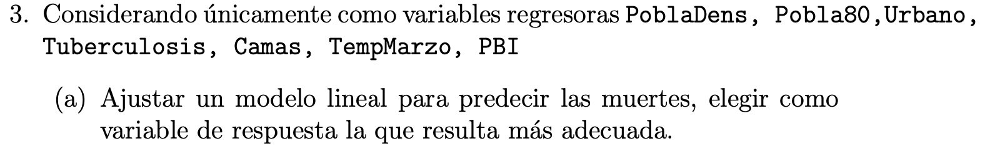
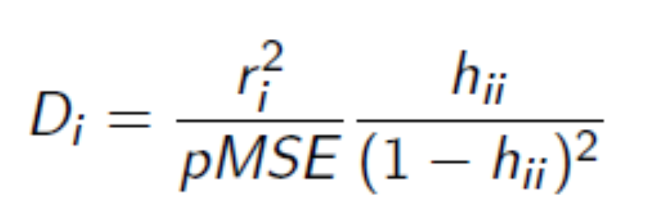
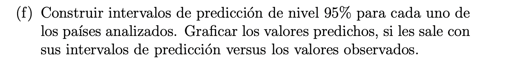
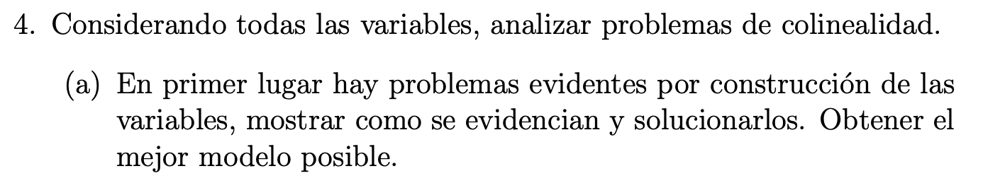
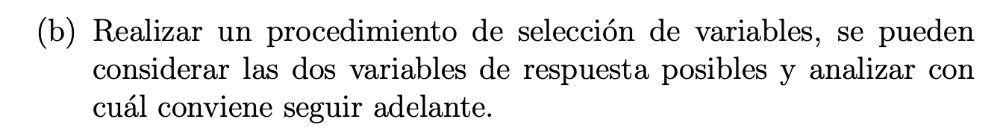
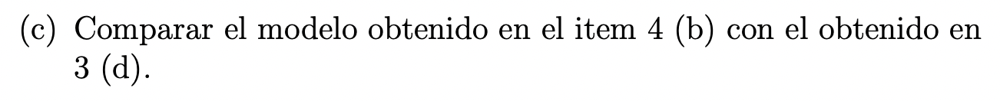

```{r setup, include=FALSE}
knitr::opts_chunk$set(echo = TRUE)
library(car)
library(dplyr)
library(corrplot)
library(RobStatTM)
library(glmnet)
```

<br><br><br><br><br><br><br><br>

<h1 style="text-align: center;">

Regresión Lineal Múltiple

</h1>

<h3 style="text-align: center;">

TP Integrador

</h3>

<br><br><br><br>

<h3 style="text-align: center;">

Alumnos

</h3>

<h3 style="text-align: center;">

Nicolás Dominutti, Carlos Suarez Gurruchaga, Hernán Telechea

</h3>

<br>  <br><br><br><br><br><br>

------------------------------------------------------------------------
```{r}
set.seed(101)
```

------------------------------------------------------------------------


```{r}
COVID = read.csv("COVID.txt", sep="")
dim(COVID)
summary(COVID)
```

Hay 35 variables analizadas para las 139 filas de datos. Una de las
variables es la lista de países. 3 de las variables son cualitativas,
mientras que las demás son cuantitativas.

```{r}
attach(COVID)

par(mfrow=c(1, 2))

boxplot(muertes.permil ~ BCGf, 
        main = "Muertes por millón de habitantes",
        ylab = "Muertes.permil", col=c("thistle","wheat"), 
        cex = 0.7, xlab = "Estrategia de inmunización",
        names = c("selectiva", "todos"))

boxplot(l10muertes.permil ~ BCGf, 
        main = "Muertes por millón [log]",
        ylab = "log10muertes.permil", col=c("thistle","wheat"),
        cex = 0.7, xlab = "Estrategia de inmunización", 
        names = c("selectiva", "todos"))
```

Ante esta comparación de boxplots, conviene considerar la variables
l10muertes.permil porque la relación entre BCGf y muertes.permil no
parece ser muy lineal y estaría considerando muchos valores como
potencialmente atípicos cuando en realidad no lo son. Al aplicar
logaritmo, apenas un dato es considerado extraño, mientras que el resto
de los datos parecen estar más claramente distribuidos. Me doy cuenta
mucho más fácilmente que tener una estrategia de vacunación contra BCG
selectiva podría generar un mayor número de muertes en las poblaciones.

------------------------------------------------------------------------


Continuamos el análisis con la variable l10muertes.permil.

```{r}
#cor(COVID[,-c(1,2,34)])
```

Las relaciones más fuertes entre variables son: Pobla80 con Hombre80 y
Mujer80, que tiene mucho sentido dado que la población es una función de
los hombres y mujeres mayores a 80 años. El total de mujeres en la
población total es mayor a la de los hombres, por eso su correlación es
\~0.99 (la de los hombres es \~0.98). En cambio, las muertes no parecen
tener relación alguna con otras enfermedades o la densidad poblacional
(correlaciones menores al módulo de 0.05).

Planteamos algunas preguntas para identificar relaciones entre variables
(muchas de ellas dentro de las más consultadas durante la pandemia):

-   ¿Mueren más donde peores condiciones económicas hay?

```{r}
plot(PBI,l10muertes.permil)
cor(PBI,l10muertes.permil)
```

Es poco clara la relación. Si bien un alto porcentaje de los países con
bajo PBI tienen un bajo total de muertes logarítmicas por millón, es
poco claro el incremento (o decrecimiento) de esta variable a mayores
niveles de PBI. Es débil esta relación: la correlación es positiva en
\~0.53.

-   ¿Tiene que ver la edad de los casos en la probabilidad de morir?

```{r}
plot(PoblaMid,l10muertes.permil)
```

```{r}
plot(Pobla65,l10muertes.permil)
```

```{r}
plot(Pobla80,l10muertes.permil)
```

Al comparar 3 tipos de población, identificamos que, cuanto mayor es la
edad promedio de la población, más relación lineal hay con respecto al
total de muertes. Esto se comprueba con las correlaciones:

```{r}
cor(PoblaMid,l10muertes.permil)
cor(Pobla65,l10muertes.permil)
cor(Pobla80,l10muertes.permil)
```

Las 3 correlaciones son positivas pero la mayor se da con Pobla80
(0.6676).

-   ¿El COVID se propaga en ambientes más fríos?

```{r}
plot(TempMarzo,l10muertes.permil)
cor(TempMarzo,l10muertes.permil)
```

Al parecer, temporaturas más elevadas parecen generar menores chances de
mortalidad, quizás porque los contagios son menores y/o el virus resiste
menos. De todas formas, no es fuerte la relación (correlación es
negativa en \~0.51).

```{r}
mean(l10muertes.permil[TempMarzo > 20] < 1)
```

El \~80% de los países cuya temperatura promedio en marzo fue mayor a 20
grados tuvieron menos de 1 muerte logarítmica por mil.

```{r}
plot(Tiempo,TempMarzo)
mean(Tiempo[TempMarzo > 20] > 60)
```

Sin embargo, estos datos solo son de marzo de 2020, época en la que la
enfermedad aún no estaba tan propagada en países del hemisferio sur (más
cálido en esa época). Por ende, en lugar de decir que hubo menos muertes
porque el ambiente era más cálido, podríamos inferir que esto fue así
porque la enfermedad tardó más en llegar. Con esto, también visualizamos
que los países con mayores temperaturas en marzo son también los que más
tardaron en registrar contagios, en promedio. De todas maneras, no
sabemos si esos contagios tardaron en llegar por la temperatura o por
alguna otra causa que desconocemos.

-   ¿Hay menos muertes en los países que mayor atención médica tienen?

```{r}
plot(Camas,l10muertes.permil)
cor(Camas,l10muertes.permil)

plot(Medicos,l10muertes.permil)
cor(Medicos,l10muertes.permil)

df = COVID[ ,c(5:7, 10, 11, 12, 23, 24, 25, 26, 27, 35)]
pairs(df[ ,c("l10muertes.permil", "Pobla80", "Pobla65", 
             "PBI", "Tuberculosis", "Medicos", "Camas")])
```

Esta relación parece contradictoria. Si bien no es fuerte, mucho no dice
que tener camas ayuda a que la gente no se muera. No es un factor tan
determinante. La relación entre médicos y muertes tiene un poco más de
sentido. En los mismos lugares en los que mayor número de muertes hay,
mayor es la presencia de médicos, quizás por el tamaño poblacional. La
correlación es positiva en \~0.62.

-   ¿Es más fácil la propagación en ambientes urbanos?

```{r}
plot(Urbano,l10muertes.permil)
cor(Urbano,l10muertes.permil)
```

Es bastante claro que ambientes más urbanizados tienen mayor número de
muertes. Esto es porque la población total también es mayor.

-   ¿Cuál es la incidencia de las muertes por sobre los casos?

```{r}
COVID$Incidencia = round(COVID$muertes / COVID$casos,2)
hist(COVID$Incidencia)
```

Vemos que, en la mayoría de los países, la incidencia fue de entre 0 y
0.05. Veamos cuáles son los que quedan hacia la cola derecha:

```{r}
COVID %>% 
  filter((COVID$Incidencia>.1)) %>%
  select('CntrName')
```

Como punto en común, podemos decir que todos estos países pertenecen al
hemisferio norte y, salvo México, Belize y Yemen, +70% de ellos son
europeos.

```{r}
df = COVID %>%
     mutate(alto = case_when(Incidencia > .1 ~ 1, Incidencia <= .1 ~ 0))

pairs(df %>% 
         filter(df$alto==1) %>%
         select('Pobla80','muertes.permil',
                'casos.permil','l10muertes.permil'),
         col = "darkblue")
```

En este pairplot, podemos ver que, dentro de los países donde la
mortalidad del virus sobre los casos totales fue mayor al .1%, existe
una posible relación marcada entre la proporción de habitantes con +80
años y las muertes por mil.

```{r}
aux = df %>% filter(df$alto==1)

plot(y=aux$Pobla80, x=aux$muertes.permil, main='Efecto de poblaciones longevas\n sobre muertes en países con letalidad alta')
abline(h=4.5, col='red')
```

En este deepdive, podemos ver que se podría segmentar estos países en 2
clusters, teniendo en cuenta el marcado salto que se produce en las
muertes por mil cuando la variable Pobla80 supera el 4.4%.

Tomamos otras variables que, intuitivamente, parecieran tener relación
directa en muertes o, en algunos casos, en los casos de covid.

¿Existirá alguna relación detectable?

```{r}
pairs(df %>%
        select('ExpectVida','Pobla80','l10muertes.permil'), col = "darkblue")
```

Vemos que, en países donde la expectativa de vida es mayor, se
produjeron más muertes. Esto se podría explicar por la relación directa
(logarítmica) que tiene esta variable con la proporción de personas
mayores a 80 años presentes en este tipo de países y, cómo vimos en el
punto anterior, esta variable se encuentra relacionada con las muertes.

Ahora, intentemos detectar estas relaciones lineales de las que hablamos
previamente, calculando el índice de correlación de Pearson:

```{r, fig.width=10}
corrplot(
  cor(select_if(df, is.numeric)),
  type='lower',
  #addCoef.col="black",
  number.cex=0.75,
  mar=c(0,0,1,0),
  title = 'Matriz de correlaciones'
  )
```

------------------------------------------------------------------------



```{r}
lm.covid = lm(l10muertes.permil ~ PoblaDens + Pobla80 + Urbano + 
                                  Tuberculosis + Camas + TempMarzo + PBI, 
              data = COVID)

lm.covid_2 = lm(muertes.permil ~ PoblaDens + Pobla80 + Urbano + 
                                  Tuberculosis + Camas + TempMarzo + PBI, 
              data = COVID)

summary(lm.covid)
summary(lm.covid_2)
```

Optamos por utilizar como variable target l10muertes.permil, debido a su
mayor R2 y cantidad de regresoras significativas para el modelo.


```{r}
leverage_sorted=sort(hatvalues(lm.covid), decreasing = T)

boxplot(leverage_sorted, 
        main = "LEVERAGE DE LAS OBSERVACIONES PARA DISTINTOS PAISES",
        col = "blue")
```

```{r}
leverage_sorted[1:10]
```

Se observa que el modelo le asigna un leverage muy elevado a la
observacion que representa a Singapur, seguida por las que representan a
Qatar, Japan, Mongolia, Canada, Bielorusia, Luxemburgo,
Brunei_Darussalam, Gabon y Lesotho, respectivamente.

```{r}
plot(lm.covid, 4)
```

En esta representancion de las distancias de Cook, observamos tambien
que las observaciones de Singapur, Japan y Qatar, presentan elevadas
distancias de Cook, lo cual reafirma que tienen un leverage elevado, ya
que la misma es proporcional a el leverage de la observacion, asi como
tambien al residuo de la misma. Por lo que ahora queda pendiente
analizar los residuos de estas observaciones para descartar o no que
sean posibles outliers, o simplemente observaciones muy influyentes para
nuestro modelo.

{width="287"}


```{r}
plot(lm.covid, 3)
```

Al analizar el aspecto de los residuos del modelo, pareciera haber un
grado de HETEROCEDASTICIDAD de los residuos, pero no visualizamos
ninguna estructura en los mismos.

```{r}
cor.test(abs(lm.covid$residuals), lm.covid$fitted.values, method = "spearman")
```

Con un pvalue pequeño rechazamos H0, y por tanto las varianzas de los
residuos son distintas, hay HETEROCEDASTICIDAD.

```{r}
plot(lm.covid, 2)
```

```{r}
ks.test(lm.covid$residuals, "pnorm",
                             mean(lm.covid$residuals), 
                             sd(lm.covid$residuals))
```

Con un pvalue de 0.89, nuestros residuos tienen una distribucion que se
asemeja a una normal.

```{r}
plot(lm.covid, 5)
```

Al analizar los residuos en funcion del Leverage de las observaciones,
vemos que la observacion correspondiente a Singapur, si bien tiene un
leverage elevado como mencionamos en el item anterior, no posee un
residuo alto, y por tanto (por el momento) preferimos dejarla en el modelo. Tambien
vemos resaltadas las observaciones Qatar y Japan, las cuales tambien
poseen un alto valor de Leverage, pero su residuo no parece ser alto y
por tanto no serian outliers.

```{r}
step(lm.covid, direction = "both")
```

Realizamos un analisis de los residuos del modelo en funcion de las
covariables utilizadas a partir del criterio "STEPWISE" y llegamos a la
conclusion que el mejor modelo es el que utiliza todas las variables
propuestas en el item 3), sin quitar ninguna.

Respecto a las covariables que mas influencia cobran para predecir el
target, se encuentran el promedio de poblacion masculina y femenina
mayor a 80 años en primer medida, seguido por la cantidad de camas de
hospital cada 1000 personas.


### ANALISIS DE OUTLIERS POR REGRESION ROBUSTA

Vamos a plantear una regresion robusta para chequear si los betas
estimados por OLS dan parecidos, o hay observaciones que nos estan
afectando la regresion y no las encontramos en los analisis hechos.

```{r}
control = lmrobdet.control(bb = 0.5, efficiency = 0.85, family = "bisquare")


modelo_MM_covid = lmrobdetMM(l10muertes.permil ~ PoblaDens + Pobla80 + Urbano + 
                                  Tuberculosis + Camas + TempMarzo + PBI, 
                             data = COVID, control = control)

summary(modelo_MM_covid)

```

```{r}
(lm.covid$coefficients)
(modelo_MM_covid$coefficients)
```

Los beta estimados por ambos metodos son muy semejantes, lo que nos da
la pauta de que NO tenemos outliers que esten viciando nuestro modelo
original de LS, respecto a los coeficientes que no dan estadisiticamente
significativos para el metodo robusto, puede deberse a que el mismo por
el metodo que emplea para su calculo, sus intervalos son mas largos que
los que devuelve OLS y por tanto, puede ocurrir que el 0 caiga dentro
del intervalo, dandonos a creer que una variable no tiene informacion
util para darnos, cuando no es asi. Por esto vamos a continuar con el
metodo de OLS, dado que no tenemos outliers y es el metodo que nos
devuelve los intervalos de los betas mas pequeños.

```{r}
plot(y = modelo_MM_covid$rweights, 
     x = modelo_MM_covid$residuals, col = "blue",
     ylim = c(0, 1), xlab = "RESIDUOS", ylab = "RWEIGHTS",
     main = "RWEIGHTS vs RESIDUOS MODELO ROBUSTO")

abline(h = 0, col = "red", lwd = 2)
```

Reafirmamos que no tenemos observaciones que sean outliers, ya que el
metodo MMestimadores, no tiene ninguna observacion que le asigne un peso
de 0


```{r}
df2 = COVID[, c("PoblaDens","Pobla80", "Urbano", "Tuberculosis", "Camas", "TempMarzo", "PBI")]


pairs(df2)
```

Probamos crear una interaccion entre las variables PBI y Camas

```{r}
df2[, "PBIcamas"] = df2$Camas * df2$PBI

lm.covid_interaccion = lm(l10muertes.permil ~ PoblaDens + Pobla80 + 
                            Urbano + Tuberculosis + Camas + 
                            TempMarzo + PBI + PBIcamas, data = df2)

summary(lm.covid_interaccion)
```

NO observamos una mejoria del R2 respecto al modelo original.

```{r}
df2[,"PBIpobla80"] = df2$PBI * df2$Pobla80

lm.covid_interaccion_2 = lm(l10muertes.permil ~ PoblaDens + Pobla80 + 
                            Urbano + Tuberculosis + Camas + 
                            TempMarzo + PBI + PBIpobla80, data = df2)

summary(lm.covid_interaccion_2)
```

Tampoco observamos un aumento significativo en el R2 al interaccionar
PBI con Pobla80.

Continuamos probando interacciones en busca de una mejora del R2.

```{r}
df2[, "PBItemp"] = df2$TempMarzo * df2$PBI

lm.covid_interaccion_3 = lm(l10muertes.permil ~ PoblaDens + Pobla80 + 
                            Urbano + Tuberculosis + Camas + 
                            TempMarzo + PBI + PBItemp, data = df2)

summary(lm.covid_interaccion_3)
```

```{r}
df2[, "PBIurbano"] = df2$Urbano * df2$PBI

lm.covid_interaccion_4 = lm(l10muertes.permil ~ PoblaDens + Pobla80 + 
                            Urbano + Tuberculosis + Camas + 
                            TempMarzo + PBI + PBIurbano, data = df2)

summary(lm.covid_interaccion_4)
```

```{r}
df2[, "PBI^2"] = df2$PBI * df2$PBI

lm.covid_interaccion_5 = lm(l10muertes.permil ~ PoblaDens + Pobla80 + 
                            Urbano + Tuberculosis + Camas + 
                            TempMarzo + PBI + PBI^2, data = df2)

summary(lm.covid_interaccion_5)
```

Si bien no conseguimos una mejora muy significativa, la mejor
interaccion que conseguimos fue entre PBI y Urbano. Vamos a aplicar
nuevamente el criterio de seleccion STEPWISE, para ver si adoptamos esta
interaccion o mantenemos nuestro modelo origil.


```{r}
step(lm.covid_interaccion_4, direction = "both")
```

Nuestro analisis de residuos por STEPWISE considera que es mejor no
tomar en cuenta la interaccion, asi que vamos a continuar con nuestro
modelo original.



```{r}
int_prediccion = predict(lm.covid, newdata = COVID, interval = c("predict"))

plot(y = lm.covid$fitted.values, 
     x = COVID$l10muertes.permil, 
     col = "darkblue", ylim = c(-2, 5), cex = .8,
     xlab = "VALORES OBSERVADOS", ylab = "VALORES PREDICHOS")

# Intervalos de prediccion
points(x = COVID$l10muertes.permil, 
      y = int_prediccion[, 2], col = "darkred", lwd =3, cex = 0.5)

points(x = COVID$l10muertes.permil, 
       y = int_prediccion[, 3], col = "darkred", lwd =3, cex = 0.5)

legend("topleft", c("INTERVALO DE PREDICCION", "OBSERVACION"), fill = c("darkred", "darkblue"))
```

------------------------------------------------------------------------



PROBLEMAS DE COLINEALIDAD:

Por construccion sabemos que geoID nos otorga la misma informacion que
CntrName.

Por construccion sabemos que casos y casos.permil, estan altamente
correlacionadas.

Por construccion sabemos que muertes y muertes.permil, estan altamente
correlacionadas.

Por construccion sabemos que Pobla80, esta relacionado altamente con
Mujeres80 y Hombres80, ya que es el promedio de los dos anteriores.

Por construccion sabemos tambien que EnfNoTrans y EnfTrans guardan una
colinealidad por construccion.

Por construccion sabemos tambien que HipTen esta relacionada altamente
con HipTen.H e HipTen.M, ya que es el promedio de los dos anteriores.

Por construccion sabemos tambien que BCG y BCGf tienen correlacion 1.

Sobre estos casos, una posible solucion seria optar por alguna de las
variables que estan correlacionadas entre si, eliminando las demas, que
no aportan informacion util nueva. Por lo tanto vamos a adoptar
quedarnos con CntrName, casos.permil, muertes.permil, Pobla80, EnfTrans,
HipTen, BCG, eliminando las demas.

A su vez, tambien vamos a realizar un analisis de multicolinealidad a partir del *Factor de inflacion de la varianza (VIF)*

```{r}
df_for_vif = COVID[, -c(1, 2, 3, 4, 5, 8, 9, 21, 30, 31, 34, 36)]
lm_for_vif = lm(l10muertes.permil ~., data = df_for_vif)

barplot(vif(lm_for_vif)[vif(lm_for_vif)>5], main = "VIF DE LAS COVARIABLES",
                                             col = "blue", cex.names = 0.65)
abline(h = 5, lwd = 2, col = "red")
```

Recordemos que el VIF es una medida de inflación de los coeficientes de la variable independiente debido a multicolinealidad entre las variables regresoras.
Un VIF que excede 5 requiere investigación de multicolinealidad y un VIF de >10 indica multicolinealidad.

Investigaremos luego los siguientes casos de alto VIF más elevados:

* Pobla80
* Pobla65
* ExpectVida
* EnfTrans

```{r}
cov_altoVIF = names(vif(lm_for_vif)[vif(lm_for_vif)>5])

data.frame(t(cor(df_for_vif$Pobla80, df_for_vif[, cov_altoVIF], 
               method = "spearman")))

data.frame(t(cor(df_for_vif$Pobla65, df_for_vif[, cov_altoVIF], 
               method = "spearman")))

data.frame(t(cor(df_for_vif$ExpectVida, df_for_vif[, cov_altoVIF], 
               method = "spearman")))

data.frame(t(cor(df_for_vif$EnfTrans, df_for_vif[, cov_altoVIF], 
               method = "spearman")))
```

* Estos valores pueden deberse a que paises con PBIs mas altos, tienen mejor calidad de vida, con lo que reducen la probabilida de muerte por condiciones nutricionales, ademas poseen mejor infraestructura hospitalaria, con lo que las madres tienen mayores tratamientos disponibles para evitar las enfermedades transmisibles. 
* A su vez, paises con mejor infraestructura y mas tratamientos disponibles, aumentan la expectativa de vida de la poblacion, asi como tambien permiten una reduccion de la mortalidad neonatal. Paises con altos PBI, que invierten mas en infraestructura medica, y tienen mayor espectativa de vida, fomentan mas la creacion y atraccion de profesionales en el area de la medicina.
* Deberiamos estudiar como fueron tomados los datos, pero por la tan alta correlacion, podemos llegar a pensar que una persona tiene 80 años, ya tiene mas de 65, con lo cual, la poblacion mayor a 80, esta incluida dentro de la poblacion de mas de 65.
* Si cambiamos el foco a a varible de ExpectVida, vemos que resulta racional que, a mayor expectativa de vida, las variables que indican mortalidad tienden a disminuír, el PBI tiende a aumentar junto con la variable de Médicos cada 1000 habitantes (como vimos antes)
* Por último, cuando miramos las enfermedades transmisibles la historia no parece cambiar y, como distintivo, vemos claramente que esta variable está relacionada con la mortalidad neonatal.

```{r}
df3 = COVID[, -c(1, 3, 4, 8, 9, 21, 30, 31, 34, 36)]
```

La covariable CntrName, podriamos codificarla como una variable dummie
para poder alimentar el modelo, pero optamos por no incluirla en la
regresion, ya que realizar ese proceso, aumentaria aun mas la
dimensionalidad de nuestro problema que ya de por si es alta, y relacion
costo beneficio, no creemos que lo valga.

```{r}
covariables_l10muertes=df3[, -c(1, 2)]
covariables_muertes_permil=df3[, -c(1, 4)]

modelo_muertes_permil = lm(muertes.permil~. , data = covariables_muertes_permil)
summary(modelo_muertes_permil)

modelo_l10muertes = lm(l10muertes.permil~. , data = covariables_l10muertes)
summary(modelo_l10muertes)
```

Observamos que utilizando la transformacion logaritmica del target
obtenemos el R2 mas elevado, asi como tambien mas estimadores
estadisticamente distintos de cero. Aun asi, observamos que debido a la
gran varianza que tienen nuestros estimadores, hay muchos coeficientes
que no logran ser significativos, esto puede deberse a los problemas de
colinealidad que mencionamos previamente y aun no eliminamos.

*Mejor modelo hasta el momento: modelo_l10muertes*.

<br>


Vamos a aplicar el metodo de seleccion de variables stepwise, utilizando
como metrica a minimizar el criterio de AKAIKE, para intentar disminuir
los problemas de colinealidad y con ello mejorar nuestro
modelo.

```{r}
wise_modelo_l10muertes = step(modelo_l10muertes, direction = c("both"), 
                                                 trace = F)

summary(wise_modelo_l10muertes)
```
```{r}
barplot(vif(wise_modelo_l10muertes), main = "VIF DE LAS COVARIABLES",
                                     col = "blue", cex.names = 0.65, 
                                     ylim=c(0,6), las=2)
abline(h = 5, lwd = 2, col = "red")
```

Disminuimos la cantidad de covariables de nuestro modelo de 23 a 10, el
R2 aumento un poco, el RSE disminuyo tambien y, al parecer, eliminamos el problema de multicolinealidad. A su vez vemos tambien
que el numero de betas estimados que son significativamente distintos de
cero aumento considerablemente, con lo que tenemos un mejor modelo, con menor varianza en sus coeficientes.

```{r}
wise_modelo_muertes_permil = step(modelo_muertes_permil, direction = c("both"),
                                                         trace = F)

summary(wise_modelo_muertes_permil)
```

Observamos nuevamente que conviene trabajar con el target convertido,
pero destacamos la mejora en el R2 y RSE respecto al modelo antes de
aplicar el criterio de seleccion.

#### Vamos a probar utilizar un enfoque backward a ver si llegamos a un
resultado distinto

```{r}
back_modelo_l10muertes = step(modelo_l10muertes, direction = c("back"),
                                                 trace = F)
summary(back_modelo_l10muertes)
```

Vemos que el R2 y el RSE coinciden con el metodo stepwise, asi como los
betas estimados, con lo que concluimos que el mejor modelo que podemos
conseguir a este punto es wise_modelo_l10muertes.

<br>

### METODOS DE REGULARIZACION

Vamos a probar ahora reducir la dimensionalidad de nuestro problema a
partir de metodos de regularizacion.

```{r}
xx = model.matrix(l10muertes.permil ~., data = covariables_l10muertes)[, -1]

lassocv_modelo_l10muertes <- cv.glmnet(xx, y = l10muertes.permil, 
                                         alpha = 1,
                                         nfolds = 5,
                                         family = "gaussian",
                                         type.measure = "mse")

```

Obtenemos los mejores valores de lambda para aplicar regularizacion
lasso, usando como metrica el error cuadratico medio.

```{r}
lassocv_modelo_l10muertes$lambda.min
lassocv_modelo_l10muertes$lambda.1se
```

Ahora aplicamos la regularizacion lasso con el lambda obtenido para ver
que covariables sobreviven.

```{r}
lasso_modelo_l10muertes_min <- glmnet(xx, y = l10muertes.permil, 
                                         alpha = 1,
                                         lambda = lassocv_modelo_l10muertes$lambda.min)

lasso_modelo_l10muertes_1sd <- glmnet(xx, y = l10muertes.permil, 
                                         alpha = 1,
                                         lambda = lassocv_modelo_l10muertes$lambda.1se)

cbind(coef(lasso_modelo_l10muertes_min),
      coef(lasso_modelo_l10muertes_1sd))
```

Notamos que usando la regularizacion con lambda.min, no logramos reducir demasiado la dimensionalidad del problema, por lo que vamos a adoptar directamente el criterio de seleccion por lambda.1se

<br>

#### CRITERIO DE LAMBDA MIN + 1se

Sobreviven las covariables casos.permil, Pobla80, ExpectVida.

Si bien el metodo nos quita la variable BCG, por el tipo de problema que
se esta analizando, consideramos que es importante, con lo que vamos a
conservala de todos modos.

```{r}
ls_covid_lasso_final_1se = lm(l10muertes.permil ~ casos.permil + Pobla80 + ExpectVida + 
                       BCG,  data = covariables_l10muertes)

summary(ls_covid_lasso_final_1se)
```

Notamos que al utilizar el metodo de regularizacion lasso,
nuestro R2 *NO* supera al obtenido a partir del criterio stepwise. Por lo
tanto vamos a conservar el modelo obtenido con stepwise, como el
definitivo.


Entonces por el momento nuestro mejor modelo es el *wise_modelo_l10muertes*, vamos a analizar sus residuos para entender la performance

```{r}
plot(wise_modelo_l10muertes)
```

Vemos la clara presencia de un outlier (alto leverage y alto residuo) que está dañando la regresión. El país que causa el problema es Qatar y la razón por la que es determinado como outlier es que tiene valores extremos de casos.permil, sin embargo, es uno de los países que menos muertes por mil tuvo. Tal diferencia nos llevaría a pensar que pudo haberse dado un error tanto en la recolección de los datos de casos o de muertes. También cabe destacar que es el país con mayor PBI (aunque este número pareciera ser más racional).

```{r fig.width=12, fig.height=3}
par(mfrow=c(1, 3))
aux = COVID[COVID$casos.permil>3000,]
barplot(aux$casos.permil, names.arg=aux$geoId, las=2, main='Casos por mil por país')
barplot(aux$muertes.permil, names.arg=aux$geoId, las=2, main='Muertes por mil por país')
barplot(aux$PBI, names.arg=aux$geoId, las=2, main='PBI por país')
```

Tomando este punto de evaluación como disparador, vamos a utilizar distintas técnicas para intentar mejorar la performance de nuestro mejor modelo hasta el momento.

<br>

# ¿Casos atípicos? Proceso de optimización del modelo

<br>

#### Prueba 1: drop de Qatar
Probemos ajustando una regresión sin este valor atípico, la misma debiera performar mucho mejor.

```{r}
df4 = COVID[, -c(2, 3, 4, 5, 8, 9, 21, 30, 31, 34, 36)]
df4 = df4[df4$geoId!='QA',]
modelo_l10muertes_V2 = lm(l10muertes.permil~. , data = df4[,-1])
summary(modelo_l10muertes_V2)
```

Efectivamente logramos que la regresión aumentara su R2ajustado en +10%, pero vemos que solo 4 de los beta estimados rechazan el test-t, lo que sería un indicio probable de la presencia de multicolinealidad, vamos a correr un proceso de selección de variables sobre este modelo para intentar solucionar dicho problema.

```{r}
wise_modelo_l10muertes_V2 = step(modelo_l10muertes_V2, direction = c("both"),
                                                         trace = F)

summary(wise_modelo_l10muertes_V2)
```

Vemos como al seleccionar las variables correctas pareciera que el modelo ya no tiene multicolinealidades y mejora su performance, pero nos surge una nueva duda ¿existen nuevos outliers que no hayamos detectado hasta el momento?

<br>

#### Prueba 2: nuevos outliers? Drop de Singapur
Como disparador en la respuesta de esta pregunta vamos inspeccionar los residuos del último modelo propuesto

```{r}
plot(wise_modelo_l10muertes_V2)
```

Encontramos un nuevo punto con alto leverage y, pese a tener un relativamente bajo residuo estandarizado absoluta, tiene una alta distancia de Cook, por lo que investigaremos más en detalle este punto, que es Singapur (ya visto como punto extremo en el punto 3c del presente trabajo)

```{r fig.width=12, fig.height=3}
aux = COVID[COVID$PoblaDens>3,]
barplot(aux$PoblaDens, names.arg=aux$geoId, las=2, main='Densidad poblacional por país')
```

Vemos que Singapur es país con mayor densidad poblacional del set de datos, llegando estar a +79 (siendo la segunda mayor de apenas más de 12). Puede ser que, debido a este punto, nuestro modelo no pueda lograr ajustar bien a dicho país (teniendo en cuenta que el beta estimado para la variable PoblaDens es de -0.023). Vamos a probar sacando este valor, volviendo a ajustar y corriendo un proceso de selección de variables para lidiar con la multicolinealidad.

```{r}
df5 = df4[df4$geoId!='SG',]
modelo_l10muertes_V3 = lm(l10muertes.permil~. , data = df5[,-1])
summary(modelo_l10muertes_V3)
```

```{r}
wise_modelo_muertes_permil_V3 = step(modelo_l10muertes_V3, direction = c("both"),
                                                         trace = F)
summary(wise_modelo_muertes_permil_V3)
```

Vemos que nuestro r2-ajustado mejora un poco y la gran mayoría de las variables resultan significativas

```{r}
plot(wise_modelo_muertes_permil_V3)
```

Al ver los residuos podemos decir que ya no se ven puntos atípicos a simple vista, al parecer hemos logrado un modelo consistente y que performa bien (recordemos el salto de un modelo de 0.61 de r2-ajustado a uno de 0.7978). Pero no vamos a detenernos con lo obtenido, tenemos aun 2 approachs por probar, siendo el primero de ellos una regresión robusta

<br>

#### Prueba 3: regresión robusta
Para esta prueba vamos a retrotraernos al modelo *antes de dropear cualquier instancia*. El plan es simple, ajustar una regresión robusta y luego analizar los residuos de esta, para detectar los outliers.

```{r} 
control = lmrobdet.control(bb = 0.5, efficiency = 0.85, family = "bisquare")
df6 = COVID[, -c(2, 3, 4, 5, 8, 9, 21, 30, 31, 34, 36)]
modelo_MM_covid_V2 = lmrobdetMM(l10muertes.permil ~ ., 
                             data = df6[,-1], control = control)
summary(modelo_MM_covid_V2)
```

```{r}
plot(modelo_MM_covid_V2$residuals,modelo_MM_covid_V2$rweights, 
     main = "REGRESION ROBUSTA 1", xlab = "RESIDUOS", 
     ylab = "RWEIGHTS",col = "blue")
```

Vemos que con este método no vemos 2 valores atípicos como en el anterior, sino que vemos 5 de ellos. Desde nuestro punto de vista resultaría muy "costoso" dropear todos estos valores, por lo que no quisieramos recurrir a esta opción. De todas formas vamos a correr un modelo quitando estos datos para analizar si esto mejora la performance del mismo y, de hacerlo, dimensionar en cuanto lo hace.

```{r}
df6 = df6[(df6$geoId!='US')&(df6$geoId!='CN')&(df6$geoId!='IN')&(df6$geoId!='QA')&(df6$geoId!='JP'),]# DROPEAMOS LOS 5 OUTLIERS QUE DETECTO MM
modelo_l10muertes_V3 = lm(l10muertes.permil~. , data = df6[,-1])
summary(modelo_l10muertes_V3)
```

```{r}
wise_modelo_muertes_permil_V4 = step(modelo_l10muertes_V3, direction = c("both"),
                                                         trace = F)
formula_elegida = wise_modelo_muertes_permil_V4$call$formula #Nos guardamos las variables seleccionadas para utilizarlas luego
summary(wise_modelo_muertes_permil_V4)
```

Vemos que el modelo ajustado por OLS mejora en un 1.6% (0.7978 vs 0.8112). Vamos a volver a ajustar una regresión robusta para inspeccionar nuevamente el gráfico de residuos que disparó este approach, para ello, vamos a usar las mismas variables que surgieron del último proceso de selección de variables.

```{r}
modelo_MM_covid_V2 = lmrobdetMM(formula_elegida, 
                             data = select_if(df6,is.numeric), control = control)

summary(modelo_MM_covid_V2)
```

```{r}
plot(modelo_MM_covid_V2$residuals,modelo_MM_covid_V2$rweights,
     main = "REGRESION ROBUSTA 2", xlab = "RESIDUOS", 
     ylab = "RWEIGHTS",col = "blue")
```

Vemos que tanto los beta no varían mucho contra el modelo de OLS y en el gráfico de rweights vs residuals tenemos una distribución que no indica presencia de outliers.
Este termina siendo nuestro mejor modelo por el momento pero, como desventaja, debemos comprender que dropeamos 5 países (Canadá, Qatar, Estados Unidos, India y Japón) podría tener su costo al momento de intentar extrapolar algún tipo de insight que surja del presente trabajo.
De todas formas, aun nos queda un approach por probar, el mismo consiste en buscar alguna transformación de la variable target o las covariables regresoras que nos permita subsanar el problema de outliers e intentar mejorar la performance del modelo.


#### Prueba 4: transformaciones
Como vimos en puntos anteriores una variable que presenta valores extremos es la de casos.permil, por ello resulta lógico probar sobre ella una transformación del tipo logarítmica pero, para corroborar nuestra hipótesis, vamos a correr un test de Box-Tidwell sobre ella para ver qué tipo de transformación nos sugiere

```{r}
df7 = COVID[, -c(2, 3, 4, 5, 8, 9, 21, 30, 31, 34, 36)]
car::boxTidwell(l10muertes.permil~casos.permil, data=df7[,-1])
```

Efectivamente, el test Box-Tidwell nos sugiere hacer una transformación logarítmica (dado que un lambda=0 cae dentro de sus intervalos de confianza)

```{r}
df7$casos.permil = log(df7$casos.permil)
modelo_l10muertes_outliers = lm(l10muertes.permil~. , data = df7[,-1])
summary(modelo_l10muertes_outliers)
```

```{r}
wise_modelo_muertes_permil_V4 = step(modelo_l10muertes_outliers, direction = c("both"),
                                                         trace = F)
formula_elegida = wise_modelo_muertes_permil_V4$call$formula
summary(wise_modelo_muertes_permil_V4)
```

Hemos logrado encontrar un mejor modelo, aumentando el r2-ajustado en 4.5% (0.8116 vs 0.8475) y, además, no hemos dropeado ninguna instancia, lo que es súmamente positivo. Vamos a ver los gráfico de residuos para asegurarnos de que no haya valores atipicos.

```{r}
plot(wise_modelo_muertes_permil_V4)
```
```{r}
ks.test(wise_modelo_muertes_permil_V4$residuals, "pnorm", mean(wise_modelo_muertes_permil_V4$residuals),
                                        sd(wise_modelo_muertes_permil_V4$residuals))
```

Pareciera que tenemos distribucion normal y homocedasticidad en los residuos y no tenemos presencia de ningún outlier. Por último, vamos a correr un modelo robusto para comparar los beta con el modelo OLS y para ver el gráfico de residuos vs r-weigths

```{r}
modelo_MM_covid_log = lmrobdetMM(formula_elegida, 
                             data = select_if(df7,is.numeric), control = control)

summary(modelo_MM_covid_log)
```
```{r}
plot(modelo_MM_covid_log$residuals,modelo_MM_covid_log$rweights, 
     main = "REGRESION ROBUSTA 3", xlab = "RESIDUOS", 
     ylab = "RWEIGHTS",col = "blue")
```

Claramente no se encuentra presencia de outliers y los beta estimados no presentan cambios significativos, por lo que podemos concluír en que nuestro modelo no se encuentra afectado por outliers significativos.
Un punto más en cuanto a la selección del modelo, vemos que el método robusto mejora el r2-ajustado y el RSS vs la versión de OLS pero, como sabemos, este tipo de método tiene intervalos de confianza mayores, por lo que (al ser marginal la mejora), perferimos quedarnos con el modelo OLS. 

```{r}
final_model = wise_modelo_muertes_permil_V4
```



```{r}
summary(lm.covid)
summary(final_model)
```

```{r}
plot(lm.covid)
```

```{r}
plot(final_model)
```

Performance: vemos el salto significativo que hay entre los 2 modelos, logrando en el segundo un incremento en la performance marcado por:
> un aumento del r2-ajustado de 0.6038 a 0.8475 (40%)
> un descenso del RSS de 0.4765 a 0.2956 (62%)
> la eliminación de la multicolinealidad
> el manejo de outliers.

Cambios de variables: es destacable el cambio de variables seleccionadas y betas estimados, en el segundo modelo vemos que casos.permil es una variable preponderante (por ser la variable más grande y tener a su vez el beta estimado más grande) y en el primer modelo no la habíamos incluído. Algo parecido ocurre con la variable BCG, que toma reelevancia en el segundo modelo y en el primero no estaba.

```{r fig.width=8, fig.height=4}
par(mfrow=c(1, 2))
int_prediccion = predict(lm.covid, newdata = COVID, interval = c("predict"))
int_prediccion_2 = predict(wise_modelo_muertes_permil_V4, newdata = df7, interval = c("predict"))

plot(y = lm.covid$fitted.values, 
     x = COVID$l10muertes.permil, 
     col = "darkblue", ylim = c(-2, 5), cex = .8,
     xlab = "VALORES OBSERVADOS", ylab = "VALORES PREDICHOS", main='Intervalos de predicción modelo 1')
# Intervalos de prediccion
points(x = COVID$l10muertes.permil, 
      y = int_prediccion[, 2], col = "darkred", lwd =3, cex = 0.5)
points(x = COVID$l10muertes.permil, 
       y = int_prediccion[, 3], col = "darkred", lwd =3, cex = 0.5)
legend("topleft", c("INTERVALO DE PREDICCION", "OBSERVACION"), fill = c("darkred", "darkblue"))


plot(y = wise_modelo_muertes_permil_V4$fitted.values, 
     x = df7$l10muertes.permil, 
     col = "darkblue", ylim = c(-2, 5), cex = .8,
     xlab = "VALORES OBSERVADOS", ylab = "VALORES PREDICHOS", main='Intervalos de predicción modelo 2')
# Intervalos de prediccion
points(x = df7$l10muertes.permil, 
      y = int_prediccion_2[, 2], col = "darkred", lwd =3, cex = 0.5)
points(x = df7$l10muertes.permil, 
       y = int_prediccion_2[, 3], col = "darkred", lwd =3, cex = 0.5)
legend("topleft", c("INTERVALO DE PREDICCION", "OBSERVACION"), fill = c("darkred", "darkblue"))
```

En cuanto a los intervalos de predicción, vemos como en nuestro último modelo estos de vuelven más estrechos, acercándose a los valores reales de nuestra variable respuesta.

```{r}
plot(final_model)
```

------------------------------------------------------------------------


Observamos que un factor muy ponderante para disminuir las muertes debidas al COVID19, fue la estrategia de INMUNIZACION, por lo que sugeririamos a las autoridades que opten por una vacunacion TOTAL y no sectorizada, y se difundan mas publicidades para concientizar sobre los beneficios de vacunarse. Tambien aumentar la cantidad de campañas y centros de vacunacion; incluso de ser posible, dar incentivos a los que aun conservan dudas sobre si vacunarse, para que lo hagan.

Otro factor que influyo en gran medida fue la cantidad de casos por cada mil habitantes, por lo que recomendamos avanzar con estrategias de aislamiento preventivo y campañas de concientización de los cuidados escenciales como el uso de barbijo, higiene correcta de manos y distancia social.

Por último, tambien observamos que la poblacion mas afectada por el virus, fue la de mayor edad (mas de 65 años). Sugerimos implementar mas politicas de concientizacion a la sociedad sobre la vulneravilidad de este sector, para que se extremen más los recaudos. Tambien sugerimos agrandar los programas publicos de asistencia para personas mayores y lanzar voluntariados a la sociedad en general, para suplir esta demanda. De esta forma, la persona mayor puede disminuir la chance de contagio, evitando ir a lugares con mucha densidad de gente (supermercados, bancos, farmacias, etc), para cubrir sus necesidades basicas.


```{r}

```

